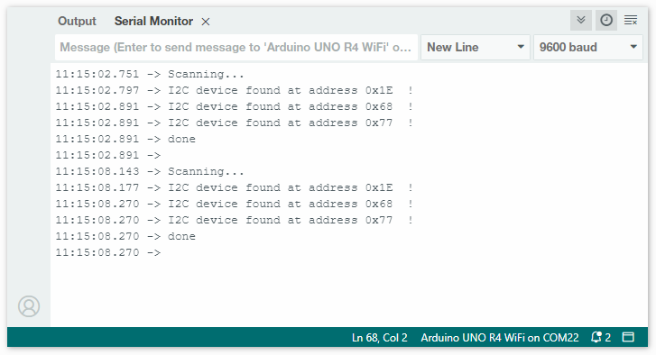

.. _i2c_scanner:

I2Cアドレスのスキャンと検出方法
==============================================

このチュートリアルでは、GY-87モジュールのI2Cアドレスをスキャンする例を取り上げ、I2Cアドレスを検出する方法を紹介します。

配線図
---------------

GY-87モジュールのSCLをUNO R4のSCLに、GY-87モジュールのSDAをUNO R4のSDAに接続します。

もう一つの方法として、GY-87モジュールのSCLをUNO R4のA5に、SDAをUNO R4のA4に接続することもできます。

.. image:: img/09-gy87_bb.png
    :align: center
    :width: 80%

.. raw:: html

    

コードのアップロード
-----------------------

以下のコードをArduino IDEにコピーして、アップロードします。

.. code-block:: arduino

   #include <Wire.h>
   
   // Set I2C bus to use: Wire, Wire1, etc.
   #define WIRE Wire
   
   void setup() {
     WIRE.begin();
   
     Serial.begin(9600);
     while (!Serial)
       delay(10);
     Serial.println("\nI2C Scanner");
   
     // Enable bypass Mode for mpu6050
     Wire.beginTransmission(0x68);
     Wire.write(0x37);
     Wire.write(0x02);
     Wire.endTransmission();
   
     Wire.beginTransmission(0x68);
     Wire.write(0x6A);
     Wire.write(0x00);
     Wire.endTransmission();
   
     // Disable Sleep Mode
     Wire.beginTransmission(0x68);
     Wire.write(0x6B);
     Wire.write(0x00);
     Wire.endTransmission();
   }
   
   
   void loop() {
     byte error, address;
     int nDevices;
   
     Serial.println("Scanning...");
   
     nDevices = 0;
     for (address = 1; address < 127; address++) {
       // The i2c_scanner uses the return value of
       // the Write.endTransmisstion to see if
       // a device did acknowledge to the address.
       WIRE.beginTransmission(address);
       error = WIRE.endTransmission();
   
       if (error == 0) {
         Serial.print("I2C device found at address 0x");
         if (address < 16)
           Serial.print("0");
         Serial.print(address, HEX);
         Serial.println("  !");
   
         nDevices++;
       } else if (error == 4) {
         Serial.print("Unknown error at address 0x");
         if (address < 16)
           Serial.print("0");
         Serial.println(address, HEX);
       }
     }
     if (nDevices == 0)
       Serial.println("No I2C devices found\n");
     else
       Serial.println("done\n");
   
     delay(5000);  // wait 5 seconds for next scan
   }

コードをアップロードした後、シリアルモニターを開いてボーレートを9600に設定します。シリアルモニターの出力を確認します。

これらが検出されたI2Cアドレスです。関連する情報を参照して、これらのアドレスに対応するチップを特定できます。この場合、 ``0x68`` はMPU6050用で、 ``0x77`` はBMP180用です。アドレス ``0x1E`` はQMC5883L用で、生産ロットによってはQMC5883Lのアドレスが ``0x0D`` になることもあります。

