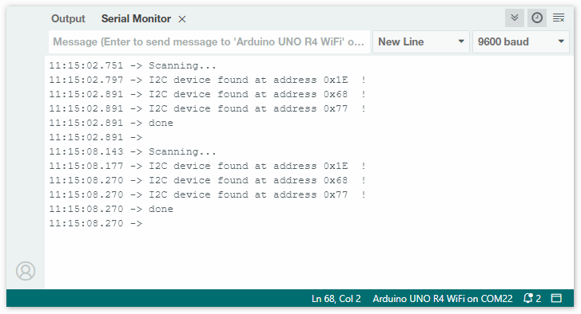

.. _i2c_sacnner:

如何扫描和检测I2C地址？
==============================================

本教程以扫描gy-87模块的I2C地址为例，指导您如何检测I2C地址。

接线
---------------

将GY-87模块的SCL连接到UNO R4的SCL，将GY-87模块的SDA连接到UNO R4的SDA。

另一种方法是将GY-87模块的SCL连接到UNO R4的A5，将GY-87模块的SDA连接到UNO R4的A4。

.. image:: img/09-gy87_bb.png
    :align: center
    :width: 80%

.. raw:: html

    

上传代码
-----------------

将以下代码复制到您的Arduino IDE中，然后上传代码。

.. code-block:: arduino

   #include <Wire.h>

   // Set I2C bus to use: Wire, Wire1, etc.
   #define WIRE Wire

   void setup() {
     WIRE.begin();

     Serial.begin(9600);
     while (!Serial)
       delay(10);
     Serial.println("\nI2C Scanner");

     // Enable bypass Mode for mpu6050
     Wire.beginTransmission(0x68);
     Wire.write(0x37);
     Wire.write(0x02);
     Wire.endTransmission();

     Wire.beginTransmission(0x68);
     Wire.write(0x6A);
     Wire.write(0x00);
     Wire.endTransmission();

     // Disable Sleep Mode
     Wire.beginTransmission(0x68);
     Wire.write(0x6B);
     Wire.write(0x00);
     Wire.endTransmission();
   }

   void loop() {
     byte error, address;
     int nDevices;

     Serial.println("Scanning...");

     nDevices = 0;
     for (address = 1; address < 127; address++) {
       // The i2c_scanner uses the return value of
       // the Write.endTransmisstion to see if
       // a device did acknowledge to the address.
       WIRE.beginTransmission(address);
       error = WIRE.endTransmission();

       if (error == 0) {
         Serial.print("I2C device found at address 0x");
         if (address < 16)
           Serial.print("0");
         Serial.print(address, HEX);
         Serial.println("  !");

         nDevices++;
       } else if (error == 4) {
         Serial.print("Unknown error at address 0x");
         if (address < 16)
           Serial.print("0");
         Serial.println(address, HEX);
       }
     }
     if (nDevices == 0)
       Serial.println("No I2C devices found\n");
     else
       Serial.println("done\n");

     delay(5000);  // wait 5 seconds for next scan
   }

上传代码后，打开串口监视器并将波特率设置为9600。检查串口监视器中的输出。

这些是检测到的I2C地址。您可以参考相关信息来确定哪些芯片对应这些地址。在本例中，``0x68``对应MPU6050，``0x77``对应BMP180。地址``0x1E``对应QMC5883L，偶尔（因不同生产批次）QMC5883L的地址也可能是``0x0D``。

