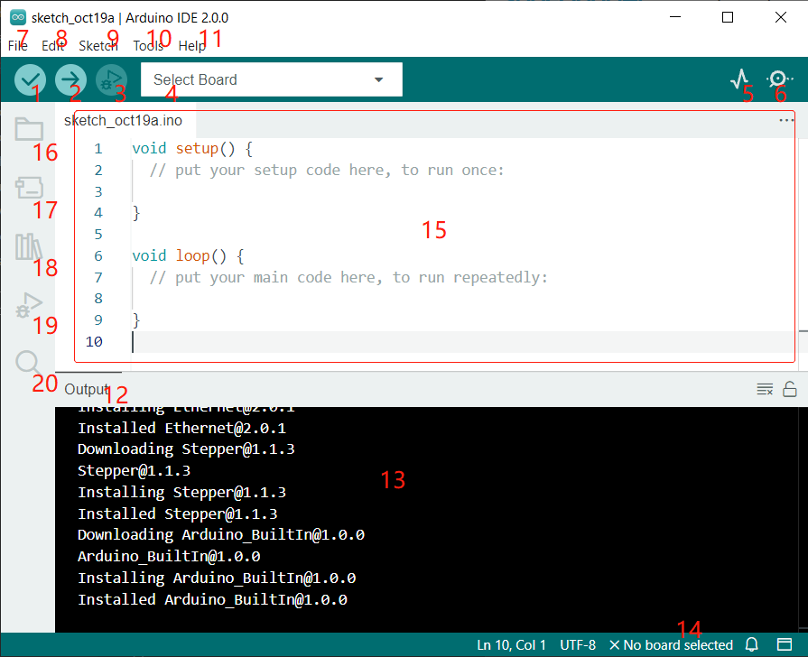

Arduino IDE 介绍
=================================

1. **Verify** 编译你的代码。任何语法问题都会提示错误。

2. **Upload** 将代码上传到你的开发板。点击按钮时，开发板上的 RX 和 TX LED 会快速闪烁，直到上传完成。

3. **Debug** 用于逐行检查错误。

4. **Select Board** 快速设置开发板和端口。

5. **Serial Plotter** 查看读取值的变化。

6. **Serial Monitor** 点击按钮后会弹出一个窗口，用于接收控制板发送的数据，对调试非常有用。

7. **File** 点击菜单后会显示下拉列表，包括创建、打开、保存、关闭文件以及配置参数等操作。

8. **Edit** 点击菜单后，下拉列表中包含 **Cut** （剪切）、**Copy** （复制）、**Paste** （粘贴）、**Find** （查找）等编辑操作及其对应的快捷键。

9. **Sketch** 包括 **Verify** （编译）、**Upload** （上传）、**Add** （添加文件）等操作。更重要的功能是 **Include Library** （添加库），你可以在其中添加库文件。

10. **Tool** 包含一些工具——最常用的是 Board（开发板）和 Port（端口）。每次上传代码时，都需要选择或检查它们。

11. **Help** 如果你是初学者，可以查看菜单下的选项获取所需帮助，包括 IDE 操作、介绍信息、故障排除、代码说明等。

12. **Output Bar** 在此切换输出选项卡。

13. **Output Window** 打印信息。

14. **Board and Port** 此处可预览上传代码所选的开发板和端口。如有误，可通过 **Tools** -> **Board**/**Port** 重新选择。

15. IDE 编辑区域，你可以在此编写代码。

16. **Sketchbook** 用于管理项目文件。

17. **Board Manager** 用于管理开发板驱动。

18. **Library Manager** 用于管理你的库文件。

19. **Debug** 帮助调试代码。

20. **Search** 在项目中搜索代码。
