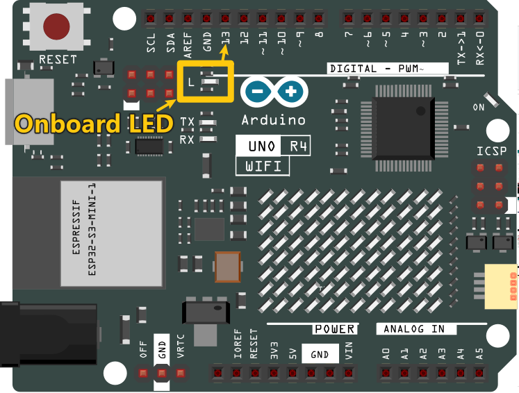

Wie man einen Sketch auf das Board hochlädt?
=============================================

In diesem Abschnitt lernen Sie, wie Sie den zuvor erstellten Sketch auf das Arduino-Board hochladen, sowie einige wichtige Überlegungen.

**1. Wählen Sie Board und Port aus**

Arduino-Entwicklungsboards werden normalerweise mit einem USB-Kabel geliefert. Sie können es verwenden, um das Board mit Ihrem Computer zu verbinden.

Wählen Sie das richtige **Board** und den richtigen **Port** in der Arduino IDE aus. Normalerweise werden Arduino-Boards automatisch vom Computer erkannt und einem Port zugewiesen, sodass Sie ihn hier auswählen können.

    .. image:: img/04_upload_1.png
        :width: 90%

Wenn Ihr Board bereits angeschlossen ist, aber nicht erkannt wird, überprüfen Sie, ob das **INSTALLED**-Logo im Abschnitt **Arduino UNO R4 Boards** des **Boards Manager** erscheint. Wenn nicht, scrollen Sie bitte etwas nach unten und klicken Sie auf **INSTALL**.

Suchen Sie **„UNO R4“** im **Boards Manager** und überprüfen Sie, ob die entsprechende Bibliothek installiert ist.

    .. image:: img/04_upload_2.png
        :width: 90%

Das Neueröffnen der Arduino IDE und das erneute Anschließen des Arduino-Boards beheben die meisten Probleme. Sie können auch **Tools** -> **Board** oder **Port** anklicken, um sie auszuwählen.

**2. Überprüfen Sie den Sketch**

Nachdem Sie auf die Schaltfläche Überprüfen geklickt haben, wird der Sketch kompiliert, um zu sehen, ob Fehler vorliegen.

    .. image:: img/04_upload_3.png
        :width: 90%

Sie können es verwenden, um Fehler zu finden, wenn Sie einige Zeichen löschen oder versehentlich einige Buchstaben eingeben. In der Nachrichtenleiste können Sie sehen, wo und welche Art von Fehlern aufgetreten sind.

    .. image:: img/04_upload_4.png
        :width: 90%

Wenn keine Fehler vorhanden sind, sehen Sie eine Nachricht wie die folgende.

    .. image:: img/04_upload_5.png
        :width: 90%

**3. Sketch hochladen**

Nachdem Sie die obigen Schritte abgeschlossen haben, klicken Sie auf die Schaltfläche **Upload**, um diesen Sketch auf das Board zu laden.

    .. image:: img/04_upload_6.png
        :width: 90%

Wenn es erfolgreich ist, können Sie die folgende Aufforderung sehen.

    .. image:: img/04_upload_7.png
        :width: 90%

Gleichzeitig blinkt die LED auf dem Board.

.. raw:: html
    
     

Das Arduino-Board führt den Sketch automatisch aus, nachdem er hochgeladen wurde und das Board mit Strom versorgt wird. Das laufende Programm kann durch Hochladen eines neuen Sketches überschrieben werden.

