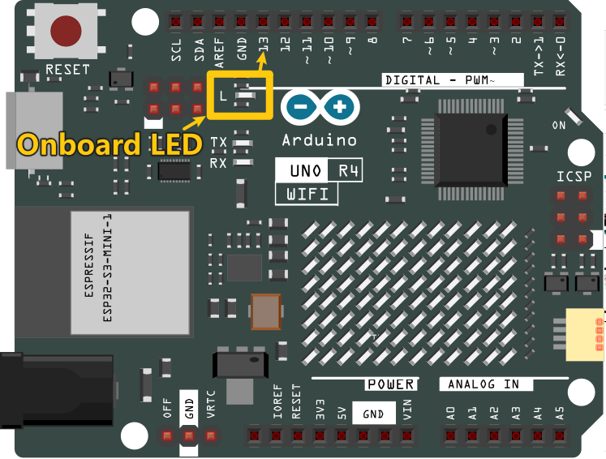

如何将项目上传到开发板？
=============================================

在本节中，你将学习如何将之前创建的项目上传到 Arduino 开发板，并了解一些注意事项。

**1. 选择开发板和端口**

Arduino 开发板通常附带一根 USB 数据线。你可以用它将开发板连接到电脑。

在 Arduino IDE 中选择正确的 **Board** （开发板）和 **Port** （端口）。通常，Arduino 开发板会被电脑自动识别并分配一个端口，你可以在此选择它。

    .. image:: img/04_upload_1.png
        :width: 90%

如果开发板已插入但未被识别，请在 **Board Manager** （开发板管理器）中的 **Arduino UNO R4 Boards** 部分检查是否显示 **INSTALLED** （已安装）标识。如果没有，请向下滚动并点击 **INSTALL** （安装）。

在 **Board Manager** （开发板管理器）中搜索 **"UNO R4"** ，检查相应的库是否已安装。

    .. image:: img/04_upload_2.png
        :width: 90%

重新打开 Arduino IDE 并重新插拔 Arduino 开发板可以解决大多数问题。你也可以点击 **Tools** -> **Board** 或 **Port** 进行选择。

**2. Verify 项目**

点击 Verify 按钮后，项目将被编译以检查是否存在错误。

    .. image:: img/04_upload_3.png
        :width: 90%

如果你不小心删除了一些字符或打错了几个字母，可以使用它来查找错误。从消息栏中，你可以看到错误发生的位置和类型。

    .. image:: img/04_upload_4.png
        :width: 90%

如果没有错误，你将看到如下所示的消息。

    .. image:: img/04_upload_5.png
        :width: 90%

**3. Upload 项目**

完成上述步骤后，点击 **Upload** （上传）按钮将项目上传到开发板。

    .. image:: img/04_upload_6.png
        :width: 90%

如果上传成功，你将看到以下提示。

    .. image:: img/04_upload_7.png
        :width: 90%

同时，开发板上的 LED 会闪烁。

.. raw:: html

     

项目上传后，Arduino 开发板在通电后会自动运行该项目。可以通过上传新的项目来覆盖正在运行的程序。
