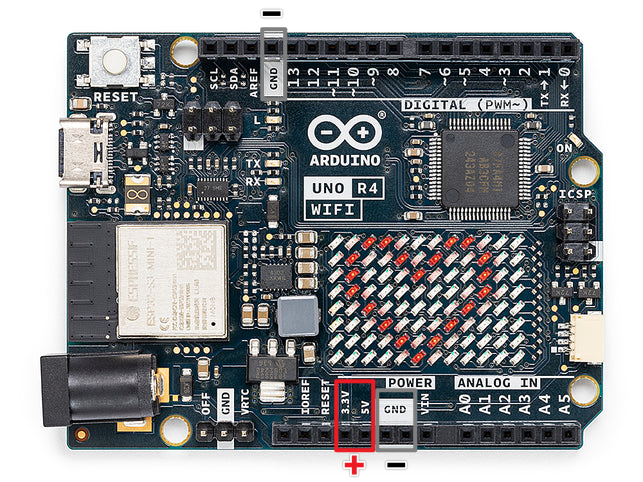
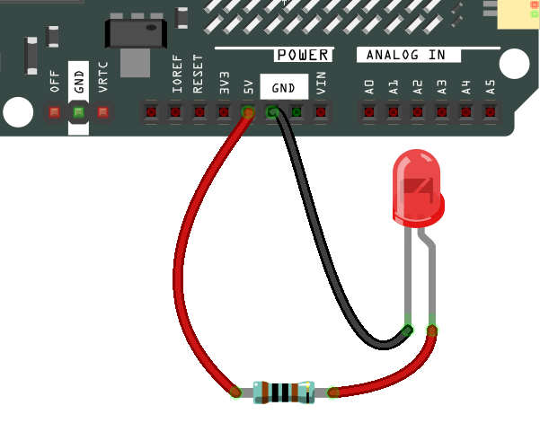
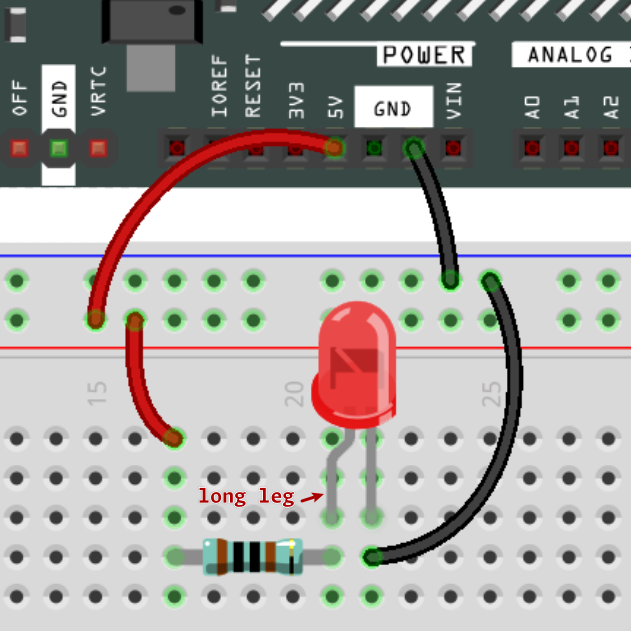
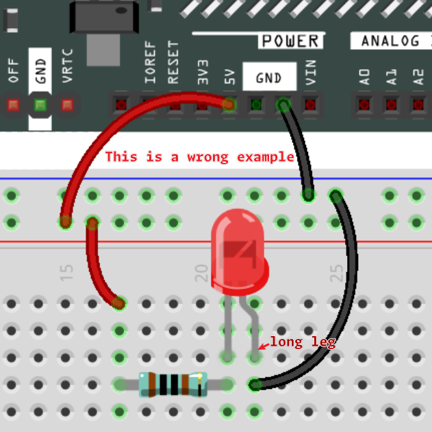
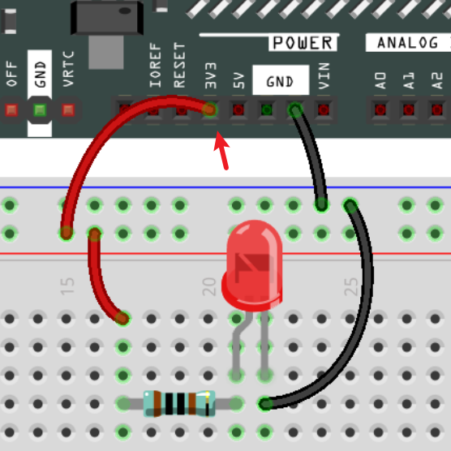
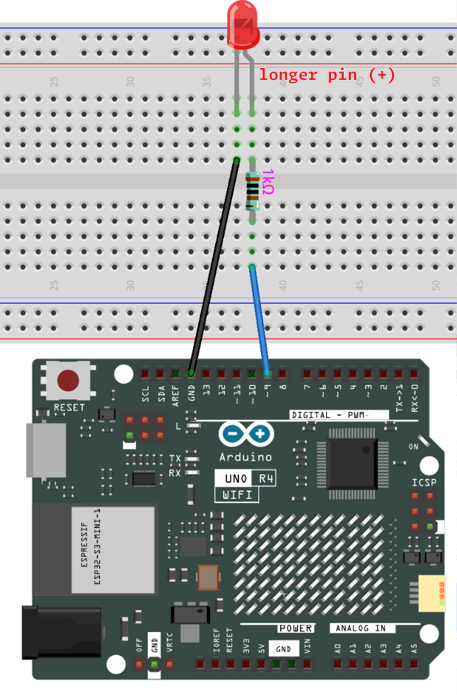

.. note::

    Ciao, benvenuto nella comunità di appassionati di SunFounder Raspberry Pi, Arduino e ESP32 su Facebook! Approfondisci Raspberry Pi, Arduino ed ESP32 insieme ad altri appassionati.

    **Perché unirti a noi?**

    - **Supporto esperto**: Risolvi i problemi post-vendita e le sfide tecniche con l'aiuto della nostra comunità e del nostro team.
    - **Impara e Condividi**: Scambia consigli e tutorial per migliorare le tue competenze.
    - **Anteprime esclusive**: Accedi in anteprima agli annunci di nuovi prodotti e agli sneak peek.
    - **Sconti speciali**: Approfitta di sconti esclusivi sui nostri prodotti più recenti.
    - **Promozioni festive e omaggi**: Partecipa a giveaway e promozioni festive.

    👉 Pronto per esplorare e creare con noi? Clicca [|link_sf_facebook|] e unisciti oggi stesso!

Come costruire il circuito
==============================

Molte delle cose che usi ogni giorno sono alimentate dall'elettricità, come le luci in casa tua e il computer che stai leggendo.

Per utilizzare l'elettricità, devi costruire un circuito elettrico. Fondamentalmente, un circuito è un percorso attraverso il quale scorre l'elettricità, o un circuito elettronico, ed è composto da dispositivi e componenti elettrici (apparecchi) che sono collegati in un certo modo, come resistori, condensatori, alimentatori e interruttori.

.. image:: img/circuit.png
    :align: center
    :width: 250

.. raw:: html
    
     

Un circuito è un percorso chiuso in cui gli elettroni si muovono per creare una corrente elettrica. Per far fluire la corrente, deve esserci un percorso conduttivo tra il terminale positivo dell'alimentatore e il terminale negativo, che viene chiamato circuito chiuso (se è interrotto, viene chiamato circuito aperto).

La scheda Arduino ha alcuni pin di uscita di potenza (positivi) e alcuni pin di massa (negativi).
Puoi utilizzare questi pin come lati positivo e negativo dell'alimentatore collegando la fonte di alimentazione alla scheda.

Con l'elettricità, puoi creare opere con luce, suono e movimento.
Puoi accendere un LED collegando il pin lungo al terminale positivo e il pin corto al terminale negativo.
Tuttavia, farlo direttamente può danneggiare rapidamente non solo il LED ma anche i pin della tua scheda UNO R4. Per evitare ciò, è essenziale aggiungere un resistore da 1kΩ nel circuito, proteggendo sia il LED che i pin dell'UNO R4.

Il circuito che formano è mostrato di seguito.

.. raw:: html
    
     

Potresti avere domande in questo momento: come costruisco questo circuito? Tengo i fili a mano, o nastro i pin e i fili?

In questa situazione, le breadboard senza saldatura saranno i tuoi alleati più forti.

.. _bc_bb:

Ciao, Breadboard!
------------------------------

Una breadboard è una piastra di plastica rettangolare con un sacco di piccoli fori. 
Questi fori ci permettono di inserire facilmente componenti elettronici e costruire circuiti elettronici. 
Le breadboard non fissano permanentemente i componenti elettronici, quindi possiamo facilmente riparare un circuito e ricominciare da capo se qualcosa va storto.

.. note::
    Non c'è bisogno di strumenti speciali per usare le breadboard. Tuttavia, molti componenti elettronici sono molto piccoli, e un paio di pinzette possono aiutarci a raccogliere meglio le piccole parti.

Su Internet, possiamo trovare molte informazioni sulle breadboard.

* `How to Use a Breadboard - Science Buddies <https://www.sciencebuddies.org/science-fair-projects/references/how-to-use-a-breadboard#pth-smd>`_

* `What is a BREADBOARD? - Makezine <https://cdn.makezine.com/uploads/2012/10/breadboardworkshop.pdf>`_

Ecco alcune cose che dovresti sapere sulle breadboard.

.. image:: ../components/img/breadboard_internal.png
    :align: center
    :width: 85%

.. raw:: html

    

#. Ogni gruppo di mezze righe (come la colonna A-E nella riga 1 o la colonna F-J nella riga 3) è collegato. Pertanto, se un segnale elettrico fluisce da A1, può uscire da B1, C1, D1, E1, ma non da F1 o A2.

#. Nella maggior parte dei casi, entrambi i lati della breadboard vengono utilizzati come bus di alimentazione, e i fori in ogni colonna (circa 50 fori) sono collegati insieme. Come regola generale, le alimentazioni positive sono collegate ai fori vicino al filo rosso, e le alimentazioni negative sono collegate ai fori vicino al filo blu.

**Seguiamo la direzione della corrente per costruire il circuito!**

.. raw:: html
    
     

1. In questo circuito, usiamo il pin 5V della scheda per alimentare il LED. Usa un filo jumper maschio-maschio (M2M) per collegarlo al bus di alimentazione rosso.

#. Per proteggere il LED e i pin dell'UNO R4, la corrente deve passare attraverso un resistore da 1k ohm. Collega un'estremità (qualunque estremità) del resistore al bus di alimentazione rosso, e l'altra estremità alla fila libera della breadboard.

.. note::
        L'anello di colore del resistore da 1000 ohm :ref:`cpn_resistor` è rosso, nero, nero, marrone e marrone.

#. Se prendi il LED, vedrai che uno dei suoi terminali è più lungo dell'altro. Collega il terminale più lungo alla stessa fila del resistore, e il terminale più corto all'altra fila.

.. note::
        Il terminale più lungo è l'anodo, che rappresenta il lato positivo del circuito; il terminale più corto è il catodo, che rappresenta il lato negativo.

        L'anodo deve essere collegato al pin GPIO attraverso un resistore; il catodo deve essere collegato al pin GND.

#. Utilizzando un cavo jumper maschio-maschio (M2M), collega il pin corto del LED al bus di alimentazione negativo della breadboard.
#. Collega il pin GND della scheda al bus di alimentazione negativo utilizzando un jumper.

Attenzione ai cortocircuiti
------------------------------
I cortocircuiti possono verificarsi quando due componenti che non dovrebbero essere collegati sono "accidentalmente" collegati.
Questo kit include resistori, transistor, condensatori, LED, ecc. che hanno lunghi pin metallici che possono urtarsi tra loro e causare un cortocircuito. Alcuni circuiti smettono semplicemente di funzionare correttamente quando si verifica un cortocircuito. Occasionalmente, un cortocircuito può danneggiare permanentemente i componenti, soprattutto tra l'alimentazione e il bus di massa, facendo riscaldare molto il circuito, sciogliendo la plastica della breadboard e persino bruciando i componenti!

Pertanto, assicurati sempre che i pin di tutti i componenti elettronici sulla breadboard non si tocchino tra loro.

Orientamento del circuito
-------------------------------
I circuiti hanno un'orientazione, e l'orientazione gioca un ruolo significativo in alcuni componenti elettronici. Ci sono alcuni dispositivi con polarità, il che significa che devono essere collegati correttamente in base ai loro poli positivo e negativo. I circuiti costruiti con l'orientazione sbagliata non funzioneranno correttamente.

.. raw:: html
    
     

Se inverti il LED in questo semplice circuito che abbiamo costruito prima, scoprirai che non funziona più.

Al contrario, alcuni dispositivi non hanno orientamento, come i resistori in questo circuito, quindi puoi provare a invertirli senza influenzare il normale funzionamento dei LED.

La maggior parte dei componenti e moduli con etichette come "+", "-", "GND", "VCC" o con pin di lunghezze diverse devono essere collegati al circuito in un modo specifico.

Protezione del circuito
-------------------------------------

La corrente è la velocità con cui gli elettroni fluiscono attraverso un punto in un circuito elettrico completo. Fondamentalmente, corrente = flusso. Un ampere (AM-pir), o amp, è l'unità internazionale utilizzata per misurare la corrente. Esprime la quantità di elettroni (a volte chiamati "carica elettrica") che fluiscono attraverso un punto in un circuito in un dato tempo.

La forza motrice (tensione) dietro il flusso di corrente è chiamata tensione ed è misurata in volt (V).

La resistenza (R) è la proprietà del materiale che limita il flusso di corrente, ed è misurata in ohm (Ω).

Secondo la legge di Ohm (purché la temperatura rimanga costante), corrente, tensione e resistenza sono proporzionali.
La corrente di un circuito è proporzionale alla sua tensione e inversamente proporzionale alla sua resistenza.

Pertanto, corrente (I) = tensione (V) / resistenza (R).

* `Legge di Ohm - Wikipedia <https://it.wikipedia.org/wiki/Legge_di_Ohm>`_

Sulla legge di Ohm possiamo fare un semplice esperimento.

Cambiando il filo che collega 5V a 3.3V, il LED diventa più fioco.
Se cambi il resistore da 1000 ohm a 2000 ohm (anello di colore: rosso, nero, nero, marrone e marrone), noterai che il LED diventa più fioco di prima. Più grande è il resistore, più fioco è il LED.

La maggior parte dei moduli confezionati richiede solo l'accesso alla tensione corretta (di solito 3.3V o 5V), come il modulo ultrasonico.

Tuttavia, nei circuiti auto-costruiti, devi essere consapevole della tensione di alimentazione e dell'uso dei resistori per i dispositivi elettrici.

Ad esempio, i LED di solito consumano 20mA di corrente, e la loro caduta di tensione è di circa 1.8V. Secondo la legge di Ohm, se utilizziamo un'alimentazione a 5V, dobbiamo collegare un resistore minimo di 160ohm ((5-1.8)/20mA) per non bruciare il LED.

Controllo del circuito con Arduino
-----------------------------------------

Ora che abbiamo una comprensione di base della programmazione Arduino e dei circuiti elettronici, è il momento di affrontare la domanda più critica: Come controllare i circuiti con Arduino?

In poche parole, il modo in cui Arduino controlla un circuito è cambiando il livello dei pin sulla scheda. Ad esempio, quando si controlla un LED integrato, si scrive un segnale di livello alto o basso sul pin 13.

Ora proviamo a programmare la scheda Arduino per controllare il lampeggiamento del LED sulla breadboard. Costruisci il circuito in modo che il LED sia collegato al pin 9.

Successivamente, carica questo sketch sulla scheda di sviluppo Arduino.

.. code-block:: C

    int ledPin = 9;
    int delayTime = 500;

    void setup() {
        pinMode(ledPin,OUTPUT); 
    }

    void loop() {
        digitalWrite(ledPin,HIGH); 
        delay(delayTime); 
        digitalWrite(ledPin,LOW); 
        delay(delayTime);
    }

Questo sketch è molto simile a quello che abbiamo usato per controllare il lampeggiamento del LED integrato, la differenza è che il valore di ``ledPin`` è stato cambiato a 9.
Questo perché stiamo cercando di controllare il livello del pin 9 questa volta.

Ora puoi vedere il LED sulla breadboard lampeggiare.

