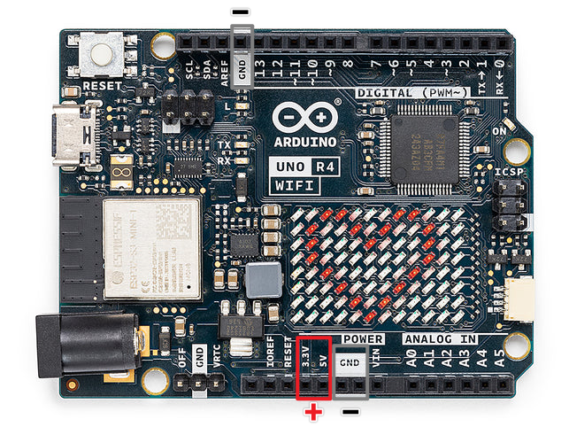
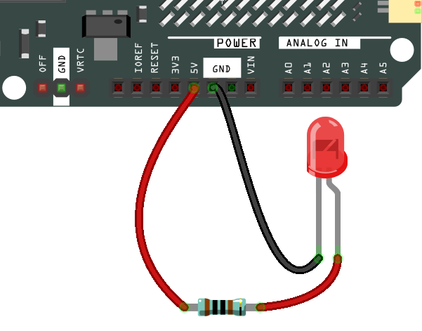
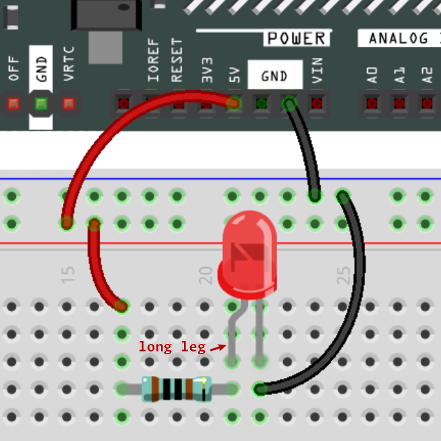
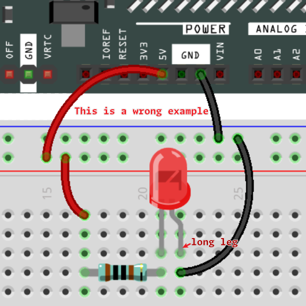
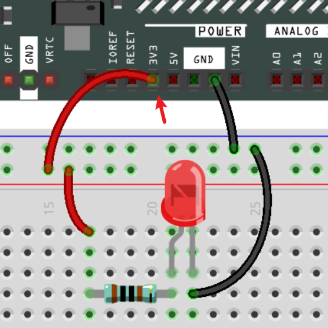
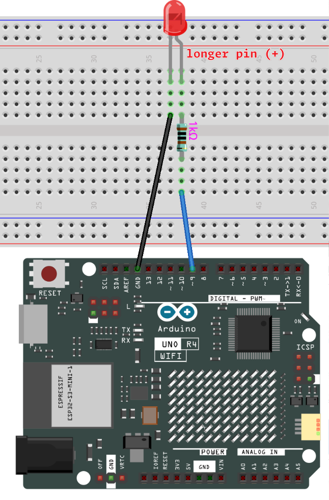

如何搭建电路
========================

你每天使用的许多东西都靠电力驱动，比如你家里的灯和你正在看书的电脑。

要使用电，你必须建立一个电路。基本上，电路是电流流动的路径，或者说电子电路，由以一定方式连接的电子设备和元件（用电器）组成，如电阻、电容、电源和开关。

.. raw:: html

     

电路是一个闭合路径，电子在其中运动产生电流。要让电流流动，必须在电源的正极和负极之间有一条导电路径，这称为闭合电路（如果断开，则称为开路）。

Arduino 开发板有一些电源输出引脚（正极）和一些接地引脚（负极）。
你可以使用这些引脚作为电源的正极和负极，将电源接入开发板。

有了电，你可以创造出具有光、声和运动效果的作品。
你可以将长引脚连接到正极端子，短引脚连接到负极端子，从而点亮 LED。
然而，直接这样做不仅会损坏 LED，还可能损坏 UNO R4 开发板的引脚。为了避免这种情况，有必要在电路中加入一个 1kΩ 的电阻，以保护 LED 和 UNO R4 的引脚。

它们形成的电路如下所示。

.. raw:: html

     

这时你可能会问：如何搭建这个电路？用手拿着导线，或者用胶带固定引脚和导线？

在这种情况下，免焊面包板将是你最得力的助手。

.. _bc_bb:

你好，面包板！
------------------------------

面包板是一块带有许多小孔的矩形塑料板。
这些孔使我们能够轻松插入电子元件并搭建电子电路。
面包板不会永久固定电子元件，因此如果出现问题，我们可以轻松修复电路并重新开始。

.. note::
    使用面包板不需要特殊工具。但是，许多电子元件非常小，一把镊子可以帮助我们更好地拾取小零件。

在互联网上，我们可以找到很多关于面包板的信息。

* `如何使用面包板 - Science Buddies <https://www.sciencebuddies.org/science-fair-projects/references/how-to-use-a-breadboard#pth-smd>`_

* `什么是面包板？- Makezine <https://cdn.makezine.com/uploads/2012/10/breadboardworkshop.pdf>`_

以下是关于面包板你应该了解的一些事项。

.. image:: ../components/img/breadboard_internal.png
    :align: center
    :width: 85%

.. raw:: html

    

#. 每个半行组（例如第 1 行 A-E 列或第 3 行 F-J 列）是连通的。因此，如果电信号从 A1 流入，它可以从 B1、C1、D1、E1 流出，但不能从 F1 或 A2 流出。

#. 在大多数情况下，面包板的两侧都用作电源母线，每列中的孔（约 50 个孔）是连接在一起的。一般来说，正电源连接到靠近红色导线一侧的孔，负电源连接到靠近蓝色导线一侧的孔。

**让我们跟随电流的方向来搭建电路！**

.. raw:: html

     

1. 在这个电路中，我们使用开发板的 5V 引脚为 LED 供电。使用公对公跳线将其连接到红色电源母线。
#. 为了保护 LED 和 UNO R4 的引脚，电流必须通过一个 1k 欧姆的电阻。将电阻的一端（任意一端）连接到红色电源母线，另一端连接到面包板的空闲行。

   .. note::
        1000 欧姆 :ref:`cpn_resistor` 的色环为红、黑、黑、棕、棕。

#. 如果你拿起 LED，会看到其中一根引脚比另一根长。将较长的引脚连接到与电阻相同的行，较短的引脚连接到另一行。

   .. note::
        较长的引脚是阳极，代表电路的正极；较短的引脚是阴极，代表电路的负极。

        阳极需要通过电阻连接到 GPIO 引脚；阴极需要连接到 GND 引脚。

#. 使用公对公跳线，将 LED 的短引脚连接到面包板的负电源母线。
#. 使用跳线将开发板的 GND 引脚连接到负电源母线。

注意短路
------------------------------
当两个不应该连接的元件被"意外"连接时，就会发生短路。
本套件包含电阻、晶体管、电容、LED 等元件，它们有长的金属引脚，可能会相互碰触导致短路。发生短路时，有些电路会直接无法正常工作。有时，短路会永久损坏元件，特别是在电源和接地母线之间，会导致电路变得非常热，熔化面包板上的塑料，甚至烧毁元件！

因此，务必确保面包板上所有电子元件的引脚不要相互接触。

电路的方向
-------------------------------
电路是有方向的，方向在某些电子元件中起着重要作用。有些元件具有极性，这意味着它们必须根据正负极正确连接。方向错误的电路将无法正常工作。

.. raw:: html

     

如果你在我们之前搭建的简单电路中反向连接 LED，你会发现它不再发光。

相比之下，有些元件没有方向性，比如这个电路中的电阻，你可以尝试反向连接它们，而不会影响 LED 的正常工作。

大多数标有"+"、"-"、"GND"、"VCC"或引脚长度不同的元件和模块必须以特定方式连接到电路。

电路的保护
-------------------------------------

电流是电子在完整电路中通过某一点的速率。最基本地说，电流 = 流动。安培是用于测量电流的国际单位。它表示在给定时间内通过电路某一点的电子（有时称为"电荷"）数量。

驱动电流流动的驱动力（电压）称为电压，以伏特（V）为单位。

电阻（R）是材料限制电流流动的特性，以欧姆（Ω）为单位。

根据欧姆定律（只要温度保持不变），电流、电压和电阻是成比例的。
电路的电流与其电压成正比，与其电阻成反比。

因此，电流（I）= 电压（V）/ 电阻（R）。

* `欧姆定律 - 维基百科 <https://en.wikipedia.org/wiki/Ohm%27s_law>`_

关于欧姆定律，我们可以做一个简单的实验。

通过将连接 5V 的导线改为 3.3V，LED 会变暗。
如果将电阻从 1000 欧姆改为 2000 欧姆（色环：红、黑、黑、棕、棕），你会注意到 LED 比以前更暗。电阻越大，LED 越暗。

大多数封装模块只需要接入合适的电压（通常为 3.3V 或 5V），例如超声波模块。

然而，在你自行搭建的电路中，你需要注意电气设备的供电电压和电阻的使用。

举例来说，LED 通常消耗 20mA 电流，其压降约为 1.8V。根据欧姆定律，如果我们使用 5V 电源，为了不烧坏 LED，需要串联一个至少 160 欧姆（(5-1.8)/20mA）的电阻。

用 Arduino 控制电路
--------------------------------

现在我们已经对 Arduino 编程和电子电路有了基本的了解，是时候面对最关键的问题了：如何用 Arduino 控制电路？

简单来说，Arduino 控制电路的方式是改变开发板上引脚的电平。例如，控制板载 LED 时，就是向引脚 13 写入高电平或低电平信号。

现在让我们尝试编写代码，让 Arduino 开发板控制面包板上的 LED 闪烁。搭建电路，使 LED 连接到引脚 9。

接下来，将此项目上传到 Arduino 开发板。

.. code-block:: C

    int ledPin = 9;
    int delayTime = 500;

    void setup() {
        pinMode(ledPin,OUTPUT);
    }

    void loop() {
        digitalWrite(ledPin,HIGH);
        delay(delayTime);
        digitalWrite(ledPin,LOW);
        delay(delayTime);
    }

这个项目与我们用来控制板载 LED 闪烁的项目非常相似，不同之处在于 ``ledPin`` 的值已更改为 9。
这是因为我们这次要控制引脚 9 的电平。

现在你可以看到面包板上的 LED 在闪烁了。
