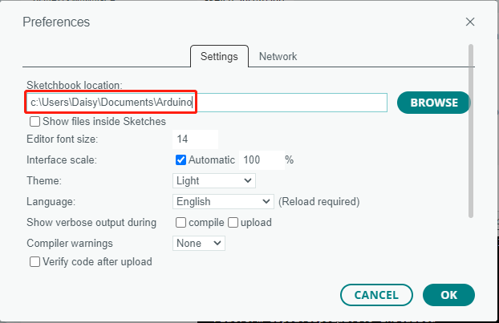

.. _add_libraries:

如何添加库？（重要）
======================================

库是预先编写好的代码或函数的集合，可以扩展 Arduino IDE 的功能。库提供了各种功能的现成代码，让你在编写复杂功能时节省时间和精力。

使用库管理器
-------------------------------

许多库可以直接通过 Arduino 库管理器获得。你可以按照以下步骤访问库管理器：

#. 在 **Library Manager** （库管理器）中，你可以按名称搜索所需库，或按不同类别浏览。

   .. note::

      在需要安装库的项目中，会有提示说明需要安装哪些库。按照指示操作，例如："此处使用了 DHT 传感器库，你可以从库管理器中安装它。"只需按提示安装推荐的库即可。

   .. image:: img/install_lib3.png

#. 找到要安装的库后，点击它，然后点击 **Install** （安装）按钮。

   .. image:: img/install_lib2.png

#. Arduino IDE 将自动下载并安装该库。

.. _manual_install_lib:

手动安装
-----------------------

有些库无法通过 **Library Manager** （库管理器）获取，需要手动安装。要安装这些库，请按以下步骤操作：

#. 打开 Arduino IDE，进入 **Sketch** -> **Include Library** -> **Add .ZIP Library** 。

   .. image:: img/add_lib_zip.png

#. 导航到库文件所在的目录，例如 ``elite-explorer-kit-main/library/`` 文件夹，选择库文件并点击 **Open** （打开）。

   .. image:: img/rfid_choose.png

#. 安装完成后，你会收到一条通知，确认库已成功添加到 Arduino IDE。下次需要使用该库时，无需重复安装过程。

   .. image:: img/rfid_success.png

#. 重复相同的过程以添加其他库。

库文件位置
-----------------------

使用上述任一方法安装的库都可以在 Arduino IDE 的默认库目录中找到，通常位于 ``C:\Users\xxx\Documents\Arduino\libraries``。

如果你的库目录不同，可以通过 **File** -> **Preferences** 进行检查。

**参考**

* |link_install_arduino_lib|
