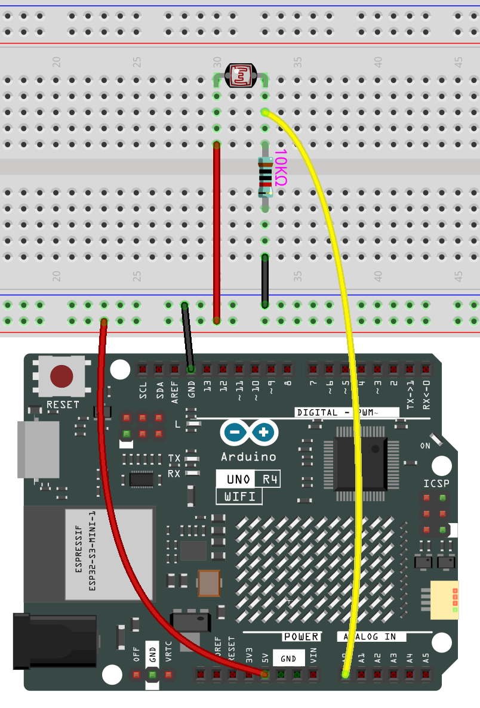

.. note::

    Ciao, benvenuto nella comunità di appassionati di SunFounder Raspberry Pi, Arduino e ESP32 su Facebook! Approfondisci Raspberry Pi, Arduino ed ESP32 insieme ad altri appassionati.

    **Perché unirti a noi?**

    - **Supporto esperto**: Risolvi i problemi post-vendita e le sfide tecniche con l'aiuto della nostra comunità e del nostro team.
    - **Impara e Condividi**: Scambia consigli e tutorial per migliorare le tue competenze.
    - **Anteprime esclusive**: Accedi in anteprima agli annunci di nuovi prodotti e agli sneak peek.
    - **Sconti speciali**: Approfitta di sconti esclusivi sui nostri prodotti più recenti.
    - **Promozioni festive e omaggi**: Partecipa a giveaway e promozioni festive.

    👉 Pronto per esplorare e creare con noi? Clicca [|link_sf_facebook|] e unisciti oggi stesso!

.. _basic_photoresistor:

Fotoresistore
==========================

.. https://docs.sunfounder.com/projects/vincent-kit/en/latest/arduino/2.26_photoresistor.html

Panoramica
---------------

In questa lezione, imparerai a conoscere il Fotoresistore. Il Fotoresistore è applicato in molti dispositivi elettronici, come il misuratore della fotocamera, la radiosveglia, il dispositivo di allarme (come rivelatore a fascio), le piccole luci notturne, l'orologio da esterno, le lampade stradali solari e così via. Il Fotoresistore è posto in un lampione per controllare quando la luce è accesa. La luce ambientale che colpisce il fotoresistore fa sì che i lampioni si accendano o si spengano.

Componenti necessari
-------------------------

In questo progetto, abbiamo bisogno dei seguenti componenti.

È sicuramente conveniente acquistare un kit completo, ecco il link:

.. list-table::
    :widths: 20 20 20
    :header-rows: 1

    *   - Nome	
        - ELEMENTI IN QUESTO KIT
        - LINK
    *   - Elite Explorer Kit
        - 300+
        - |link_Elite_Explorer_kit|

Puoi anche acquistarli separatamente dai link qui sotto.

.. list-table::
    :widths: 30 20
    :header-rows: 1

    *   - INTRODUZIONE AI COMPONENTI
        - LINK PER L'ACQUISTO

    *   - :ref:`uno_r4_wifi`
        - \-
    *   - :ref:`cpn_breadboard`
        - |link_breadboard_buy|
    *   - :ref:`cpn_wires`
        - |link_wires_buy|
    *   - :ref:`cpn_resistor`
        - |link_resistor_buy|
    *   - :ref:`cpn_photoresistor`
        - |link_photoresistor_buy|

Collegamenti
----------------------

In questo esempio, utilizziamo il pin analogico (A0) per leggere il valore del fotoresistore. Un pin del fotoresistore è collegato a 5V, l'altro è collegato ad A0. Inoltre, è necessario un resistore da 10kΩ prima che l'altro pin sia collegato a GND.

Schema Elettrico
-----------------------

.. image:: img/01_photoresistor_schematic.png
    :align: center
    :width: 70%

Codice
---------------

.. note::

    * Puoi aprire il file ``01-photoresistor`` direttamente dal percorso ``elite-explorer-kit-main\basic_project\01-photoresistor``.
    * Oppure copia questo codice nell'IDE di Arduino.

.. raw:: html

    <iframe src=https://create.arduino.cc/editor/sunfounder01/e6bf007e-b20d-44d0-9ef9-6d57c1ce4c3c/preview?embed style="height:510px;width:100%;margin:10px 0" frameborder=0></iframe>

Dopo aver caricato il codice sulla scheda uno, puoi aprire il monitor seriale per vedere il valore letto dal pin. Quando la luce ambientale diventa più intensa, la lettura aumenterà di conseguenza, e l'intervallo di lettura del pin è 「0」~「1023」. Tuttavia, a seconda delle condizioni ambientali e delle caratteristiche del fotoresistore, l'intervallo di lettura effettivo potrebbe essere inferiore all'intervallo teorico.
