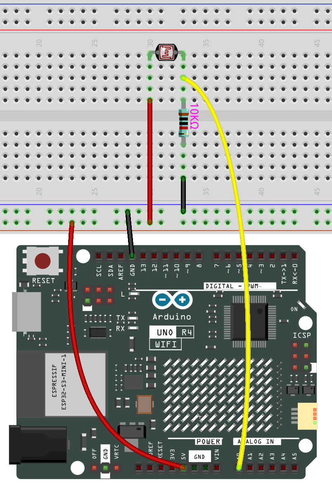
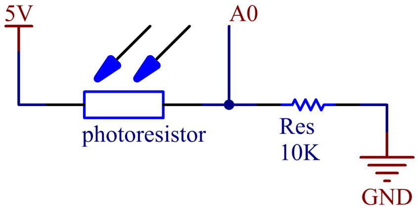

.. note::

    Hello, welcome to the SunFounder Raspberry Pi & Arduino & ESP32 Enthusiasts Community on Facebook! Dive deeper into Raspberry Pi, Arduino, and ESP32 with fellow enthusiasts.

    **Why Join?**

    - **Expert Support**: Solve post-sale issues and technical challenges with help from our community and team.
    - **Learn & Share**: Exchange tips and tutorials to enhance your skills.
    - **Exclusive Previews**: Get early access to new product announcements and sneak peeks.
    - **Special Discounts**: Enjoy exclusive discounts on our newest products.
    - **Festive Promotions and Giveaways**: Take part in giveaways and holiday promotions.

    👉 Ready to explore and create with us? Click [|link_sf_facebook|] and join today!

.. _basic_photoresistor:

Photoresistor
==========================

.. https://docs.sunfounder.com/projects/vincent-kit/en/latest/arduino/2.26_photoresistor.html

Overview
---------------

In this lesson, you will learn about Photoresistor. Photoresistor is applied in many electronic goods, such as the camera meter, clock radio, alarm device (as beam detector), small night lights, outdoor clock, solar street lamps and etc. Photoresistor is placed in a street lamp to control when the light is turned on. Ambient light falling on the photoresistor causes street lamps to turn on or off.

Required Components
-------------------------

In this project, we need the following components. 

It's definitely convenient to buy a whole kit, here's the link: 

.. list-table::
    :widths: 20 20 20
    :header-rows: 1

    *   - Name	
        - ITEMS IN THIS KIT
        - LINK
    *   - Elite Explorer Kit
        - 300+
        - |link_Elite_Explorer_kit|

You can also buy them separately from the links below.

.. list-table::
    :widths: 30 20
    :header-rows: 1

    *   - COMPONENT INTRODUCTION
        - PURCHASE LINK

    *   - :ref:`uno_r4_wifi`
        - \-
    *   - :ref:`cpn_breadboard`
        - |link_breadboard_buy|
    *   - :ref:`cpn_wires`
        - |link_wires_buy|
    *   - :ref:`cpn_resistor`
        - |link_resistor_buy|
    *   - :ref:`cpn_photoresistor`
        - |link_photoresistor_buy|

Wiring
----------------------

In this example, we use analog pin ( A0 ) to read the value of photoresistor. One pin of photoresistor is connected to 5V, the other is wired up to A0. Besides, a 10kΩ resistor is needed before the other pin is connected to GND.

Schematic Diagram
-----------------------

Code
---------------

.. note::

    * You can open the file ``01-photoresistor`` under the path of ``elite-explorer-kit-main\basic_project\01-photoresistor`` directly.
    * Or copy this code into Arduino IDE.

.. literalinclude:: /_code/01_basic_photoresistor.ino
   :language: cpp
   :linenos:
   :caption: 01-photoresistor.ino

After uploading the codes to the uno board, you can open the serial monitor to see the read value of the pin. When the ambient light becomes stronger, the reading will increase correspondingly, and the pin reading range is 「0」~「1023」.  However, according to the environmental conditions and the characteristics of the photoresistor, the actual reading range may be smaller than the theoretical range. 