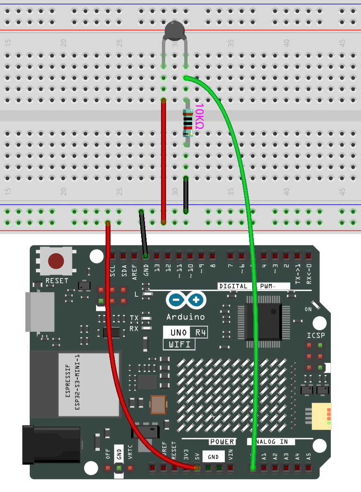

.. note::

    Hallo und willkommen in der SunFounder Raspberry Pi & Arduino & ESP32 Enthusiasten-Gemeinschaft auf Facebook! Tauchen Sie tiefer ein in die Welt von Raspberry Pi, Arduino und ESP32 mit anderen Enthusiasten.

    **Warum beitreten?**

    - **Expertenunterstützung**: Lösen Sie Nachverkaufsprobleme und technische Herausforderungen mit Hilfe unserer Gemeinschaft und unseres Teams.
    - **Lernen & Teilen**: Tauschen Sie Tipps und Anleitungen aus, um Ihre Fähigkeiten zu verbessern.
    - **Exklusive Vorschauen**: Erhalten Sie frühzeitigen Zugang zu neuen Produktankündigungen und exklusiven Einblicken.
    - **Spezialrabatte**: Genießen Sie exklusive Rabatte auf unsere neuesten Produkte.
    - **Festliche Aktionen und Gewinnspiele**: Nehmen Sie an Gewinnspielen und Feiertagsaktionen teil.

    👉 Sind Sie bereit, mit uns zu erkunden und zu erschaffen? Klicken Sie auf [|link_sf_facebook|] und treten Sie heute bei!

.. _basic_thermistor:

Thermistor
==========================

.. https://docs.sunfounder.com/projects/vincent-kit/en/latest/arduino/2.27_thermistor.html#ar-thermistor

Übersicht
-------------

In dieser Lektion lernen Sie, wie man einen Thermistor verwendet. Thermistoren können als elektronische Schaltkomponenten zur Temperaturkompensation in Messgeräteschaltungen eingesetzt werden. Sie finden Anwendung in Strommessgeräten, Durchflussmessern, Gasanalysatoren und anderen Geräten. Zudem werden sie für Überhitzungsschutz, kontaktlose Relais, Temperaturkonstanz, automatische Verstärkungsregelung, Motoranlauf, Zeitverzögerung, automatische Entmagnetisierung von Farbfernsehern, Brandmelder und Temperaturkompensation verwendet.

Benötigte Komponenten
-------------------------

Für dieses Projekt benötigen wir die folgenden Komponenten.

Es ist definitiv praktisch, ein ganzes Kit zu kaufen. Hier ist der Link:

.. list-table::
    :widths: 20 20 20
    :header-rows: 1

    *   - Name	
        - ARTIKEL IN DIESEM KIT
        - LINK
    *   - Elite Explorer Kit
        - 300+
        - |link_Elite_Explorer_kit|

Sie können die Komponenten auch einzeln über die untenstehenden Links kaufen.

.. list-table::
    :widths: 30 20
    :header-rows: 1

    *   - KOMPONENTENBESCHREIBUNG
        - KAUF-LINK

    *   - :ref:`uno_r4_wifi`
        - \-
    *   - :ref:`cpn_breadboard`
        - |link_breadboard_buy|
    *   - :ref:`cpn_wires`
        - |link_wires_buy|
    *   - :ref:`cpn_resistor`
        - |link_resistor_buy|
    *   - :ref:`cpn_thermistor`
        - |link_thermistor_buy|

Verdrahtung
----------------------

In diesem Beispiel verwenden wir den analogen Pin A0, um den Wert des Thermistors zu ermitteln. Ein Pin des Thermistors wird mit 5V verbunden, der andere mit A0. Gleichzeitig wird ein 10kΩ Widerstand mit dem anderen Pin verbunden, bevor dieser mit GND verbunden wird.

Schaltplan
-----------------------

.. image:: img/02_thermistor_schematic.png
   :align: center
   :width: 70%

Code
-----------

.. note::

    * Sie können die Datei ``02-thermistor.ino`` direkt im Pfad ``elite-explorer-kit-main\basic_project\02-thermistor`` öffnen.
    * Oder kopieren Sie diesen Code in die Arduino IDE.

.. raw:: html

    <iframe src=https://create.arduino.cc/editor/sunfounder01/be5dbe68-b57d-41f0-9fc0-237b99acbe3f/preview?embed style="height:510px;width:100%;margin:10px 0" frameborder=0></iframe>

Nachdem Sie den Code auf das Uno R4 Board hochgeladen haben, können Sie den seriellen Monitor öffnen, um die aktuelle Temperatur zu überprüfen.

Die Kelvin-Temperatur wird mit der Formel **T\ K\ =1/(ln(R\ T/R\ N)/B+1/T\ N)** berechnet. Diese Gleichung stammt aus dem |link_steinhart_hart| und vereinfacht die Berechnungen. Weitere Informationen zu dieser Formel finden Sie auf der detaillierten Einführungsseite des :ref:`cpn_thermistor`.

