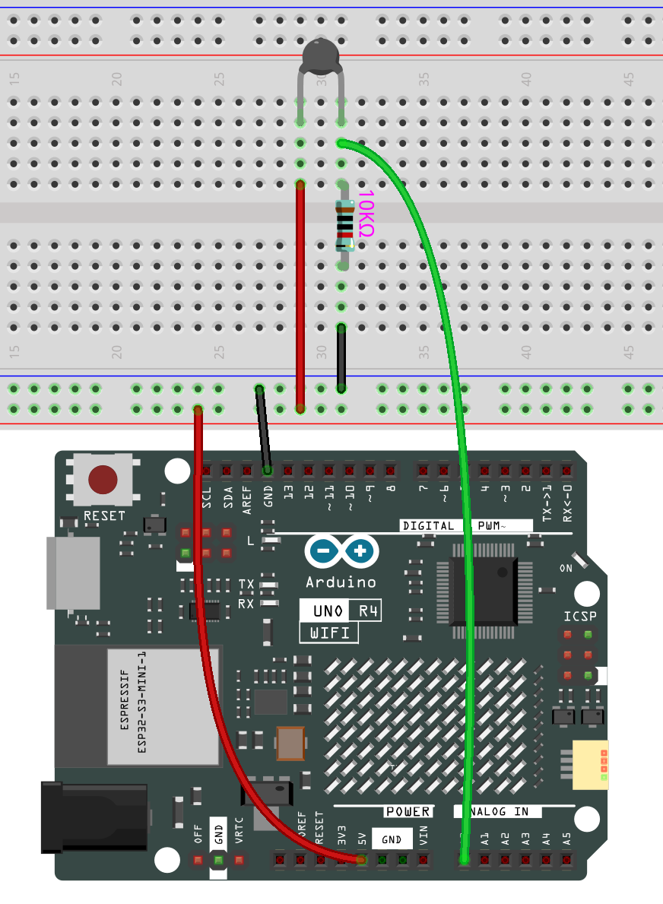
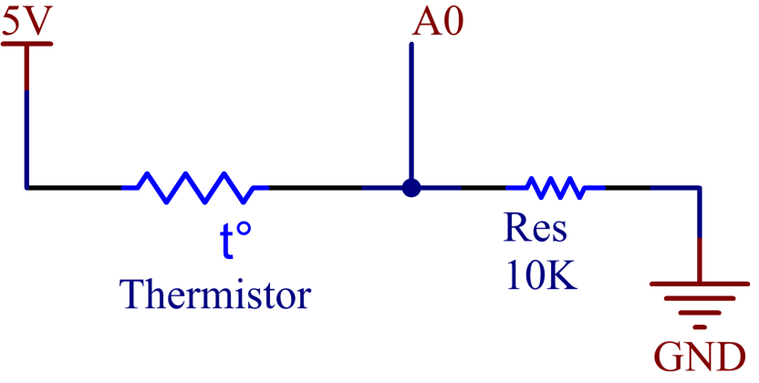

.. _basic_thermistor:

热敏电阻
==========================

.. https://docs.sunfounder.com/projects/vincent-kit/en/latest/arduino/2.27_thermistor.html#ar-thermistor

概述
-------------

在本课中，您将学习如何使用热敏电阻。热敏电阻可用作仪器电路温度补偿的电子电路元件，应用于电流表、流量计、气体分析仪等设备中。它还可用于过热保护、无触点继电器、恒温、自动增益控制、电机启动、延时、彩电自动消磁、火灾报警和温度补偿等。

所需元件
-------------------------

本项目中，我们需要以下元件。

购买整套套件会更加方便，以下是链接：

.. list-table::
    :widths: 20 20 20
    :header-rows: 1

    *   - 名称
        - 套件所含项目
        - 链接
    *   - Elite Explorer 套件
        - 300+
        - |link_Elite_Explorer_kit|

您也可以从以下链接单独购买。

.. list-table::
    :widths: 30 20
    :header-rows: 1

    *   - 元件介绍
        - 购买链接

    *   - :ref:`uno_r4_wifi`
        - \-
    *   - :ref:`cpn_breadboard`
        - |link_breadboard_buy|
    *   - :ref:`cpn_wires`
        - |link_wires_buy|
    *   - :ref:`cpn_resistor`
        - |link_resistor_buy|
    *   - :ref:`cpn_thermistor`
        - |link_thermistor_buy|

接线
----------------------

在本示例中，我们使用模拟引脚A0获取热敏电阻的值。热敏电阻的一个引脚连接到5V，另一个引脚连接到A0。同时，另一个引脚在连接到GND之前串联一个10kΩ电阻。

原理图
-----------------------

代码
-----------

.. note::

    * 您可以直接打开路径 ``elite-explorer-kit-main\basic_project\02-thermistor`` 下的 ``02-thermistor.ino`` 文件。
    * 或者将以下代码复制到 Arduino IDE 中。

.. literalinclude:: /_code/02_basic_thermistor.ino
   :language: cpp
   :linenos:
   :caption: 02-thermistor.ino

将代码上传到 Uno R4 板后，您可以打开串口监视器查看当前温度。

开尔文温度使用公式 **T\ K\ =1/(ln(R\ T/R\ N)/B+1/T\ N)** 计算。该方程源自 |link_steinhart_hart| 并简化了计算。您还可以在 :ref:`cpn_thermistor` 的详细介绍页面上找到有关此公式的更多信息。
