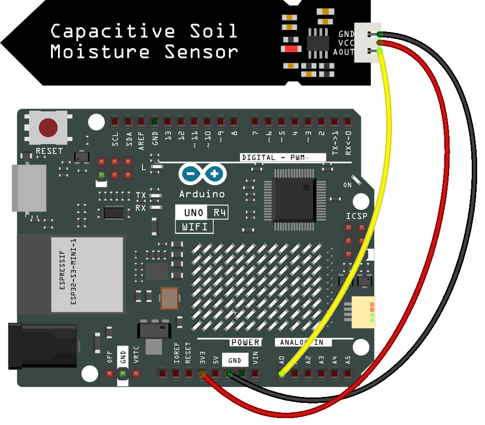

.. note::

    ¡Hola, bienvenido a la Comunidad de Entusiastas de SunFounder Raspberry Pi, Arduino y ESP32 en Facebook! Sumérgete más profundamente en Raspberry Pi, Arduino y ESP32 con otros entusiastas.

    **¿Por qué unirse?**

    - **Soporte experto**: Resuelve problemas postventa y desafíos técnicos con la ayuda de nuestra comunidad y equipo.
    - **Aprende y comparte**: Intercambia consejos y tutoriales para mejorar tus habilidades.
    - **Avances exclusivos**: Obtén acceso anticipado a nuevos anuncios de productos y adelantos.
    - **Descuentos especiales**: Disfruta de descuentos exclusivos en nuestros productos más nuevos.
    - **Promociones festivas y sorteos**: Participa en sorteos y promociones de temporada.

    👉 ¿Listo para explorar y crear con nosotros? Haz clic en [|link_sf_facebook|] y únete hoy mismo!

.. _basic_moisture:

Humedad del Suelo
=============================

.. https://docs.sunfounder.com/projects/3in1-kit-r4/en/latest/basic_project/ar_moisture.html

Descripción general
--------------------------

En la industria agrícola, los cultivos no pueden adquirir directamente elementos inorgánicos del suelo. En su lugar, el agua presente en el suelo actúa como un solvente para disolver estos elementos.

Los cultivos absorben la humedad del suelo a través de su sistema radicular para obtener nutrientes y facilitar el crecimiento.

Durante el crecimiento y desarrollo de los cultivos, hay diferentes requisitos para la temperatura del suelo. Por lo tanto, es necesario usar un sensor de humedad del suelo.

Componentes necesarios
-------------------------

En este proyecto, necesitamos los siguientes componentes.

Es definitivamente conveniente comprar un kit completo, aquí está el enlace:

.. list-table::
    :widths: 20 20 20
    :header-rows: 1

    *   - Nombre	
        - ELEMENTOS EN ESTE KIT
        - ENLACE
    *   - Elite Explorer Kit
        - 300+
        - |link_Elite_Explorer_kit|

También puedes comprarlos por separado desde los enlaces a continuación.

.. list-table::
    :widths: 30 20
    :header-rows: 1

    *   - INTRODUCCIÓN DEL COMPONENTE
        - ENLACE DE COMPRA

    *   - :ref:`uno_r4_wifi`
        - \-
    *   - :ref:`cpn_breadboard`
        - |link_breadboard_buy|
    *   - :ref:`cpn_wires`
        - |link_wires_buy|
    *   - :ref:`cpn_soil_moisture`
        - |link_soil_moisture_buy|

Cableado
----------------------

Diagrama esquemático
-----------------------

.. image:: img/03_moisture_schematic.webp
    :align: center
    :width: 70%

Código
---------------

.. note::

    * Abre el archivo ``03-moisture.ino`` en la ruta ``elite-explorer-kit-main\basic_project\03-moisture``.
    * O copia este código en **Arduino IDE**.
    
.. raw:: html

    <iframe src=https://create.arduino.cc/editor/sunfounder01/c585dd77-2e8a-4839-a908-d22e1d6e93aa/preview?embed style="height:510px;width:100%;margin:10px 0" frameborder=0></iframe>
    
Una vez que el código se haya subido correctamente, el monitor serial imprimirá el valor de la humedad del suelo.

Al insertar el módulo en el suelo y regarlo, el valor del sensor de humedad del suelo se reducirá.
