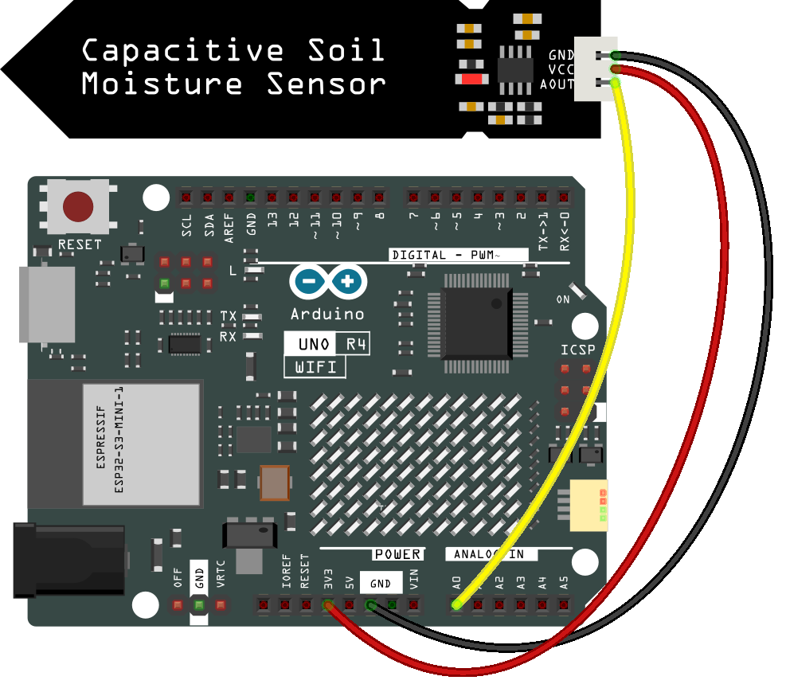
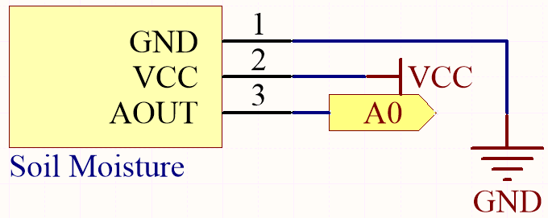

.. _basic_moisture:

土壤湿度传感器
==========================

.. https://docs.sunfounder.com/projects/3in1-kit-r4/en/latest/basic_project/ar_moisture.html

概述
---------------

在农业中，作物无法直接从土壤中获取无机元素，而是通过土壤中的水分作为溶剂来溶解这些元素。

作物通过根系从土壤中吸收水分，以获取养分并促进生长。

在作物的生长发育过程中，对土壤温度有不同的要求。因此，需要使用土壤湿度传感器。

所需元件
-------------------------

本项目中，我们需要以下元件。

购买整套套件会更加方便，以下是链接：

.. list-table::
    :widths: 20 20 20
    :header-rows: 1

    *   - 名称
        - 套件所含项目
        - 链接
    *   - Elite Explorer 套件
        - 300+
        - |link_Elite_Explorer_kit|

您也可以从以下链接单独购买。

.. list-table::
    :widths: 30 20
    :header-rows: 1

    *   - 元件介绍
        - 购买链接

    *   - :ref:`uno_r4_wifi`
        - \-
    *   - :ref:`cpn_breadboard`
        - |link_breadboard_buy|
    *   - :ref:`cpn_wires`
        - |link_wires_buy|
    *   - :ref:`cpn_soil_moisture`
        - |link_soil_moisture_buy|

接线
----------------------

原理图
-----------------------

代码
---------------

.. note::

    * 打开路径 ``elite-explorer-kit-main\basic_project\03-moisture`` 下的 ``03-moisture.ino`` 文件。
    * 或者将以下代码复制到 **Arduino IDE** 中。

.. raw:: html

    <iframe src=https://create.arduino.cc/editor/sunfounder01/c585dd77-2e8a-4839-a908-d22e1d6e93aa/preview?embed style="height:510px;width:100%;margin:10px 0" frameborder=0></iframe>

代码成功上传后，串口监视器将打印出土壤湿度值。

将模块插入土壤并浇水后，土壤湿度传感器的数值会变小。
