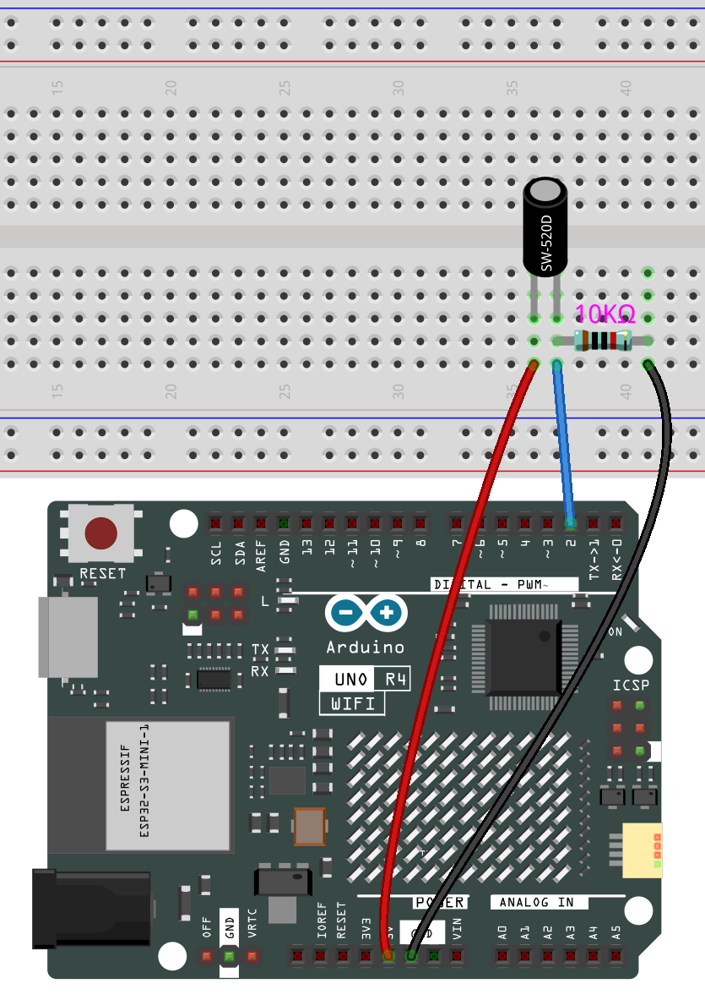

.. _basic_tilt_switch:

チルトスイッチ
==========================

.. https://docs.sunfounder.com/projects/vincent-kit/en/latest/arduino/2.17_tilt_switch.html#ar-tilt

概要
---------------

このレッスンでは、チルトスイッチについて学びます。チルトスイッチは、物体が傾いているかどうかを検出するために使用でき、実用的な応用で大きな価値があります。橋や建物、送電線タワーの傾斜を判断するために使用され、メンテナンス作業を行う上で重要な指針となります。

必要なコンポーネント
-------------------------

このプロジェクトでは、以下のコンポーネントが必要です。

全てのキットを一式購入するのが便利です。こちらがリンクです：

.. list-table::
    :widths: 20 20 20
    :header-rows: 1

    *   - 名称	
        - このキットのアイテム数
        - リンク
    *   - Elite Explorer Kit
        - 300+
        - |link_Elite_Explorer_kit|

下記のリンクから個別に購入することもできます。

.. list-table::
    :widths: 30 20
    :header-rows: 1

    *   - コンポーネント紹介
        - 購入リンク

    *   - :ref:`uno_r4_wifi`
        - \-
    *   - :ref:`cpn_breadboard`
        - |link_breadboard_buy|
    *   - :ref:`cpn_wires`
        - |link_wires_buy|
    *   - :ref:`cpn_resistor`
        - |link_resistor_buy|
    *   - :ref:`cpn_tilt_switch`
        - \-

配線図
---------------------

この例では、デジタルピン2を使用してチルトスイッチのシグナルを読み取ります。

回路図
-----------------------

.. image:: img/04_tilt_switch_schematic.png
   :align: center
   :width: 70%

コード
----------

.. note::

    * ``elite-explorer-kit-main\basic_project\04-tilt_switch`` のパスの下にある ``04-tilt_switch.ino`` ファイルを直接開く。
    * または、このコードをArduino IDEにコピーします。

.. raw:: html

    <iframe src=https://create.arduino.cc/editor/sunfounder01/d85d75d9-e491-424c-93be-95e1f4e99549/preview?embed style="height:510px;width:100%;margin:10px 0" frameborder=0></iframe>

コードがuno r4ボードにアップロードされると、シリアルモニターを開いてピンの読み取りを表示できます。チルトスイッチが垂直位置にある場合（内部の金属ボールがワイヤーピンに接触している場合）や傾斜している場合に応じて、「1」または「0」が表示されます。
