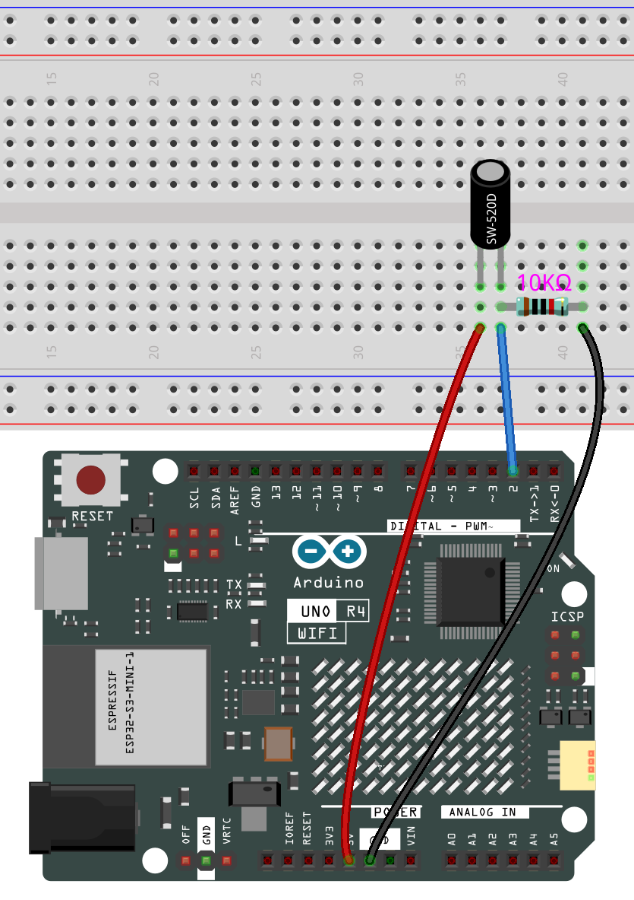

.. _basic_tilt_switch:

倾斜开关
==========================

.. https://docs.sunfounder.com/projects/vincent-kit/en/latest/arduino/2.17_tilt_switch.html#ar-tilt

概述
---------------

在本课中，您将了解倾斜开关。倾斜开关可用于检测物体是否倾斜，这在实际应用中具有重要价值。它可用于判断桥梁、建筑物、输电线路塔等的倾斜情况，因此对开展维护工作具有重要的指导作用。

所需元件
-------------------------

本项目中，我们需要以下元件。

购买整套套件会更加方便，以下是链接：

.. list-table::
    :widths: 20 20 20
    :header-rows: 1

    *   - 名称
        - 套件所含项目
        - 链接
    *   - Elite Explorer 套件
        - 300+
        - |link_Elite_Explorer_kit|

您也可以从以下链接单独购买。

.. list-table::
    :widths: 30 20
    :header-rows: 1

    *   - 名称
        - 购买链接

    *   - :ref:`uno_r4_wifi`
        - \-
    *   - :ref:`cpn_breadboard`
        - |link_breadboard_buy|
    *   - :ref:`cpn_wires`
        - |link_wires_buy|
    *   - :ref:`cpn_resistor`
        - |link_resistor_buy|
    *   - :ref:`cpn_tilt_switch`
        - \-

Fritzing 电路图
---------------------

在本示例中，数字引脚2用于读取倾斜开关的信号。

原理图
-----------------------

代码
----------

.. note::

    * 您可以直接打开路径 ``elite-explorer-kit-main\basic_project\04-tilt_switch`` 下的 ``04-tilt_switch.ino`` 文件。
    * 或者将以下代码复制到 Arduino IDE 中。

.. literalinclude:: /_code/04_basic_tilt_switch.ino
   :language: cpp
   :linenos:
   :caption: 04-tilt_switch.ino

将代码上传到 Uno R4 板后，您可以打开串口监视器查看引脚读数。读数将显示"1"或"0"，具体取决于倾斜开关是处于垂直位置（内部金属球与线引脚接触）还是倾斜位置。
