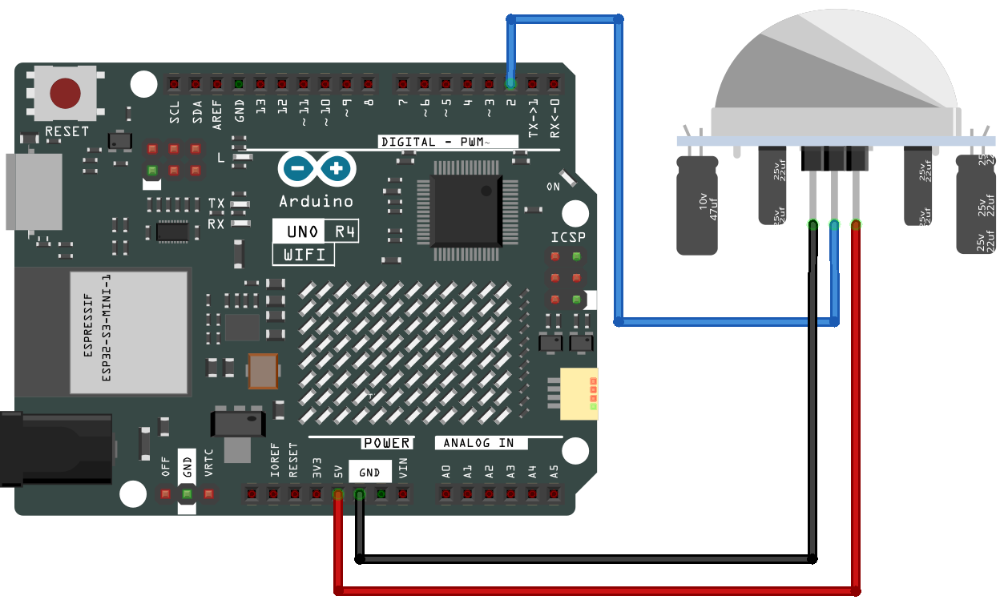

.. note::

    Hallo und willkommen in der SunFounder Raspberry Pi & Arduino & ESP32 Enthusiasten-Gemeinschaft auf Facebook! Tauchen Sie tiefer ein in die Welt von Raspberry Pi, Arduino und ESP32 mit anderen Enthusiasten.

    **Warum beitreten?**

    - **Expertenunterstützung**: Lösen Sie Nachverkaufsprobleme und technische Herausforderungen mit Hilfe unserer Gemeinschaft und unseres Teams.
    - **Lernen & Teilen**: Tauschen Sie Tipps und Anleitungen aus, um Ihre Fähigkeiten zu verbessern.
    - **Exklusive Vorschauen**: Erhalten Sie frühzeitigen Zugang zu neuen Produktankündigungen und exklusiven Einblicken.
    - **Spezialrabatte**: Genießen Sie exklusive Rabatte auf unsere neuesten Produkte.
    - **Festliche Aktionen und Gewinnspiele**: Nehmen Sie an Gewinnspielen und Feiertagsaktionen teil.

    👉 Sind Sie bereit, mit uns zu erkunden und zu erschaffen? Klicken Sie auf [|link_sf_facebook|] und treten Sie heute bei!

.. _basic_pir:

PIR-Bewegungssensormodul
==========================

.. https://docs.sunfounder.com/projects/kepler-kit/en/latest/cproject/ar_pir.html#ar-pir

Übersicht
---------------

In dieser Lektion erfahren Sie mehr über das PIR-Bewegungssensormodul. Der passive Infrarot(PIR)-Bewegungssensor ist ein Sensor, der Bewegungen erkennt. Er wird häufig in Sicherheitssystemen und automatischen Beleuchtungssystemen eingesetzt. Der Sensor hat zwei Schlitze, die Infrarotstrahlung detektieren. Wenn ein Objekt, wie eine Person, vor dem Sensor vorbeigeht, erkennt er eine Veränderung in der Menge der Infrarotstrahlung und löst ein Ausgangssignal aus.

Benötigte Komponenten
-------------------------

Für dieses Projekt benötigen wir die folgenden Komponenten.

Es ist definitiv praktisch, ein komplettes Kit zu kaufen, hier ist der Link:

.. list-table::
    :widths: 20 20 20
    :header-rows: 1

    *   - Name
        - ARTIKEL IN DIESEM KIT
        - LINK
    *   - Elite Explorer Kit
        - 300+
        - |link_Elite_Explorer_kit|

Sie können die Komponenten auch separat über die untenstehenden Links kaufen.

.. list-table::
    :widths: 30 20
    :header-rows: 1

    *   - KOMPONENTENBESCHREIBUNG
        - KAUF-LINK

    *   - :ref:`uno_r4_wifi`
        - \-
    *   - :ref:`cpn_breadboard`
        - |link_breadboard_buy|
    *   - :ref:`cpn_wires`
        - |link_wires_buy|
    *   - :ref:`cpn_pir`
        - |link_pir_buy|

Verdrahtung
----------------------

Schaltplan
-----------------------

.. image:: img/05-pir_schematic.png
   :align: center
   :width: 50%

Code
---------------

.. note::

    * Sie können die Datei ``05-pir_motion_sensor.ino`` direkt unter dem Pfad ``elite-explorer-kit-main\basic_project\05-pir_motion_sensor`` öffnen.
    * Oder kopieren Sie diesen Code in die Arduino IDE.

.. raw:: html

    <iframe src=https://create.arduino.cc/editor/sunfounder01/d9fc9198-1538-413d-b501-2cddc8d7cfe6/preview?embed style="height:510px;width:100%;margin:10px 0" frameborder=0></iframe>

Nachdem der Code auf das Arduino Uno-Board hochgeladen wurde, können Sie den seriellen Monitor öffnen, um die Ausgabe des Sensors zu beobachten. Wenn der PIR-Bewegungssensor eine Bewegung erkennt, zeigt der serielle Monitor die Nachricht „Somebody here!“ an, um anzuzeigen, dass eine Bewegung erkannt wurde. Wird keine Bewegung erkannt, wird stattdessen die Nachricht „Monitoring...“ angezeigt.

Der PIR-Sensor gibt ein digitales HIGH- oder LOW-Signal aus, je nachdem, ob Bewegung erkannt oder nicht erkannt wird. Im Gegensatz zu einem analogen Sensor, der eine Reihe von Werten liefert, ist der digitale Ausgang dieses PIR-Sensors entweder HIGH (typischerweise als „1“ dargestellt) oder LOW (typischerweise als „0“ dargestellt).

Beachten Sie, dass die tatsächliche Empfindlichkeit und der Erfassungsbereich je nach den Eigenschaften des PIR-Sensors und den Umgebungsbedingungen variieren können. Daher ist es ratsam, den Sensor entsprechend Ihren spezifischen Bedürfnissen zu kalibrieren.
