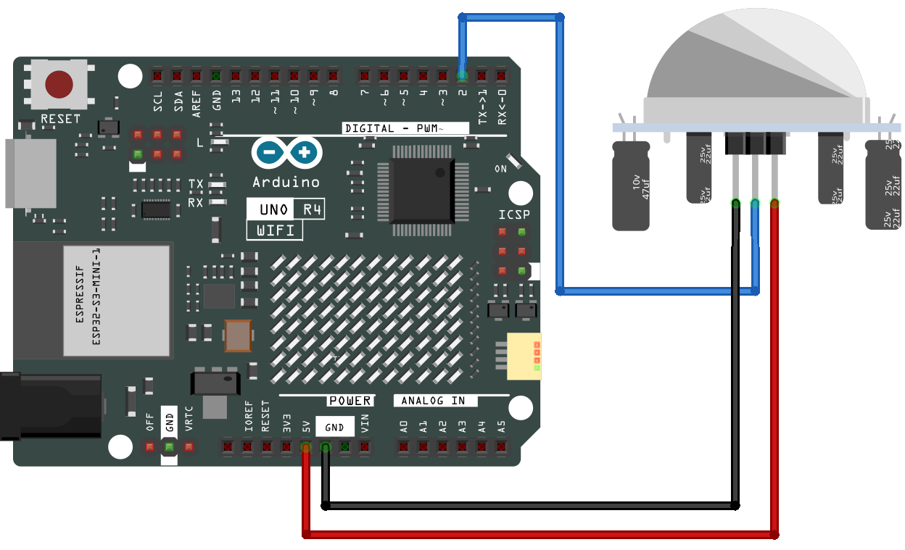

.. _basic_pir:

PIR 人体运动传感器模块
==========================

.. https://docs.sunfounder.com/projects/kepler-kit/en/latest/cproject/ar_pir.html#ar-pir

概述
---------------

在本课中，您将了解 PIR 人体运动传感器模块。被动红外（PIR）运动传感器是一种检测运动的传感器。它常用于安防系统和自动照明系统。该传感器有两个槽，用于检测红外辐射。当一个物体（例如人）经过传感器前方时，它会检测到红外辐射量的变化并触发输出信号。

所需元件
-------------------------

本项目中，我们需要以下元件。

购买整套套件会更加方便，以下是链接：

.. list-table::
    :widths: 20 20 20
    :header-rows: 1

    *   - 名称
        - 套件所含项目
        - 链接
    *   - Elite Explorer 套件
        - 300+
        - |link_Elite_Explorer_kit|

您也可以从以下链接单独购买。

.. list-table::
    :widths: 30 20
    :header-rows: 1

    *   - 元件介绍
        - 购买链接

    *   - :ref:`uno_r4_wifi`
        - \-
    *   - :ref:`cpn_breadboard`
        - |link_breadboard_buy|
    *   - :ref:`cpn_wires`
        - |link_wires_buy|
    *   - :ref:`cpn_pir`
        - |link_pir_buy|

接线
----------------------

原理图
-----------------------

.. image:: img/05-pir_schematic.png
   :align: center
   :width: 50%

代码
---------------

.. note::

    * 您可以直接打开路径 ``elite-explorer-kit-main\basic_project\05-pir_motion_sensor`` 下的 ``05-pir_motion_sensor.ino`` 文件。
    * 或者将以下代码复制到 Arduino IDE 中。

.. literalinclude:: /_code/05_basic_pir.ino
   :language: cpp
   :linenos:
   :caption: 05-pir_motion_sensor.ino

将代码上传到 Arduino Uno 板后，您可以打开串口监视器观察传感器输出。当 PIR（被动红外）运动传感器检测到移动时，串口监视器将显示消息 "Somebody here!" 以表示检测到运动。如果未检测到运动，则会显示消息 "Monitoring..."。

PIR 传感器输出数字 HIGH 或 LOW 信号，分别对应检测到或未检测到运动。与提供一系列数值的模拟传感器不同，此 PIR 传感器的数字输出要么是 HIGH（通常表示为'1'），要么是 LOW（通常表示为'0'）。

请注意，实际的检测灵敏度和范围可能因 PIR 传感器的特性和环境条件而异。因此，建议根据您的具体需求校准传感器。
