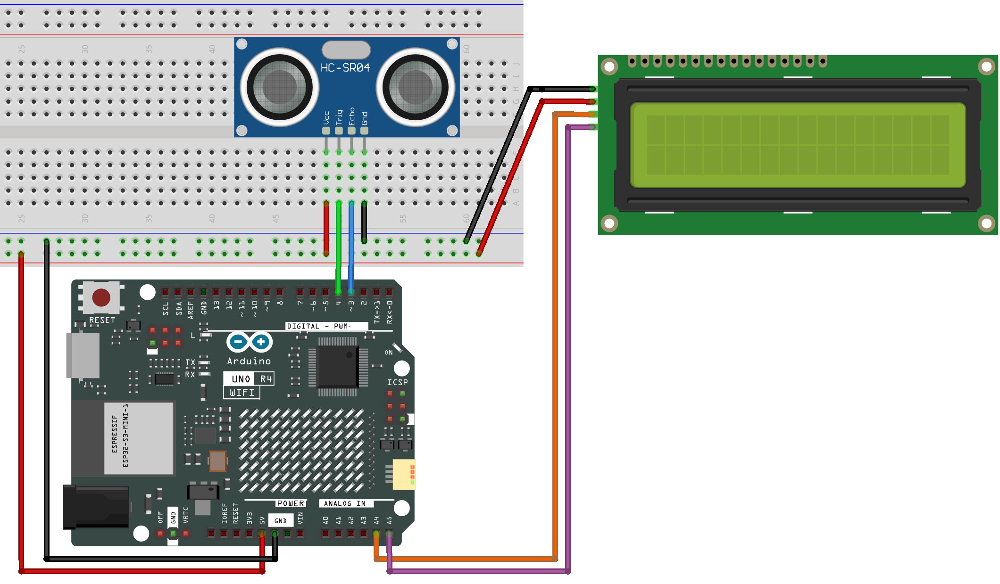

.. _basic_ultrasonic_sensor:

Ultraschall
==========================

Überblick
--------------------

Wenn Sie rückwärts fahren, sehen Sie die Entfernung zwischen dem Auto und den umliegenden Hindernissen, um eine Kollision zu vermeiden. Das Gerät zur Entfernungserkennung ist ein Ultraschallsensor. In diesem Experiment lernen Sie, wie die Ultraschallwelle die Entfernung erkennt.

Benötigte Komponenten
-------------------------

Für dieses Projekt benötigen wir die folgenden Komponenten.

Es ist definitiv praktisch, ein komplettes Kit zu kaufen, hier ist der Link:

.. list-table::
    :widths: 20 20 20
    :header-rows: 1

    *   - Name
        - ARTIKEL IN DIESEM KIT
        - LINK
    *   - Elite Explorer Kit
        - 300+
        - |link_Elite_Explorer_kit|

Sie können die Komponenten auch separat über die untenstehenden Links kaufen.

.. list-table::
    :widths: 30 20
    :header-rows: 1

    *   - KOMPONENTENBESCHREIBUNG
        - KAUF-LINK

    *   - :ref:`uno_r4_wifi`
        - \-
    *   - :ref:`cpn_breadboard`
        - |link_breadboard_buy|
    *   - :ref:`cpn_wires`
        - |link_wires_buy|
    *   - :ref:`cpn_ultrasonic`
        - |link_ultrasonic_buy|
    *   - :ref:`cpn_i2c_lcd1602`
        - |link_i2clcd1602_buy|

Verdrahtung
----------------------

.. raw:: html

     

Schaltplan
-----------------------

.. image:: img/06_ultrasonic_schematic.png
    :align: center
    :width: 100%

Code
--------

.. note::

    * Sie können die Datei ``06-ultrasonic.ino`` direkt unter dem Pfad ``elite-explorer-kit-main\basic_project\06-ultrasonic`` öffnen.
    * Oder kopieren Sie diesen Code in die Arduino IDE.

.. raw:: html

   <iframe src=https://create.arduino.cc/editor/sunfounder01/1897efb6-fa3c-4ebc-8993-6561b24848a9/preview?embed style="height:510px;width:100%;margin:10px 0" frameborder=0></iframe>
    
.. raw:: html

   <video loop autoplay muted style = "max-width:100%">
      <source src="../_static/videos/basic_projects/06_basic_ultrasonic_sensor.mp4"  type="video/mp4">
      Ihr Browser unterstützt das Video-Tag nicht.
   </video>

Code-Analyse
------------------------

**1. Initialisieren des Ultraschallsensors und des LCD1602**

    .. code-block:: arduino
    
       #include <LiquidCrystal_I2C.h>
       
       LiquidCrystal_I2C lcd(0x27, 16, 2);  // initialize the Liquid Crystal Display object with the I2C address 0x27, 16 columns and 2 rows
       
       // Define the pin numbers for the ultrasonic sensor
       const int echoPin = 3;
       const int trigPin = 4;
       
       void setup() {
         pinMode(echoPin, INPUT);               // Set echo pin as input
         pinMode(trigPin, OUTPUT);              // Set trig pin as output
       
         lcd.init();       // initialize the LCD
         lcd.clear();      // clear the LCD display
         lcd.backlight();  // Make sure backlight is on
       
       }

**2. Anzeige der Entfernung auf dem LCD1602**

    .. code-block:: arduino
    
       void loop() {
         float distance = readDistance();  // Call the function to read the sensor data and get the distance
       
         lcd.setCursor(0, 0);         //Place the cursor at Line 1, Column 1. From here the characters are to be displayed
         lcd.print("Distance:");      ////Print Distance: on the LCD
         lcd.setCursor(0, 1);         //Set the cursor at Line 1, Column 0
         lcd.print("               ");  //Here is to leave some spaces after the characters so as to clear the previous characters that may still remain.
         lcd.setCursor(7, 1);         //Set the cursor at Line 1, Column 7.
         lcd.print(distance);         // print on the LCD the value of the distance converted from the time between ping sending and receiving.
         lcd.setCursor(14, 1);        //Set the cursor at Line 1, Column 14.
         lcd.print("cm");             //print the unit "cm"
       
         delay(800);                       // Delay for 800 milliseconds before repeating the loop
       }

**3. Umrechnung der Zeit in Entfernung**

    .. code-block:: arduino

        float readDistance(){// ...}

    Hier bezieht sich „PING“ auf den Prozess, bei dem der Ultraschallsensor einen Ultraschallimpuls (oder „Ping“) aussendet und dann auf sein Echo wartet.
    
    PING wird durch einen HIGH-Puls von 2 oder mehr Mikrosekunden ausgelöst. (Vorher einen kurzen LOW-Puls geben, um einen sauberen HIGH-Puls zu gewährleisten.)

    .. code-block:: arduino

        digitalWrite(trigPin, LOW); 
        delayMicroseconds(2);
        digitalWrite(trigPin, HIGH); 
        delayMicroseconds(10);
        digitalWrite(trigPin, LOW); 

    Der Echo-Pin wird verwendet, um das Signal von PING zu lesen, einen HIGH-Puls, dessen Dauer die Zeit (in Mikrosekunden) vom Senden des Pings bis zum Empfang des Echos des Objekts ist. Wir verwenden die folgende Funktion, um die Dauer zu erhalten.

    .. code-block:: arduino

        pulseIn(echoPin, HIGH);

    Die Schallgeschwindigkeit beträgt 340 m/s oder 29 Mikrosekunden pro Zentimeter.

    Dies gibt die vom Ping zurückgelegte Strecke, hin und zurück, an, daher teilen wir durch 2, um die Entfernung des Hindernisses zu erhalten.

    .. code-block:: arduino

        float distance = pulseIn(echoPin, HIGH) / 29.00 / 2;     // Formula: (340m/s * 1us) / 2
