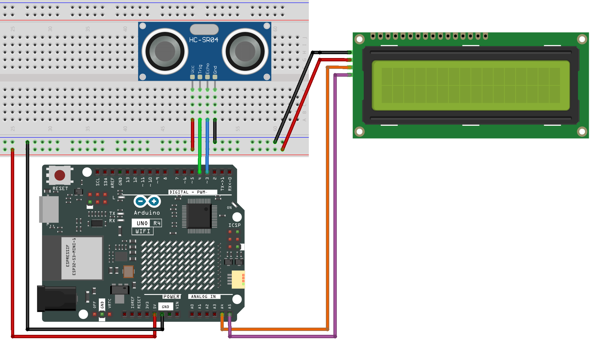
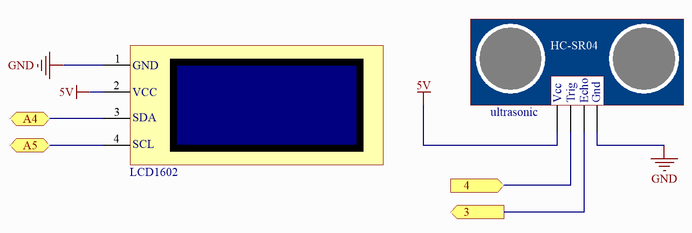

.. note::

    Bonjour et bienvenue dans la communauté SunFounder Raspberry Pi & Arduino & ESP32 Enthusiasts sur Facebook ! Plongez plus profondément dans l'univers de Raspberry Pi, Arduino et ESP32 avec d'autres passionnés.

    **Pourquoi nous rejoindre ?**

    - **Support d'experts** : Résolvez les problèmes post-vente et les défis techniques grâce à l'aide de notre communauté et de notre équipe.
    - **Apprendre et partager** : Échangez des conseils et des tutoriels pour améliorer vos compétences.
    - **Aperçus exclusifs** : Accédez en avant-première aux nouvelles annonces de produits et aux avant-goûts.
    - **Réductions spéciales** : Profitez de réductions exclusives sur nos derniers produits.
    - **Promotions festives et concours** : Participez à des concours et promotions de fêtes.

    👉 Prêt à explorer et à créer avec nous ? Cliquez sur [|link_sf_facebook|] et rejoignez-nous dès aujourd'hui !

.. _basic_ultrasonic_sensor:

Ultrason
==========================

Aperçu
--------------------

Lorsque vous reculez, vous voyez la distance entre la voiture et les obstacles environnants pour éviter les collisions. L'appareil qui détecte la distance est un capteur à ultrasons. Dans cette expérience, vous apprendrez comment l'onde ultrasonore détecte la distance.

Composants nécessaires
-------------------------

Dans ce projet, nous avons besoin des composants suivants.

Il est certainement pratique d'acheter un kit complet, voici le lien :

.. list-table::
    :widths: 20 20 20
    :header-rows: 1

    *   - Nom
        - ARTICLES DANS CE KIT
        - LIEN
    *   - Elite Explorer Kit
        - 300+
        - |link_Elite_Explorer_kit|

Vous pouvez également les acheter séparément à partir des liens ci-dessous.

.. list-table::
    :widths: 30 20
    :header-rows: 1

    *   - INTRODUCTION DES COMPOSANTS
        - LIEN D'ACHAT

    *   - :ref:`uno_r4_wifi`
        - \-
    *   - :ref:`cpn_breadboard`
        - |link_breadboard_buy|
    *   - :ref:`cpn_wires`
        - |link_wires_buy|
    *   - :ref:`cpn_ultrasonic`
        - |link_ultrasonic_buy|
    *   - :ref:`cpn_i2c_lcd1602`
        - |link_i2clcd1602_buy|

Câblage
----------------------

.. raw:: html

     

Schéma
-----------------------

Code
--------

.. note::

    * Vous pouvez ouvrir le fichier ``06-ultrasonic.ino`` sous le chemin ``elite-explorer-kit-main\basic_project\06-ultrasonic`` directement.
    * Ou copiez ce code dans l'IDE Arduino.

.. literalinclude:: /_code/06_basic_ultrasonic_sensor.ino
   :language: cpp
   :linenos:
   :caption: 06-ultrasonic.ino
    
.. raw:: html

   <video loop autoplay muted style = "max-width:100%">
      <source src="../_static/videos/basic_projects/06_basic_ultrasonic_sensor.mp4"  type="video/mp4">
      Your browser does not support the video tag.
   </video>
   
Analyse du code
------------------------

**1. Initialisation du capteur ultrasonique et de l'écran LCD1602**

    .. code-block:: arduino
    
       #include <LiquidCrystal_I2C.h>
       
       LiquidCrystal_I2C lcd(0x27, 16, 2);  // initialiser l'objet écran LCD avec l'adresse I2C 0x27, 16 colonnes et 2 rangées
       
       // Définir les numéros de broches pour le capteur ultrasonique
       const int echoPin = 3;
       const int trigPin = 4;
       
       void setup() {
         pinMode(echoPin, INPUT);               // Définir la broche echo en tant qu'entrée
         pinMode(trigPin, OUTPUT);              // Définir la broche trig en tant que sortie
       
         lcd.init();       // initialiser l'écran LCD
         lcd.clear();      // effacer l'écran LCD
         lcd.backlight();  // Assurer que le rétroéclairage est activé
       
       }

**2. Afficher la distance sur l'écran LCD1602**

    .. code-block:: arduino
    
       void loop() {
         float distance = readDistance();  // Appeler la fonction pour lire les données du capteur et obtenir la distance
       
         lcd.setCursor(0, 0);         // Placer le curseur à la ligne 1, colonne 1. C'est ici que les caractères seront affichés
         lcd.print("Distance:");      // Afficher "Distance:" sur l'écran LCD
         lcd.setCursor(0, 1);         // Placer le curseur à la ligne 1, colonne 0
         lcd.print("               ");  // Ajouter des espaces après les caractères pour effacer les précédents qui pourraient encore rester
         lcd.setCursor(7, 1);         // Placer le curseur à la ligne 1, colonne 7
         lcd.print(distance);         // Afficher sur l'écran LCD la valeur de la distance convertie depuis le temps entre l'envoi et la réception du ping
         lcd.setCursor(14, 1);        // Placer le curseur à la ligne 1, colonne 14
         lcd.print("cm");             // Afficher l'unité "cm"
       
         delay(800);                  // Attendre 800 millisecondes avant de répéter la boucle
       }

**3. Conversion du temps en distance**

    .. code-block:: arduino

        float readDistance(){// ...}

    Ici, "PING" fait référence au processus où le capteur ultrasonique envoie une impulsion ultrasonique (ou "ping") et attend ensuite son écho.
    
    Le PING est déclenché par une impulsion HIGH de 2 microsecondes ou plus. (Donner une courte impulsion LOW avant pour assurer une impulsion HIGH propre.)

    .. code-block:: arduino

        digitalWrite(trigPin, LOW); 
        delayMicroseconds(2);
        digitalWrite(trigPin, HIGH); 
        delayMicroseconds(10);
        digitalWrite(trigPin, LOW); 

    La broche echo est utilisée pour lire le signal du PING, une impulsion HIGH dont la durée est le temps (en microsecondes) entre l'envoi du ping et la réception de l'écho de l'objet. Nous utilisons la fonction suivante pour obtenir la durée.

    .. code-block:: arduino

        pulseIn(echoPin, HIGH);

    La vitesse du son est de 340 m/s ou 29 microsecondes par centimètre.

    Cela donne la distance parcourue par le ping, aller-retour, donc nous divisons par 2 pour obtenir la distance de l'obstacle.

    .. code-block:: arduino

        float distance = pulseIn(echoPin, HIGH) / 29.00 / 2;     // Formule : (340m/s * 1us) / 2
