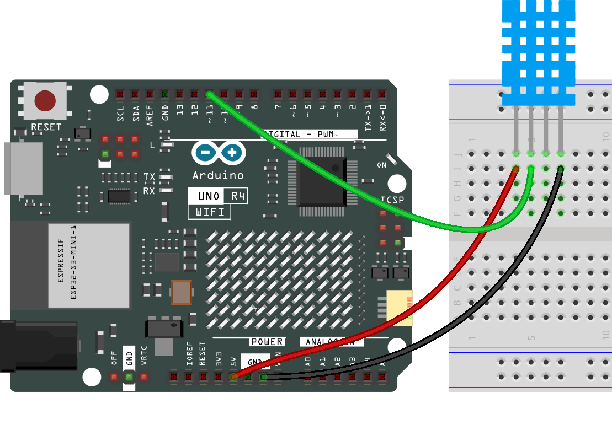

.. note::

    こんにちは、SunFounderのRaspberry Pi & Arduino & ESP32愛好家コミュニティへようこそ！Facebook上でRaspberry Pi、Arduino、ESP32についてもっと深く掘り下げ、他の愛好家と交流しましょう。

    **参加する理由は？**

    - **エキスパートサポート**：コミュニティやチームの助けを借りて、販売後の問題や技術的な課題を解決します。
    - **学び＆共有**：ヒントやチュートリアルを交換してスキルを向上させましょう。
    - **独占的なプレビュー**：新製品の発表や先行プレビューに早期アクセスしましょう。
    - **特別割引**：最新製品の独占割引をお楽しみください。
    - **祭りのプロモーションとギフト**：ギフトや祝日のプロモーションに参加しましょう。

    👉 私たちと一緒に探索し、創造する準備はできていますか？[|link_sf_facebook|]をクリックして今すぐ参加しましょう！

.. _basic_humiture_sensor:

湿度・温度センサーモジュール
=============================

.. https://docs.sunfounder.com/projects/3in1-kit/en/latest/basic_project/ar_dht11.html#ar-dht11

概要
---------------

このレッスンでは、湿度・温度センサーモジュールについて学びます。湿度と温度は、物理的な量から実際の人々の生活に至るまで密接に関連しています。
人間の環境の温度と湿度は、人体の体温調節機能と熱伝達効果に直接影響を与えます。
それはさらに、思考活動と精神状態に影響を与え、私たちの学習や仕事の効率に影響を及ぼします。

温度は国際単位系における7つの基本物理量の一つで、物体の熱さや冷たさを測るために使用されます。
摂氏は、世界でより広く使用されている温度スケールの一つで、「℃」の記号で表されます。

湿度は、空気中に存在する水蒸気の濃度です。
日常生活では、空気の相対湿度が一般的に使用され、%RHで表されます。相対湿度は温度と密接に関連しています。
一定体積の密閉されたガスにおいて、温度が高いほど相対湿度は低く、温度が低いほど相対湿度は高くなります。

このキットには、デジタル温度・湿度センサーであるdht11が提供されています。これは、周囲の空気を測定するために、容量性湿度センサーとサーミスターを使用し、データピンにデジタル信号を出力します。

必要なコンポーネント
-------------------------

このプロジェクトでは、以下のコンポーネントが必要です。

全体のキットを購入すると便利です。以下がリンクです:

.. list-table::
    :widths: 20 20 20
    :header-rows: 1

    *   - 名称	
        - このキットのアイテム数
        - リンク
    *   - Elite Explorer Kit
        - 300+
        - |link_Elite_Explorer_kit|

以下のリンクから個別に購入することもできます。

.. list-table::
    :widths: 30 20
    :header-rows: 1

    *   - コンポーネント紹介
        - 購入リンク

    *   - :ref:`uno_r4_wifi`
        - \-
    *   - :ref:`cpn_breadboard`
        - |link_breadboard_buy|
    *   - :ref:`cpn_wires`
        - |link_wires_buy|
    *   - :ref:`cpn_dht11`
        - |link_humiture_buy|

配線図
----------------------

回路図
-----------------------

.. image:: img/07_humiture_schematic.png
    :align: center
    :width: 40%

コード
---------------

.. note::

    * ``elite-explorer-kit-main\basic_project\07-humiture_sensor`` のパスの下にあるファイル ``07-humiture_sensor.ino`` を直接開くことができます。
    * または、このコードをArduino IDEにコピーします。

.. note:: 
    ライブラリのインストールには、Arduinoライブラリマネージャーを使用し、 **「DHT sensor library」** と検索してインストールします。 

.. raw:: html

    <iframe src=https://create.arduino.cc/editor/sunfounder01/1086b07f-9551-4fa0-a0c0-391a6465ad2e/preview?embed style="height:510px;width:100%;margin:10px 0" frameborder=0></iframe>

コードが正常にアップロードされると、シリアルモニターに温度と湿度が継続的に表示され、プログラムが安定して実行されるにつれて、これらの2つの値はより正確になります。

コード解析
------------------------

#. 必要なライブラリのインクルードと定数の定義。
   このコードの部分では、DHTセンサーライブラリを含め、このプロジェクトで使用されるピン番号とセンサータイプを定義します。

   .. note:: 
      ライブラリのインストールには、Arduinoライブラリマネージャーを使用し、 **「DHT sensor library」** と検索してインストールします。 

   .. code-block:: arduino
    
      #include <DHT.h>
      #define DHTPIN 2       // Define the pin used to connect the sensor
      #define DHTTYPE DHT11  // Define the sensor type

#. DHTオブジェクトの作成。
   ここでは、定義されたピン番号とセンサータイプを使用してDHTオブジェクトを作成します。

   .. code-block:: arduino

      DHT dht(DHTPIN, DHTTYPE);  // Create a DHT object

#. Arduinoが起動したときに一度実行されるこの関数では、シリアル通信とDHTセンサーを初期化します。

   .. code-block:: arduino

      void setup() {
        Serial.begin(9600);
        Serial.println(F("DHT11 test!"));
        dht.begin();  // Initialize the DHT sensor
      }

#. メインループ。
   setup関数の後に継続的に実行される ``loop()`` 関数では、湿度と温度の値を読み取り、体感温度指数を計算し、これらの値をシリアルモニターに出力します。センサーの読み取りに失敗した場合（NaNを返す場合）、エラーメッセージを出力します。

   .. note::
    
      |link_heat_index| は、外気温と湿度を組み合わせて外の暑さを測定する方法です。また「体感気温」または「見かけの温度」とも呼ばれます。

   .. code-block:: arduino

      void loop() {
        delay(2000);
        float h = dht.readHumidity();
        float t = dht.readTemperature();
        float f = dht.readTemperature(true);
        if (isnan(h) || isnan(t) || isnan(f)) {
          Serial.println(F("Failed to read from DHT sensor!"));
          return;
        }
        float hif = dht.computeHeatIndex(f, h);
        float hic = dht.computeHeatIndex(t, h, false);
        Serial.print(F("Humidity: "));
        Serial.print(h);
        Serial.print(F("%  Temperature: "));
        Serial.print(t);
        Serial.print(F("°C "));
        Serial.print(f);
        Serial.print(F("°F  Heat index: "));
        Serial.print(hic);
        Serial.print(F("°C "));
        Serial.print(hif);
        Serial.println(F("°F"));
      }
