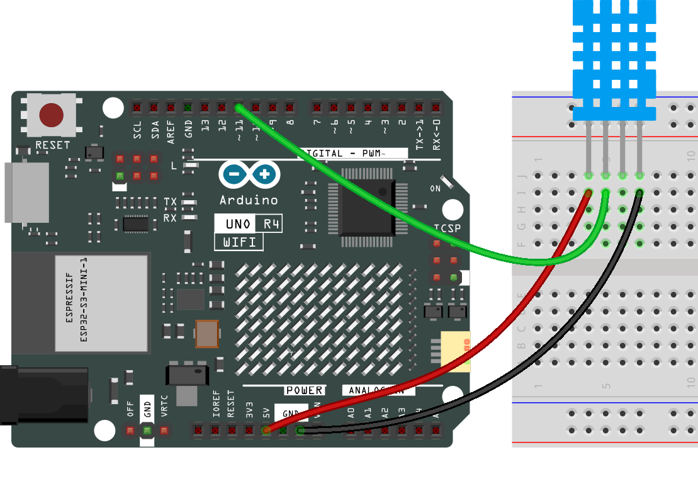

.. note::

    Ciao, benvenuto nella comunità di appassionati di SunFounder Raspberry Pi, Arduino e ESP32 su Facebook! Approfondisci Raspberry Pi, Arduino ed ESP32 insieme ad altri appassionati.

    **Perché unirti a noi?**

    - **Supporto esperto**: Risolvi i problemi post-vendita e le sfide tecniche con l'aiuto della nostra comunità e del nostro team.
    - **Impara e Condividi**: Scambia consigli e tutorial per migliorare le tue competenze.
    - **Anteprime esclusive**: Accedi in anteprima agli annunci di nuovi prodotti e agli sneak peek.
    - **Sconti speciali**: Approfitta di sconti esclusivi sui nostri prodotti più recenti.
    - **Promozioni festive e omaggi**: Partecipa a giveaway e promozioni festive.

    👉 Pronto per esplorare e creare con noi? Clicca [|link_sf_facebook|] e unisciti oggi stesso!

.. _basic_humiture_sensor:

Modulo Sensore di Umidità e Temperatura
==============================================

.. https://docs.sunfounder.com/projects/3in1-kit/en/latest/basic_project/ar_dht11.html#ar-dht11

Panoramica
---------------

L'umidità e la temperatura sono strettamente correlate, sia come grandezze fisiche che nella vita quotidiana delle persone.
La temperatura e l'umidità dell'ambiente umano influenzano direttamente la funzione termoregolatoria e l'effetto di trasferimento del calore del corpo umano.
Questo influisce ulteriormente sull'attività mentale e lo stato d'animo, influenzando così l'efficienza nello studio e nel lavoro.

La temperatura è una delle sette grandezze fisiche fondamentali nel Sistema Internazionale di Unità, utilizzata per misurare il grado di caldo e freddo di un oggetto.
Il Celsius è una delle scale di temperatura più ampiamente utilizzate al mondo, espressa dal simbolo "℃".

L'umidità è la concentrazione di vapore acqueo presente nell'aria.
L'umidità relativa dell'aria è comunemente utilizzata nella vita quotidiana ed è espressa in %RH. L'umidità relativa è strettamente correlata alla temperatura.
Per un determinato volume di gas sigillato, maggiore è la temperatura, minore è l'umidità relativa, e minore è la temperatura, maggiore è l'umidità relativa.

Il DHT11, un sensore digitale di temperatura e umidità, è incluso in questo kit. Utilizza un sensore capacitivo di umidità e un termistore per misurare l'aria circostante e fornisce un segnale digitale sul pin dati.

Componenti necessari
-------------------------

In questo progetto, abbiamo bisogno dei seguenti componenti.

È sicuramente conveniente acquistare un kit completo, ecco il link:

.. list-table::
    :widths: 20 20 20
    :header-rows: 1

    *   - Nome	
        - ELEMENTI IN QUESTO KIT
        - LINK
    *   - Elite Explorer Kit
        - 300+
        - |link_Elite_Explorer_kit|

Puoi anche acquistarli separatamente dai link qui sotto.

.. list-table::
    :widths: 30 20
    :header-rows: 1

    *   - INTRODUZIONE AI COMPONENTI
        - LINK PER L'ACQUISTO

    *   - :ref:`uno_r4_wifi`
        - \-
    *   - :ref:`cpn_breadboard`
        - |link_breadboard_buy|
    *   - :ref:`cpn_wires`
        - |link_wires_buy|
    *   - :ref:`cpn_dht11`
        - |link_humiture_buy|

Collegamenti
----------------------

Schema Elettrico
-----------------------

.. image:: img/07_humiture_schematic.png
    :align: center
    :width: 40%

Codice
---------------

.. note::

    * Puoi aprire il file ``07-humiture_sensor.ino`` dal percorso ``elite-explorer-kit-main\basic_project\07-humiture_sensor`` direttamente.
    * Oppure copia questo codice nell'IDE di Arduino.

.. note:: 
    Per installare la libreria, usa il Library Manager di Arduino e cerca **"DHT sensor library"** e installala. 

.. literalinclude:: /_code/07_basic_humiture_sensor.ino
   :language: cpp
   :linenos:
   :caption: 07-humiture_sensor.ino

Dopo che il codice è stato caricato con successo, vedrai il Monitor Seriale stampare continuamente la temperatura e l'umidità, e man mano che il programma si stabilizza, questi due valori diventeranno sempre più accurati.

Analisi del Codice
------------------------

#. Inclusione delle librerie necessarie e definizione delle costanti.
   Questa parte del codice include la libreria del sensore DHT e definisce il numero di pin e il tipo di sensore utilizzati in questo progetto.

   .. note:: 
      Per installare la libreria, usa il Library Manager di Arduino e cerca **"DHT sensor library"** e installala.

   .. code-block:: arduino
    
      #include <DHT.h>
      #define DHTPIN 11       // Definisci il pin utilizzato per collegare il sensore
      #define DHTTYPE DHT11  // Definisci il tipo di sensore

#. Creazione dell'oggetto DHT.
   Qui creiamo un oggetto DHT utilizzando il numero di pin e il tipo di sensore definiti.

   .. code-block:: arduino

      DHT dht(DHTPIN, DHTTYPE);  // Crea un oggetto DHT

#. Questa funzione viene eseguita una volta quando Arduino si avvia. Inizializziamo la comunicazione seriale e il sensore DHT in questa funzione.

   .. code-block:: arduino

      void setup() {
        Serial.begin(9600);
        Serial.println(F("DHT11 test!"));
        dht.begin();  // Inizializza il sensore DHT
      }

#. Loop principale.
   La funzione ``loop()`` viene eseguita continuamente dopo la funzione setup. Qui, leggiamo i valori di umidità e temperatura, calcoliamo l'indice di calore e stampiamo questi valori sul monitor seriale. Se la lettura del sensore fallisce (restituisce NaN), viene stampato un messaggio di errore.

   .. note::
    
      L'|link_heat_index| è un modo per misurare quanto caldo si sente all'esterno combinando la temperatura dell'aria e l'umidità. È anche chiamato "temperatura percepita" o "temperatura apparente".

   .. code-block:: arduino

      void loop() {
        delay(2000);
        float h = dht.readHumidity();
        float t = dht.readTemperature();
        float f = dht.readTemperature(true);
        if (isnan(h) || isnan(t) || isnan(f)) {
          Serial.println(F("Failed to read from DHT sensor!"));
          return;
        }
        float hif = dht.computeHeatIndex(f, h);
        float hic = dht.computeHeatIndex(t, h, false);
        Serial.print(F("Humidity: "));
        Serial.print(h);
        Serial.print(F("%  Temperature: "));
        Serial.print(t);
        Serial.print(F("°C "));
        Serial.print(f);
        Serial.print(F("°F  Heat index: "));
        Serial.print(hic);
        Serial.print(F("°C "));
        Serial.print(hif);
        Serial.println(F("°F"));
      }
