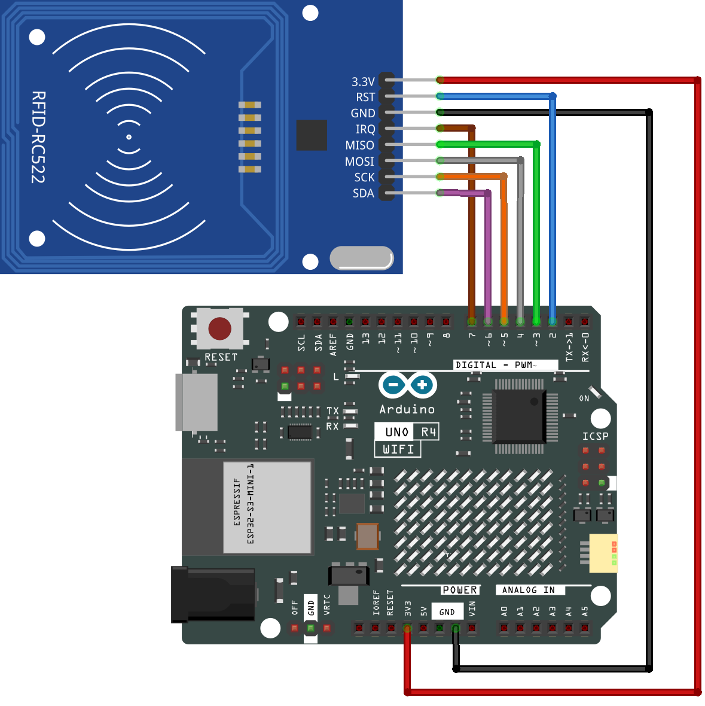

.. note::

    Hello, welcome to the SunFounder Raspberry Pi & Arduino & ESP32 Enthusiasts Community on Facebook! Dive deeper into Raspberry Pi, Arduino, and ESP32 with fellow enthusiasts.

    **Why Join?**

    - **Expert Support**: Solve post-sale issues and technical challenges with help from our community and team.
    - **Learn & Share**: Exchange tips and tutorials to enhance your skills.
    - **Exclusive Previews**: Get early access to new product announcements and sneak peeks.
    - **Special Discounts**: Enjoy exclusive discounts on our newest products.
    - **Festive Promotions and Giveaways**: Take part in giveaways and holiday promotions.

    👉 Ready to explore and create with us? Click [|link_sf_facebook|] and join today!

.. _basic_mfrc522:

RFID-RC522 Module
==========================

.. https://docs.sunfounder.com/projects/vincent-kit/en/latest/arduino/2.35_rfid-rc522_module.html

Overview
-------------

In this lesson, you will learn how to use an RFID Module. RFID stands for Radio Frequency Identification. Its principle of operation involves contactless data communication between the reader and the label to identify the target. The applications of RFID are extensive, including animal chips, immobilizers, access control, parking control, production chain automation, material management, and more.

Required Components
-------------------------

In this project, we need the following components. 

It's definitely convenient to buy a whole kit, here's the link: 

.. list-table::
    :widths: 20 20 20
    :header-rows: 1

    *   - Name	
        - ITEMS IN THIS KIT
        - LINK
    *   - Elite Explorer Kit
        - 300+
        - |link_Elite_Explorer_kit|

You can also buy them separately from the links below.

.. list-table::
    :widths: 30 20
    :header-rows: 1

    *   - COMPONENT INTRODUCTION
        - PURCHASE LINK

    *   - :ref:`uno_r4_wifi`
        - \-
    *   - :ref:`cpn_wires`
        - |link_wires_buy|
    *   - :ref:`cpn_mfrc522`
        - |link_mfrc522_rfid_buy|

Fritzing Circuit
---------------------

In this example, we insert the RFID into the breadboard. Get the 3.3V of RFID connected to 3.3V, GND to GND, RST to pin 2, SDA to pin 6, SCK to pin 5, MOSI to pin 4, MISO to pin 3 and IRQ to pin 7.

Schematic Diagram
-------------------------

.. image:: img/08_mfrc522_schematic.png
   :align: center
   :width: 70%

Code
-----------

.. note::

    * You can open the file ``08-mfrc522.ino`` under the path of ``elite-explorer-kit-main\basic_project\08-mfrc522`` directly.
    * The ``RFID1`` library is used here. The library can be found in the ``elite-explorer-kit-main/library/`` directory, or you can click here :download:`RFID1.zip </_static/RFID1.zip>` to download it. Refer to :ref:`manual_install_lib` for a tutorial on how to install it.

.. raw:: html

    <iframe src=https://create.arduino.cc/editor/sunfounder01/9a4e9be9-78f5-4bf0-8b44-ca6e44092dc1/preview?embed style="height:510px;width:100%;margin:10px 0" frameborder=0></iframe>

Uploaded the codes to the uno board, you can get your RFID card (secret key) close to the RFID Reader. The module will read the card information and then print it on the serial monitor.  

Code Analysis
-------------------

The functions of the module are included in the library ``rfid1.h``.

.. code-block:: arduino

    #include <rfid1.h>

**Library Functions:**

.. code-block:: arduino

    RFID1 rfid;

Create a new instance of the rfid1 class that represents a particular
RFID module attached to your Arduino .

.. code-block:: arduino

    void begin(IRQ_PIN,SCK_PIN,MOSI_PIN,MISO_PIN,SDA_PIN,RST_PIN)

Pin configuration.

* ``IRQ_PIN,SCK_PIN,MOSI_PIN,MISO_PIN``: the pins used for the SPI communication.
* ``SDA_PIN``: Synchronous data adapter.
* ``RST_PIN``: The pins used for reset.

.. code-block:: arduino

    void init()

Initialize the RFID.

.. code-block:: arduino

    uchar request(uchar reqMode, uchar *TagType);

Search card and read card type, and the function will return the current read status of RFID and return MI_OK if successed.

* ``reqMode``: Search methods. PICC_REQIDL is defined that 0x26 command bits (Search the cards that does not in the sleep mode in the antenna area).
* ``*TagType``: It is used to store card type, and its value can be 4byte (e.g. 0x0400).

.. code-block:: arduino

    char * readCardType(uchar *TagType)

This function decodes the four-digit hexadecimal number of ``*tagType``
into the specific card type and returns a string. If passed 0x0400,
"MFOne-S50" will be returned.

.. code-block:: arduino

    uchar anticoll(uchar *serNum);

Prevent conflict, and read the card serial number. The function will
return the current reading status of RFID. It returns MI_OK if
successed.

* ``*serNum``: It is used to store the card serial number, and return the 4 bytes card serial number. The 5th byte is recheck byte(e.g. e.g. my magnetic card ID is 5AE4C955).
