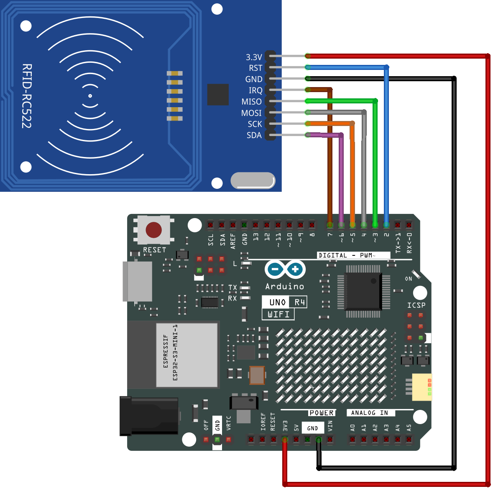
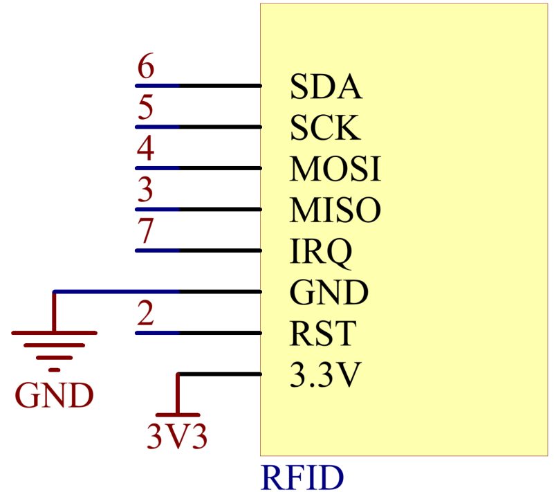

.. _basic_mfrc522:

RFID-RC522 模块
==========================

.. https://docs.sunfounder.com/projects/vincent-kit/en/latest/arduino/2.35_rfid-rc522_module.html

概述
-------------

在本课中，您将学习如何使用 RFID 模块。RFID 代表射频识别。其工作原理涉及读写器与标签之间的非接触式数据通信，以识别目标。RFID 的应用非常广泛，包括动物芯片、汽车防盗器、门禁控制、停车场控制、生产链自动化、物料管理等。

所需元件
-------------------------

本项目中，我们需要以下元件。

购买整套套件会更加方便，以下是链接：

.. list-table::
    :widths: 20 20 20
    :header-rows: 1

    *   - 名称
        - 套件所含项目
        - 链接
    *   - Elite Explorer 套件
        - 300+
        - |link_Elite_Explorer_kit|

您也可以从以下链接单独购买。

.. list-table::
    :widths: 30 20
    :header-rows: 1

    *   - 元件介绍
        - 购买链接

    *   - :ref:`uno_r4_wifi`
        - \-
    *   - :ref:`cpn_wires`
        - |link_wires_buy|
    *   - :ref:`cpn_mfrc522`
        - |link_mfrc522_rfid_buy|

Fritzing 电路图
---------------------

在本示例中，我们将 RFID 模块插入面包板。将 RFID 的 3.3V 连接到 3.3V，GND 连接到 GND，RST 连接到引脚 2，SDA 连接到引脚 6，SCK 连接到引脚 5，MOSI 连接到引脚 4，MISO 连接到引脚 3，IRQ 连接到引脚 7。

原理图
-------------------------

代码
-----------

.. note::

    * 您可以直接打开路径 ``elite-explorer-kit-main\basic_project\08-mfrc522`` 下的 ``08-mfrc522.ino`` 文件。
    * 这里使用 ``RFID1`` 库。该库可以在 ``elite-explorer-kit-main/library/`` 目录中找到，或者您可以点击此处 :download:`RFID1.zip </_static/RFID1.zip>` 下载。请参考 :ref:`manual_install_lib` 了解如何安装。

.. literalinclude:: /_code/08_basic_mfrc522.ino
   :language: cpp
   :linenos:
   :caption: 08-mfrc522.ino

将代码上传到 Uno 板后，您可以将 RFID 卡（密钥）靠近 RFID 读写器。模块将读取卡片信息，然后将其打印在串口监视器上。

代码分析
-------------------

模块的功能包含在库 ``rfid1.h`` 中。

.. code-block:: arduino

    #include <rfid1.h>

**库函数：**

.. code-block:: arduino

    RFID1 rfid;

创建一个新的 rfid1 类实例，代表连接到 Arduino 的特定 RFID 模块。

.. code-block:: arduino

    void begin(IRQ_PIN,SCK_PIN,MOSI_PIN,MISO_PIN,SDA_PIN,RST_PIN)

引脚配置。

* ``IRQ_PIN,SCK_PIN,MOSI_PIN,MISO_PIN``：用于 SPI 通信的引脚。
* ``SDA_PIN``：同步数据适配器。
* ``RST_PIN``：用于复位的引脚。

.. code-block:: arduino

    void init()

初始化 RFID。

.. code-block:: arduino

    uchar request(uchar reqMode, uchar *TagType);

搜索卡片并读取卡片类型，该函数将返回 RFID 的当前读取状态，如果成功则返回 MI_OK。

* ``reqMode``：搜索方式。PICC_REQIDL 定义为 0x26 命令位（搜索天线区域内不在睡眠模式下的卡片）。
* ``*TagType``：用于存储卡片类型，其值为 4 字节（例如 0x0400）。

.. code-block:: arduino

    char * readCardType(uchar *TagType)

此函数将 ``*tagType`` 的四位十六进制数解码为具体的卡片类型并返回一个字符串。如果传入 0x0400，将返回 "MFOne-S50"。

.. code-block:: arduino

    uchar anticoll(uchar *serNum);

防冲突，读取卡片序列号。该函数将返回 RFID 的当前读取状态。如果成功则返回 MI_OK。

* ``*serNum``：用于存储卡片序列号，并返回 4 字节的卡片序列号。第 5 个字节为校验字节（例如，我的磁卡 ID 为 5AE4C955）。
