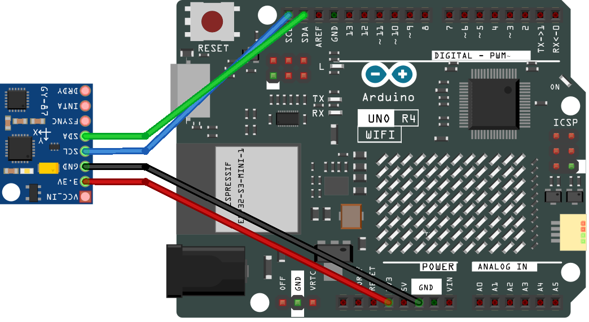

.. note::

    Bonjour, bienvenue dans la communauté des passionnés de SunFounder Raspberry Pi, Arduino et ESP32 sur Facebook ! Plongez plus profondément dans le monde des Raspberry Pi, Arduino et ESP32 avec d'autres passionnés.

    **Pourquoi nous rejoindre ?**

    - **Support d'experts** : Résolvez les problèmes après-vente et les défis techniques avec l'aide de notre communauté et de notre équipe.
    - **Apprendre et partager** : Échangez des astuces et des tutoriels pour améliorer vos compétences.
    - **Aperçus exclusifs** : Accédez en avant-première aux nouvelles annonces de produits et aux aperçus exclusifs.
    - **Réductions spéciales** : Profitez de réductions exclusives sur nos produits les plus récents.
    - **Promotions festives et cadeaux** : Participez à des concours et à des promotions pendant les fêtes.

    👉 Prêt à explorer et créer avec nous ? Cliquez sur [|link_sf_facebook|] et rejoignez-nous dès aujourd'hui !

.. _basic_gy87_mpu6050:

MPU6050
==========================

Aperçu
---------------

Dans ce tutoriel, vous apprendrez à interfacer le module IMU GY-87 avec un Arduino Uno, en vous concentrant sur le capteur MPU6050. Nous couvrirons l'initialisation du MPU6050 et l'affichage de ses données d'accéléromètre, de gyroscope et de température sur le moniteur série. Cette leçon est essentielle pour les projets nécessitant la détection de mouvement et de température, tels que la robotique, les dispositifs contrôlés par gestes et les installations artistiques interactives.

Composants nécessaires
-------------------------

Dans ce projet, nous avons besoin des composants suivants. 

Il est très pratique d'acheter un kit complet, voici le lien : 

.. list-table::
    :widths: 20 20 20
    :header-rows: 1

    *   - Nom	
        - ÉLÉMENTS DANS CE KIT
        - LIEN
    *   - Kit Elite Explorer
        - 300+
        - |link_Elite_Explorer_kit|

Vous pouvez également les acheter séparément via les liens ci-dessous.

.. list-table::
    :widths: 30 20
    :header-rows: 1

    *   - INTRODUCTION DES COMPOSANTS
        - LIEN D'ACHAT

    *   - :ref:`uno_r4_wifi`
        - \-
    *   - :ref:`cpn_wires`
        - |link_wires_buy|
    *   - :ref:`cpn_gy87`
        - \-

Câblage
----------------------

.. raw:: html

    

Schéma de connexion
-----------------------

.. image:: img/09_basic_gy87_schematic.png
    :align: center
    :width: 60%

Code
-----------

.. note::

    * Vous pouvez ouvrir le fichier ``09-gy87_mpu6050.ino`` sous le chemin ``elite-explorer-kit-main\basic_project\09-gy87_mpu6050`` directement.
    * Ou copiez ce code dans l'IDE Arduino.

.. note:: 
    Pour installer la bibliothèque, utilisez le gestionnaire de bibliothèques Arduino et recherchez **"Adafruit MPU6050"** et installez-la. 

.. literalinclude:: /_code/09_basic_gy87_mpu6050.ino
   :language: cpp
   :linenos:
   :caption: 09-gy87_mpu6050.ino

Analyse du Code
------------------------

#. Inclusion des bibliothèques

   Les bibliothèques ``Adafruit_MPU6050``, ``Adafruit_Sensor`` et ``Wire`` sont incluses pour l'interfaçage et la communication avec le capteur.

   .. code-block:: arduino

      #include <Adafruit_MPU6050.h>
      #include <Adafruit_Sensor.h>
      #include <Wire.h>

#. Initialisation de l'objet capteur

   Un objet de la classe Adafruit_MPU6050 est créé pour représenter le capteur MPU6050.

   .. code-block:: arduino

      Adafruit_MPU6050 mpu;

#. Fonction Setup

   Initialise la communication série et appelle la fonction d'initialisation du capteur MPU6050.

   .. code-block:: arduino

      void setup() {
        Serial.begin(9600);
        initializeMPU6050();
      }

#. Fonction Loop

   Appelle de manière répétée la fonction d'impression des données du MPU6050 avec un délai de 500 millisecondes entre chaque appel.

   .. code-block:: arduino

      void loop() {
        printMPU6050();
        delay(500);
      }

#. Fonction d'initialisation du MPU6050

   Vérifie si le MPU6050 est connecté, définit les plages de l'accéléromètre et du gyroscope, et configure la bande passante du filtre.

   .. code-block:: arduino

      void initializeMPU6050() {
        // Vérifie si le capteur MPU6050 est détecté
        if (!mpu.begin()) {
          Serial.println("Failed to find MPU6050 chip");
          while (1)
            ;  // Arrêt si le capteur n'est pas trouvé
        }
        Serial.println("MPU6050 Found!");
      
        // Définir la plage de l'accéléromètre à +-8G
        mpu.setAccelerometerRange(MPU6050_RANGE_8_G);
      
        // Définir la plage du gyroscope à +- 500 deg/s
        mpu.setGyroRange(MPU6050_RANGE_500_DEG);
      
        // Définir la bande passante du filtre à 21 Hz
        mpu.setFilterBandwidth(MPU6050_BAND_21_HZ);
      
        Serial.println("");
        delay(100);
      }

#. Fonction d'impression des données du MPU6050

   Lit et imprime les données de l'accéléromètre, du gyroscope et de la température du MPU6050 sur le moniteur série.

   .. code-block:: arduino

      void printMPU6050() {
      
        Serial.println();
        Serial.println("MPU6050 ------------");
      
        /* Obtenir de nouveaux événements capteur avec les lectures */
        sensors_event_t a, g, temp;
        mpu.getEvent(&a, &g, &temp);
      
        /* Imprimer les valeurs */
        Serial.print("Acceleration X: ");
        Serial.print(a.acceleration.x);
        Serial.print(", Y: ");
        Serial.print(a.acceleration.y);
        Serial.print(", Z: ");
        Serial.print(a.acceleration.z);
        Serial.println(" m/s^2");
      
        Serial.print("Rotation X: ");
        Serial.print(g.gyro.x);
        Serial.print(", Y: ");
        Serial.print(g.gyro.y);
        Serial.print(", Z: ");
        Serial.print(g.gyro.z);
        Serial.println(" rad/s");
      
        Serial.print("Temperature: ");
        Serial.print(temp.temperature);
        Serial.println(" degC");
      
        Serial.println("MPU6050 ------------");
        Serial.println();
      }
