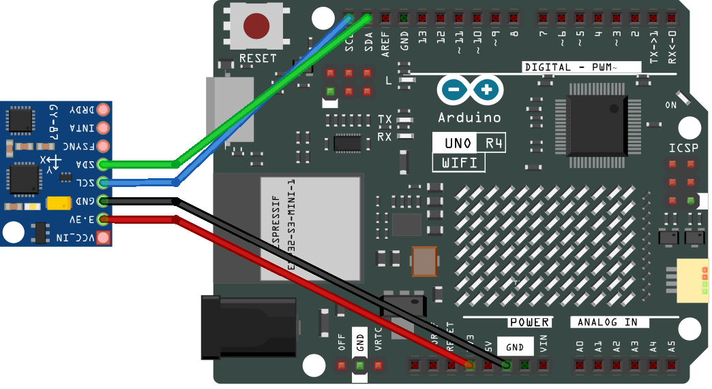
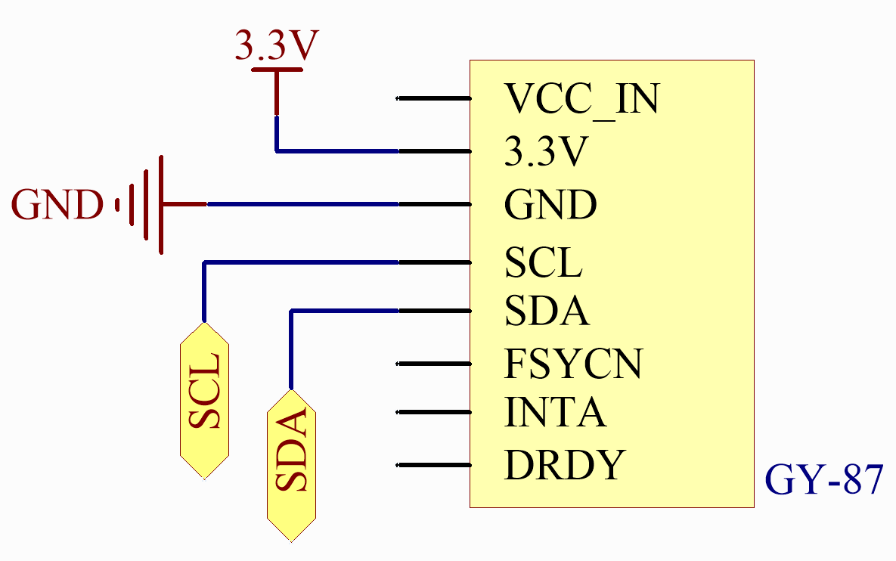
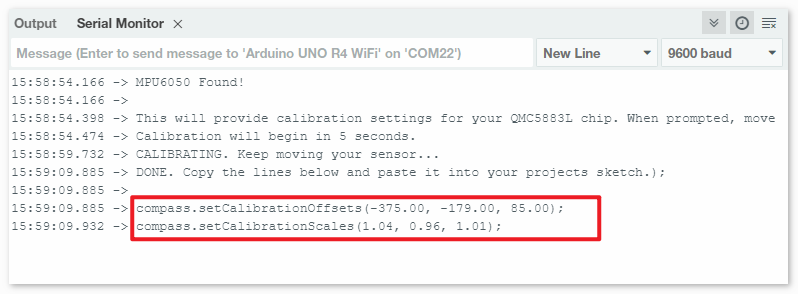

.. _basic_gy87_qmc5883L:

QMC5883L
==========================

概要
---------------

このチュートリアルでは、GY-87 IMUモジュールに焦点を当て、特にそのQMC5883L磁力計について探求します。チュートリアルの最初の部分では、QMC5883L磁力計の校正方法について案内します。これは正確な磁場測定に不可欠です。Arduinoに校正スケッチをアップロードし、リアルタイムで校正を行い、プロジェクトにこれらの設定を適用する方法を学びます。チュートリアルの第二部では、Arduino Uno上でMPU6050（加速度計とジャイロスコープ）とQMC5883LをAdafruit MPU6050およびQMC5883LCompassライブラリを使って初期化する方法を取り上げます。センサーデータを読み取り、シリアルモニターに表示する基本的なスキルを身につけます。これは、ナビゲーション、動作追跡、方向検出などのアプリケーションに不可欠です。

必要なコンポーネント
-------------------------

このプロジェクトでは、以下のコンポーネントが必要です。

キット全体を購入するのは便利です。リンクはこちら：

.. list-table::
    :widths: 20 20 20
    :header-rows: 1

    *   - 名称	
        - このキットのアイテム数
        - リンク
    *   - Elite Explorer Kit
        - 300+
        - |link_Elite_Explorer_kit|

下記のリンクから個別に購入することもできます。

.. list-table::
    :widths: 30 20
    :header-rows: 1

    *   - コンポーネント紹介
        - 購入リンク

    *   - :ref:`uno_r4_wifi`
        - \-
    *   - :ref:`cpn_wires`
        - |link_wires_buy|
    *   - :ref:`cpn_gy87`
        - \-

配線図
----------------------

.. raw:: html

    

回路図
-----------------------

ライブラリのインストール
--------------------------

.. note:: 
    ライブラリをインストールするには、Arduino Library Managerを使用します。
    
        - **「Adafruit MPU6050」** を検索してインストール

          各ライブラリをインストールする際は、すべての依存関係のインストールを選択してください。
      
          .. image:: img/09-add_lib_tip.png
             :width: 80%

        - **「QMC5883LCompass」** を検索してインストール

.. _basic_gy87_calibrate:

QMC5883Lの校正
-----------------------

.. note::

    * ``09-gy87_compass_calibration.ino`` ファイルを ``elite-explorer-kit-main\basic_project\09-gy87_compass_calibration`` のパスから直接開くことができます。
    * または、このコードをArduino IDEにコピーします。

.. raw:: html

    <iframe src=https://create.arduino.cc/editor/sunfounder01/252c7a58-3a9f-4c66-959e-f45fc19e68aa/preview?embed style="height:510px;width:100%;margin:10px 0" frameborder=0></iframe>

コードのアップロード後、シリアルモニターを開きます。シリアルモニターの指示に従ってQMC5883Lを校正します。センサーの移動を求められた場合、図8の校正方法を使用することをお勧めします。または、センサーを地面と平行に保ち、シリアルモニターが校正が完了したことを示すまで時計回りまたは反時計回りに回転させます。

校正データがすべて収集されると、スケッチは ``compass.setCalibrationOffsets(-375.00, -179.00, 85.00);`` や ``compass.setCalibrationScales(1.04, 0.96, 1.01);`` のようなコードを提供します。このコードをコピーしてください。今後の参考のために保存しておくことをお勧めします。

QMC5883Lを使用する場合：プロジェクトのスケッチを開き、 ``compass.init()`` の呼び出しの直下にコピーしたコードを貼り付けます。以下のようにします：

.. code:: arduino 

   void initializeQMC5883L() {
   
     compass.init();
   
     // You should replace the code below according to your calibration results
     compass.setCalibrationOffsets(-375.00, -179.00, 85.00);
     compass.setCalibrationScales(1.04, 0.96, 1.01);
   
   }

コード
---------------------------------------------

.. note::

   磁力計はコンパスとして使用する前に校正する必要があり(:ref:`basic_gy87_calibrate`)、使用中に水平に保持し、 **鉄製品、磁化した材料、電流を運ぶワイヤーから遠ざける** 必要があります。

.. note::

    * ``09-gy87_qmc5883l.ino`` ファイルを ``elite-explorer-kit-main\basic_project\09-gy87_qmc5883l`` のパスから直接開くことができます。
    * または、このコードをArduino IDEにコピーします。
    * 校正手順から得られたコードを、関数 ``initializeQMC5883L()`` の ``compass.init()`` のコードの下に配置します。

.. raw:: html

    <iframe src=https://create.arduino.cc/editor/sunfounder01/8b266a18-ce7b-4330-8c10-c9f4148bb8ec/preview?embed style="height:510px;width:100%;margin:10px 0" frameborder=0></iframe>

コード解析
------------------------

#. ライブラリのインクルードとセンサーの初期化
   このセクションでは、MPU6050およびQMC5883Lセンサーに必要なライブラリをインクルードし、そのオブジェクトを初期化します。

   .. code-block:: arduino
      
      #include <Adafruit_MPU6050.h>
      #include <Adafruit_Sensor.h>
      #include <Wire.h>
      #include <QMC5883LCompass.h>

      Adafruit_MPU6050 mpu;
      QMC5883LCompass compass;

#. Setup関数

   シリアル通信、MPU6050センサーを初期化し、MPU6050をI2Cバイパスモードに設定してQMC5883L磁力計への直接アクセスを可能にします。その後、QMC5883L磁力計を初期化します。

   .. code-block:: arduino
      
      void setup() {
        // Initialize the serial communication with a baud rate of 9600
        Serial.begin(9600);
      
        // Initialize the MPU6050 sensor (accelerometer and gyroscope)
        initializeMPU6050();
      
        // Enable I2C bypass on MPU6050 to directly access the QMC5883L magnetometer
        mpu.setI2CBypass(true);
      
        // Initialize the QMC5883L magnetometer sensor
        initializeQMC5883L();
      }

#. ループ関数

   QMC5883L磁力計からデータを連続的に読み取り、シリアルモニターに出力します。

   .. code-block:: arduino
      
      void loop() {
        printQMC5883L();
        delay(500);
      }

#. QMC5883L初期化関数

   QMC5883L磁力計を初期化し、校正します。校正値は特定の校正データに基づいて調整する必要があります。(:ref:`basic_gy87_calibrate`)

   .. code-block:: arduino
      
      void initializeQMC5883L() {
        compass.init();
      
        // You should replace the code below according to your calibration results
        compass.setCalibrationOffsets(-549.00, -66.00, 160.00);
        compass.setCalibrationScales(0.97, 1.02, 1.02);
      }

#. QMC5883Lデータ表示関数

   この関数は磁力計のX、Y、Z値と方位角を読み取り、シリアルモニターに出力します。

   .. code-block:: arduino

    void printQMC5883L() {
    
      Serial.println();
      Serial.println("QMC5883L ------------");
    
    	int x, y, z, a;
    	char myArray[3];
    	
    	compass.read();
      
    	x = compass.getX();
    	y = compass.getY();
    	z = compass.getZ();
    	
    	a = compass.getAzimuth();
    
    	compass.getDirection(myArray, a);
      
    	Serial.print("X: ");
    	Serial.print(x);
    
    	Serial.print(" Y: ");
    	Serial.print(y);
    
    	Serial.print(" Z: ");
    	Serial.print(z);
    
    	Serial.print(" Azimuth: ");
    	Serial.print(a);
    
    	Serial.print(" Direction: ");
    	Serial.print(myArray[0]);
    	Serial.print(myArray[1]);
    	Serial.println(myArray[2]);
    
      Serial.println("QMC5883L ------------");
      Serial.println();
    }
