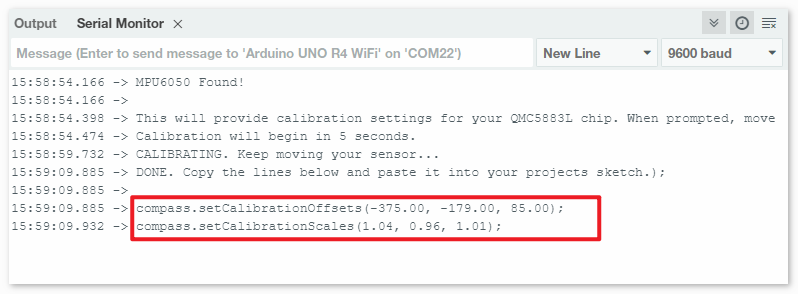

.. _basic_gy87_qmc5883l:

QMC5883L
==========================

概述
---------------

在本教程中，我们将探索 GY-87 IMU 模块，重点介绍其 QMC5883L 磁力计。教程的第一部分将指导您校准 QMC5883L 磁力计，这对于精确的磁场测量至关重要。您将学习如何将校准草图上传到 Arduino，执行实时校准，并在项目中应用这些设置。教程的第二部分介绍如何使用 Adafruit MPU6050 和 QMC5883LCompass 库，在 Arduino Uno 上初始化 MPU6050（加速度计和陀螺仪）和 QMC5883L。您将学习如何读取传感器数据并在串口监视器上显示，这是导航、运动追踪和方向检测应用中的基础技能。

所需元件
-------------------------

本项目中，我们需要以下元件。

购买整套套件会更加方便，以下是链接：

.. list-table::
    :widths: 20 20 20
    :header-rows: 1

    *   - 名称
        - 套件所含项目
        - 链接
    *   - Elite Explorer 套件
        - 300+
        - |link_Elite_Explorer_kit|

您也可以从以下链接单独购买。

.. list-table::
    :widths: 30 20
    :header-rows: 1

    *   - 元件介绍
        - 购买链接

    *   - :ref:`uno_r4_wifi`
        - \-
    *   - :ref:`cpn_wires`
        - |link_wires_buy|
    *   - :ref:`cpn_gy87`
        - \-

接线
----------------------

.. image:: img/09-gy87_bb.png
    :align: center
    :width: 90%

.. raw:: html

    

原理图
-----------------------

.. image:: img/09_basic_gy87_schematic.png
    :align: center
    :width: 60%

安装库
-----------------------

.. note::
    要安装库，请使用 Arduino 库管理器。

        - 搜索 **"Adafruit MPU6050"** 并安装

          安装每个库时，请确保选择安装所有依赖项。

          .. image:: img/09-add_lib_tip.png
             :width: 80%

        - 搜索 **"QMC5883LCompass"** 并安装

.. _basic_gy87_calibrate:

校准 QMC5883L
-----------------------

.. note::

    * 您可以直接打开路径 ``elite-explorer-kit-main\basic_project\09-gy87_compass_calibration`` 下的 ``09-gy87_compass_calibration.ino`` 文件。
    * 或者将以下代码复制到 Arduino IDE 中。

.. literalinclude:: /_code/09_basic_gy87_qmc5883l_calib.ino
   :language: cpp
   :linenos:
   :caption: 09-gy87_compass_calibration.ino

上传代码后，打开串口监视器。按照串口监视器中的指示校准 QMC5883L。当提示移动传感器时，建议使用八字校准法。或者，只需将传感器保持与地面平行，顺时针或逆时针旋转，直到串口监视器提示校准完成。

收集完所有校准数据后，草图将提供类似 ``compass.setCalibrationOffsets(-375.00, -179.00, 85.00);`` 和 ``compass.setCalibrationScales(1.04, 0.96, 1.01);`` 的代码。复制此代码。建议保存以供将来参考。

使用 QMC5883L 时：打开项目草图，将复制的代码行直接粘贴到 ``compass.init()`` 调用下方。如下所示：

.. code:: arduino

   void initializeQMC5883L() {

     compass.init();

     // 您应根据校准结果替换以下代码
     compass.setCalibrationOffsets(-375.00, -179.00, 85.00);
     compass.setCalibrationScales(1.04, 0.96, 1.01);

   }

代码
---------------------------------------------

.. note::

   磁力计必须经过校准(:ref:`basic_gy87_calibrate`)才能用作指南针，使用时必须保持水平，并**远离铁质物体、磁化材料和载流导线** 。

.. note::

    * 您可以直接打开路径 ``elite-explorer-kit-main\basic_project\09-gy87_qmc5883l`` 下的 ``09-gy87_qmc5883l.ino`` 文件。
    * 或者将以下代码复制到 Arduino IDE 中。
    * 将从校准步骤获得的代码放在函数 ``initializeQMC5883L()`` 中 ``compass.init()`` 代码行下方。

.. literalinclude:: /_code/09_basic_gy87_qmc5883l.ino
   :language: cpp
   :linenos:
   :caption: 09-gy87_qmc5883l.ino

代码分析
------------------------

#. 包含库并初始化传感器
   这部分包含了 MPU6050 和 QMC5883L 传感器所需的库，并初始化了它们的对象。

   .. code-block:: arduino

      #include <Adafruit_MPU6050.h>
      #include <Adafruit_Sensor.h>
      #include <Wire.h>
      #include <QMC5883LCompass.h>

      Adafruit_MPU6050 mpu;
      QMC5883LCompass compass;

#. 设置函数

   初始化串口通信、MPU6050 传感器，并将 MPU6050 设置为 I2C 旁路模式以允许直接访问 QMC5883L 磁力计。然后，初始化 QMC5883L 磁力计。

   .. code-block:: arduino

      void setup() {
        // 初始化串口通信，波特率为 9600
        Serial.begin(9600);

        // 初始化 MPU6050 传感器（加速度计和陀螺仪）
        initializeMPU6050();

        // 在 MPU6050 上启用 I2C 旁路以直接访问 QMC5883L 磁力计
        mpu.setI2CBypass(true);

        // 初始化 QMC5883L 磁力计传感器
        initializeQMC5883L();
      }

#. 循环函数

   持续从 QMC5883L 磁力计读取数据并打印到串口监视器。

   .. code-block:: arduino

      void loop() {
        printQMC5883L();
        delay(500);
      }

#. 初始化 QMC5883L 函数

   初始化并校准 QMC5883L 磁力计。校准值应根据具体校准数据进行调整。(:ref:`basic_gy87_calibrate`)

   .. code-block:: arduino

      void initializeQMC5883L() {
        compass.init();

        // 您应根据校准结果替换以下代码
        compass.setCalibrationOffsets(-549.00, -66.00, 160.00);
        compass.setCalibrationScales(0.97, 1.02, 1.02);
      }

#. 打印 QMC5883L 数据函数

   此函数读取磁力计的 X、Y、Z 值和方位角，然后打印到串口监视器。

   .. code-block:: arduino

    void printQMC5883L() {

      Serial.println();
      Serial.println("QMC5883L ------------");

    	int x, y, z, a;
    	char myArray[3];

    	compass.read();

    	x = compass.getX();
    	y = compass.getY();
    	z = compass.getZ();

    	a = compass.getAzimuth();

    	compass.getDirection(myArray, a);

    	Serial.print("X: ");
    	Serial.print(x);

    	Serial.print(" Y: ");
    	Serial.print(y);

    	Serial.print(" Z: ");
    	Serial.print(z);

    	Serial.print(" Azimuth: ");
    	Serial.print(a);

    	Serial.print(" Direction: ");
    	Serial.print(myArray[0]);
    	Serial.print(myArray[1]);
    	Serial.println(myArray[2]);

      Serial.println("QMC5883L ------------");
      Serial.println();
    }
