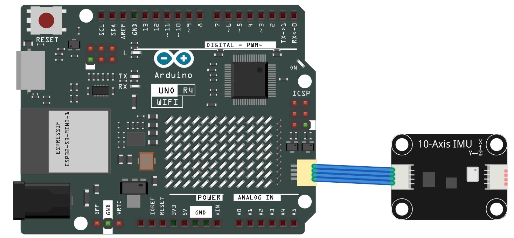
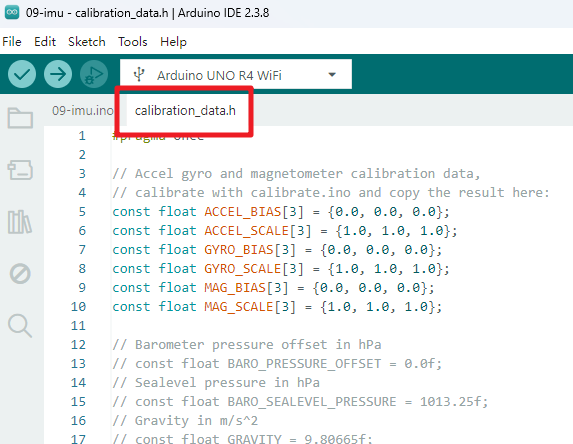
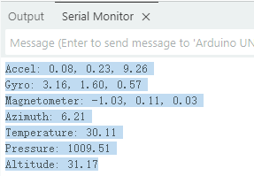

.. note::

    こんにちは、SunFounderのRaspberry Pi & Arduino & ESP32愛好家コミュニティへようこそ！Facebook上でRaspberry Pi、Arduino、ESP32についてもっと深く掘り下げ、他の愛好家と交流しましょう。

    **参加する理由は？**

    - **エキスパートサポート**：コミュニティやチームの助けを借りて、販売後の問題や技術的な課題を解決します。
    - **学び＆共有**：ヒントやチュートリアルを交換してスキルを向上させましょう。
    - **独占的なプレビュー**：新製品の発表や先行プレビューに早期アクセスしましょう。
    - **特別割引**：最新製品の独占割引をお楽しみください。
    - **祭りのプロモーションとギフト**：ギフトや祝日のプロモーションに参加しましょう。

    👉 私たちと一緒に探索し、創造する準備はできていますか？[|link_sf_facebook|]をクリックして今すぐ参加しましょう！

.. _basic_imu:

IMUモジュール（10軸）
==========================

.. note:: このキットの異なるバージョンでは、異なるIMUモジュールが使用されている場合があります。お持ちのキットのバージョンに基づいて、適切なチュートリアルを選択してください。10軸IMUモジュールをお持ちの場合は、このチュートリアルを参照してください。GY-87モジュールをお持ちの場合は、:ref:`basic_gy87`\ を参照してください。

10軸IMU（慣性計測ユニット）モジュールは、複数のセンサーを組み合わせて、包括的な動作および環境データを提供します。高度測定用の気圧センサー（SPL06_001）、加速度および回転用の6軸モーションセンサー（SH3001）、コンパス方位用の3軸磁力計（QMC6310）を統合しています。この高度なモジュールは、ロボティクス、ナビゲーションシステム、モーショントラッキングアプリケーションに最適です。

Fritzing回路
----------------------------------

.. raw:: html

    

.. .. image:: img/09_basic_gy87_schematic.png
..     :align: center
..     :width: 90%

ライブラリのインストール
---------------------------------

ライブラリをインストールするには、Arduinoライブラリマネージャーを使用します。

   - **"SunFounder_IMU"** を検索してインストールします。

      .. image:: img/09-add_lib_tip_imu.png

キャリブレーション
----------------------

IMUモジュールを使用する前に、センサーデータの精度を確保するためにキャリブレーションを実行することをお勧めします。キャリブレーション手順は以下のとおりです：

* ``elite-explorer-kit-main\basic_project\09-imu_calibration`` のパスにある ``09-imu_calibration.ino`` ファイルを直接開きます。

このコードを実行した後、シリアルモニタを開くと、センサーデータの出力が表示されます。通常、次の形式で表示されます：

.. code-block:: text

   const float ACCEL_BIAS[3] = {0.0, 0.0, 0.0};
   const float ACCEL_SCALE[3] = {1.0, 1.0, 1.0};
   const float GYRO_BIAS[3] = {0.0, 0.0, 0.0};
   const float GYRO_SCALE[3] = {1.0, 1.0, 1.0};
   const float MAG_BIAS[3] = {0.0, 0.0, 0.0};
   const float MAG_SCALE[3] = {1.0, 1.0, 1.0};

このデータをコピーします。

コードの実行
----------------------

``elite-explorer-kit-main\basic_project\09-imu`` のパスにある ``09-imu.ino`` ファイルを直接開きます。

プロジェクトの ``calibration_data.h`` ページに移動し、先ほどコピーしたデータを ``calibration_data.h`` ファイルに貼り付けて、元のデータを置き換えます。

``09-imu.ino`` ページに戻り、Arduino Uno R4ボードにコードをアップロードします。

.. literalinclude:: /_code/09_basic_imu.ino
   :language: cpp
   :linenos:
   :caption: 09-imu.ino

コードがArduino Uno R4に正常にアップロードされると、シリアルモニタが起動し、10軸IMUモジュールからのセンサーデータが連続的に表示されます。

