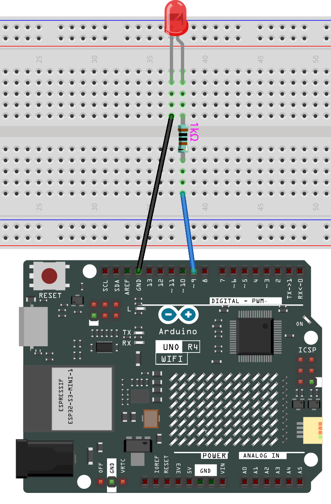
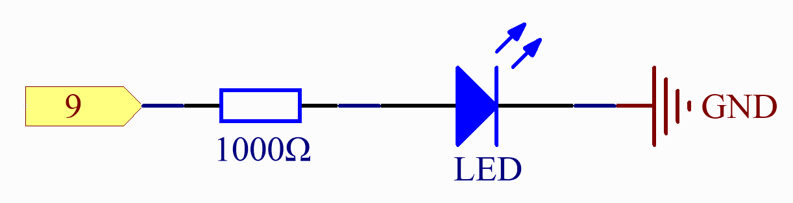

.. _basic_led:

LED module
==========================

Just as printing "Hello, world!" is the first step in learning to program, using a program to drive an LED is the traditional introduction to learning physical programming.

Required Components
-------------------------

In this project, we need the following components. 

It's definitely convenient to buy a whole kit, here's the link: 

.. list-table::
    :widths: 20 20 20
    :header-rows: 1

    *   - Name	
        - ITEMS IN THIS KIT
        - LINK
    *   - Elite Explorer Kit
        - 300+
        - |link_Elite_Explorer_kit|

You can also buy them separately from the links below.

.. list-table::
    :widths: 30 20
    :header-rows: 1

    *   - COMPONENT INTRODUCTION
        - PURCHASE LINK

    *   - :ref:`uno_r4_wifi`
        - \-
    *   - :ref:`cpn_breadboard`
        - |link_breadboard_buy|
    *   - :ref:`cpn_wires`
        - |link_wires_buy|
    *   - :ref:`cpn_resistor`
        - |link_resistor_buy|
    *   - :ref:`cpn_led`
        - |link_led_buy|

Wiring
----------------------

Schematic Diagram
-----------------------

Code
---------------

.. note::

   * You can open the file ``10-led.ino`` under the path of ``elite-explorer-kit-main\basic_project\10-led``. 
   * Or copy this code into **Arduino IDE**.

.. raw:: html

    <iframe src=https://create.arduino.cc/editor/sunfounder01/2d23289e-ebd1-49e9-b11f-b1bbc1f192c1/preview?embed style="height:510px;width:100%;margin:10px 0" frameborder=0></iframe>

.. raw:: html

   <video loop autoplay muted style = "max-width:100%">
      <source src="../_static/videos/basic_projects/10_basic_led.mp4"  type="video/mp4">
      Your browser does not support the video tag.
   </video>

After the code is uploaded successfully, you will see the LED connected to digital pin 9 of the Arduino board start to blink. The LED will turn on for half a second and then turn off for another half a second, repeating this cycle continuously as the program runs.

Code Analysis
------------------------

Here, we connect the LED to the digital pin 9, so we need to declare an ``int`` variable called ``ledpin`` at the beginning of the program and assign a value of 9.

.. code-block:: arduino

    const int ledPin = 9;

Now, initialize the pin in the ``setup()`` function, where you need to initialize the pin to ``OUTPUT`` mode.

.. code-block:: arduino

    void setup() {
        pinMode(ledPin, OUTPUT);
    }

In ``loop()``, ``digitalWrite()`` is used to provide 5V high level signal for ledpin, which will cause voltage difference between LED pins and light LED up.

.. code-block:: arduino

    digitalWrite(ledPin, HIGH);

If the level signal is changed to LOW, the ledPin’s signal will be returned to 0 V to turn LED off.

.. code-block:: arduino

    digitalWrite(ledPin, LOW);

An interval between on and off is required to allow people to see the change, 
so we use a ``delay(1000)`` code to let the controller do nothing for 1000 ms.

.. code-block:: arduino

    delay(1000);   