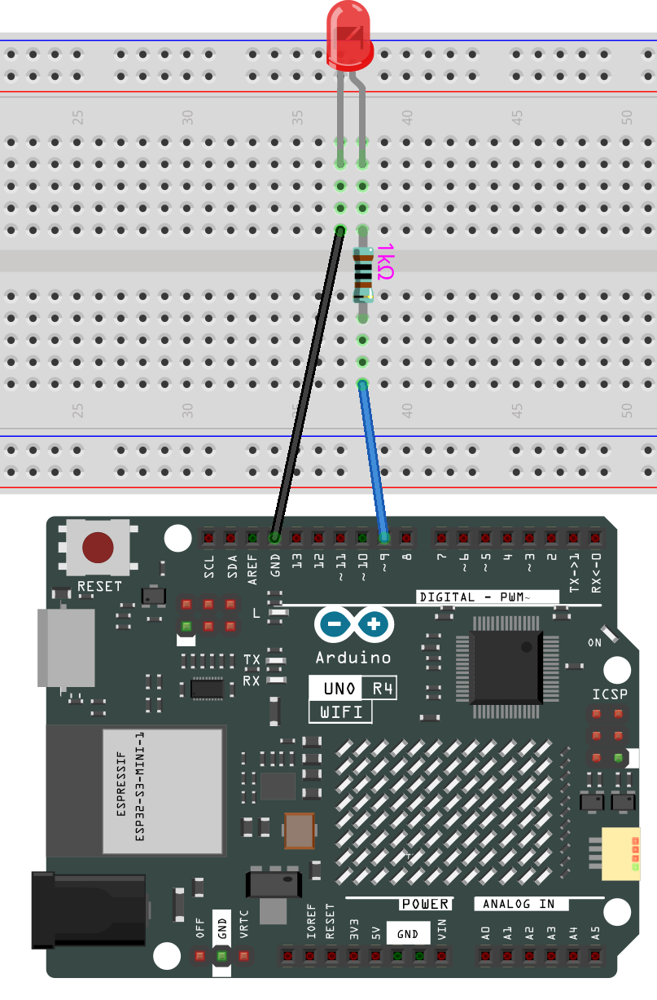
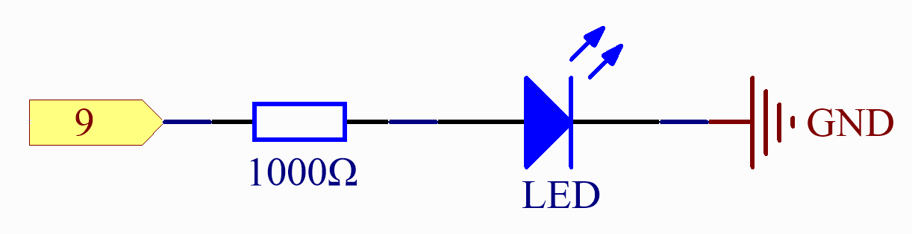

.. note::

    Bonjour, bienvenue dans la communauté SunFounder Raspberry Pi & Arduino & ESP32 Enthusiasts sur Facebook ! Plongez au cœur de Raspberry Pi, Arduino et ESP32 avec d'autres passionnés.

    **Pourquoi nous rejoindre ?**

    - **Support d'experts** : Résolvez les problèmes après-vente et les défis techniques grâce à l'aide de notre communauté et de notre équipe.
    - **Apprendre & Partager** : Échangez des astuces et des tutoriels pour améliorer vos compétences.
    - **Aperçus exclusifs** : Accédez en avant-première aux annonces de nouveaux produits et aux avant-goûts.
    - **Réductions spéciales** : Profitez de réductions exclusives sur nos nouveaux produits.
    - **Promotions festives et tirages au sort** : Participez à des tirages au sort et des promotions de vacances.

    👉 Prêt à explorer et créer avec nous ? Cliquez sur [|link_sf_facebook|] et rejoignez-nous dès aujourd'hui !

.. _basic_led:

Module LED
==========================

Tout comme l'impression de "Hello, world !" est la première étape pour apprendre à programmer, utiliser un programme pour piloter une LED est l'introduction traditionnelle à la programmation physique.

Composants requis
-------------------------

Pour ce projet, nous avons besoin des composants suivants. 

Il est certainement pratique d'acheter un kit complet, voici le lien : 

.. list-table::
    :widths: 20 20 20
    :header-rows: 1

    *   - Nom	
        - ARTICLES DANS CE KIT
        - LIEN
    *   - Elite Explorer Kit
        - 300+
        - |link_Elite_Explorer_kit|

Vous pouvez également les acheter séparément à partir des liens ci-dessous.

.. list-table::
    :widths: 30 20
    :header-rows: 1

    *   - INTRODUCTION DES COMPOSANTS
        - LIEN D'ACHAT

    *   - :ref:`uno_r4_wifi`
        - \-
    *   - :ref:`cpn_breadboard`
        - |link_breadboard_buy|
    *   - :ref:`cpn_wires`
        - |link_wires_buy|
    *   - :ref:`cpn_resistor`
        - |link_resistor_buy|
    *   - :ref:`cpn_led`
        - |link_led_buy|

Câblage
----------------------

Schéma de câblage
-----------------------

Code
---------------

.. note::

   * Vous pouvez ouvrir le fichier ``10-led.ino`` sous le chemin ``elite-explorer-kit-main\basic_project\10-led``. 
   * Ou copiez ce code dans **Arduino IDE**.

.. literalinclude:: /_code/10_basic_led.ino
   :language: cpp
   :linenos:
   :caption: 10-led.ino

.. raw:: html

   <video loop autoplay muted style = "max-width:100%">
      <source src="../_static/videos/basic_projects/10_basic_led.mp4"  type="video/mp4">
      Your browser does not support the video tag.
   </video>

Une fois le code téléversé avec succès, vous verrez la LED connectée à la broche numérique 9 de la carte Arduino commencer à clignoter. La LED s'allumera pendant une demi-seconde puis s'éteindra pendant une autre demi-seconde, répétant ce cycle continuellement tant que le programme est en cours d'exécution.

Analyse du code
------------------------

Ici, nous connectons la LED à la broche numérique 9, donc nous devons déclarer une variable ``int`` appelée ``ledPin`` au début du programme et lui attribuer une valeur de 9.

.. code-block:: arduino

    const int ledPin = 9;

Maintenant, initialisez la broche dans la fonction ``setup()``, où vous devez initialiser la broche en mode ``OUTPUT``.

.. code-block:: arduino

    void setup() {
        pinMode(ledPin, OUTPUT);
    }

Dans la fonction ``loop()``, ``digitalWrite()`` est utilisé pour fournir un signal de niveau haut de 5V à la broche ledPin, ce qui entraînera une différence de tension entre les broches de la LED et l'allumera.

.. code-block:: arduino

    digitalWrite(ledPin, HIGH);

Si le signal de niveau est changé en LOW, le signal de la broche ledPin sera ramené à 0 V pour éteindre la LED.

.. code-block:: arduino

    digitalWrite(ledPin, LOW);

Un intervalle entre l'allumage et l'extinction est nécessaire pour permettre aux 
gens de voir le changement, nous utilisons donc un code ``delay(1000)`` pour que le contrôleur ne fasse rien pendant 1000 ms.

.. code-block:: arduino

    delay(1000);   
