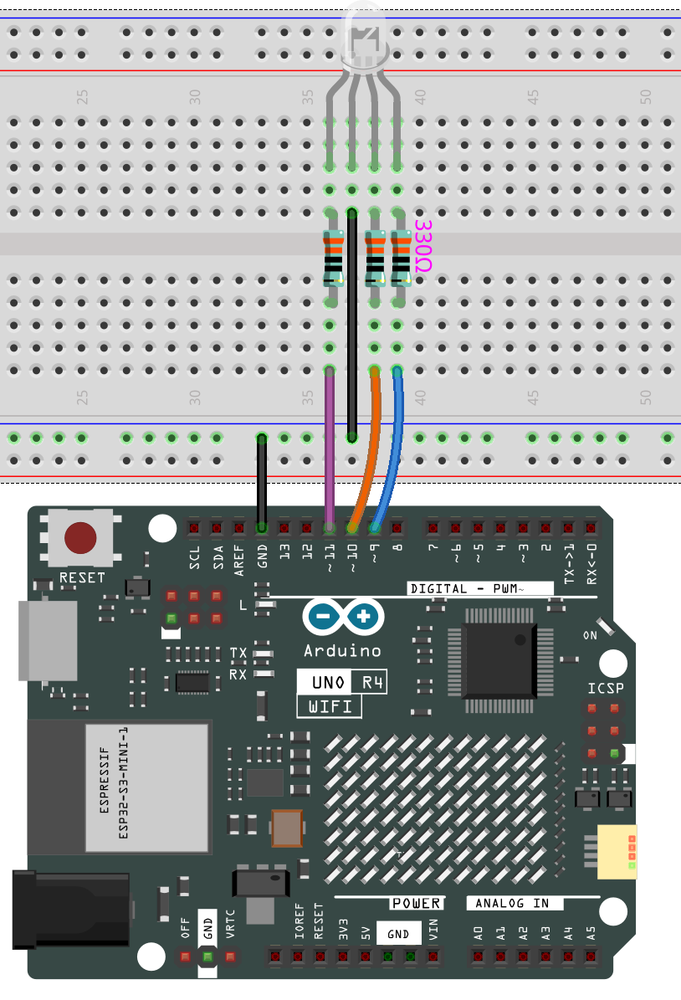
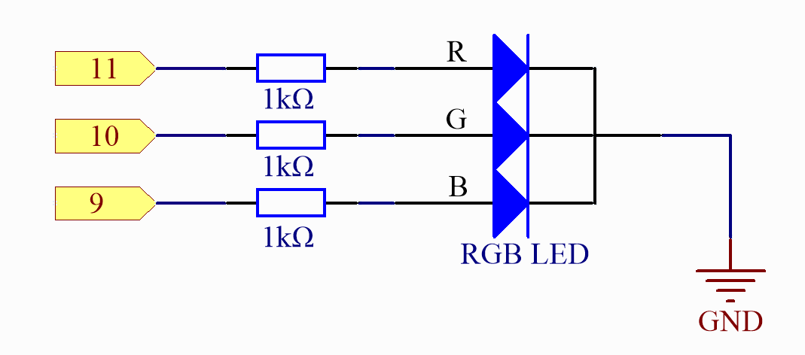

.. note::

    こんにちは、SunFounderのRaspberry Pi & Arduino & ESP32愛好家コミュニティへようこそ！Facebook上でRaspberry Pi、Arduino、ESP32についてもっと深く掘り下げ、他の愛好家と交流しましょう。

    **参加する理由は？**

    - **エキスパートサポート**：コミュニティやチームの助けを借りて、販売後の問題や技術的な課題を解決します。
    - **学び＆共有**：ヒントやチュートリアルを交換してスキルを向上させましょう。
    - **独占的なプレビュー**：新製品の発表や先行プレビューに早期アクセスしましょう。
    - **特別割引**：最新製品の独占割引をお楽しみください。
    - **祭りのプロモーションとギフト**：ギフトや祝日のプロモーションに参加しましょう。

    👉 私たちと一緒に探索し、創造する準備はできていますか？[|link_sf_facebook|]をクリックして今すぐ参加しましょう！

.. _basic_rgb_led:

RGB LED
==========================

概要
---------------

本レッスンでは、PWM（パルス幅変調）を使用してRGB LEDを様々な色に点滅させます。LEDのR（赤）、G（緑）、B（青）ピンに異なるPWM値を設定すると、その明るさが変わります。3つの異なる色を混ぜることで、RGB LEDが様々な色に点滅するのを観察できます。

必要なコンポーネント
-------------------------

このプロジェクトには、以下のコンポーネントが必要です。

全セットを購入するのが便利です。こちらがリンクです：

.. list-table::
    :widths: 20 20 20
    :header-rows: 1

    *   - 名称	
        - このキットのアイテム数
        - リンク
    *   - Elite Explorer Kit
        - 300+
        - |link_Elite_Explorer_kit|

以下のリンクから個別に購入することもできます。

.. list-table::
    :widths: 30 20
    :header-rows: 1

    *   - コンポーネント紹介
        - 購入リンク

    *   - :ref:`uno_r4_wifi`
        - \-
    *   - :ref:`cpn_breadboard`
        - |link_breadboard_buy|
    *   - :ref:`cpn_wires`
        - |link_wires_buy|
    *   - :ref:`cpn_resistor`
        - |link_resistor_buy|
    *   - :ref:`cpn_rgb_led`
        - |link_rgb_led_buy|

PWM
--------

パルス幅変調（PWM）は、デジタル手段でアナログ結果を得るための技術です。デジタル制御を使用して、オンとオフの間で切り替えられる矩形波（スクエアウェーブ）を作成します。このオン・オフのパターンは、オン（5ボルト）とオフ（0ボルト）の間の電圧を、信号がオンになる時間とオフになる時間の比率を変えることでシミュレートできます。"オン時間"の持続時間を「パルス幅」と呼びます。異なるアナログ値を得るには、その幅を変調（調整）します。このオン・オフのパターンを十分に高速で繰り返すと、例えばLEDのようなデバイスでは、信号が0～5Vの間の安定した電圧として現れ、LEDの明るさを制御します（Arduinoの公式ウェブサイト上のPWM説明を参照）。

以下の図では、緑色の線が通常の時間周期を表しています。この持続時間または周期はPWM周波数の逆数です。つまり、ArduinoのPWM周波数が約500Hzであれば、緑色の線はそれぞれ2ミリ秒となります。

.. image:: img/11_rgbled_pwm.jpeg
   :align: center
   :width: 60%

analogWrite()の呼び出しは0～255のスケールで行われ、analogWrite(255)は100％のデューティサイクル（常にオン）、analogWrite(127)は50％のデューティサイクル（半分の時間オン）を要求します。

PWM値が小さいほど、電圧に変換された後の値も小さくなります。その結果、LEDの明るさもそれに応じて暗くなります。したがって、PWM値を制御することでLEDの明るさをコントロールできます。

配線図
----------------------

回路図
-----------------------

コード
---------------

.. note::

    * ファイル ``11-rgb_led.ino`` を ``elite-explorer-kit-main\basic_project\11-rgb_led`` のパスで直接開くことができます。
    * または、このコードをArduino IDEにコピーしてください。

.. raw:: html

    <iframe src=https://create.arduino.cc/editor/sunfounder01/71dc53ac-adc6-4c4d-8d92-1dfffd1d0f7f/preview?embed style="height:510px;width:100%;margin:10px 0" frameborder=0></iframe>

.. raw:: html

   <video loop autoplay muted style = "max-width:100%">
      <source src="../_static/videos/basic_projects/11_basic_rgb_led.mp4"  type="video/mp4">
      ブラウザがビデオタグをサポートしていません。
   </video>

コードが正常にアップロードされると、最初はRGB LEDが赤、緑、青の順に循環点滅し、その後、赤、オレンジ、黄色、緑、青、藍色、紫の順に点滅します。

コード解析
--------------------

**色の設定**

ここでは ``color()`` 関数を使用してRGB LEDの色を設定します。コードでは、7つの異なる色に点滅するように設定されています。

コンピューターのペイントツールを使用してRGB値を取得できます。

1. コンピューターでペイントツールを開き、色の編集をクリックします。

   .. image:: img/11_rgbled_color1.png
      :align: center

2. 1色を選択すると、その色のRGB値が表示されます。それらをコードに入力してください。
   
   .. note:: 
      ハードウェアや環境要因により、コンピューターの画面とRGB LEDで表示される色は、同じRGB値を使用しても異なる場合があります。

   .. image:: img/11_rgbled_color2.png
      :align: center

   .. raw:: html

       
   
   .. code-block:: arduino
   
       void loop() // run over and over again
   
       {
   
         // Basic colors:
   
         color(255, 0, 0); // turn the RGB LED red
   
         delay(1000); // delay for 1 second
   
         color(0,255, 0); // turn the RGB LED green
   
         delay(1000); // delay for 1 second
   
         color(0, 0, 255); // turn the RGB LED blue
   
         delay(1000); // delay for 1 second
   
         // Example blended colors:
   
         color(255,0,252); // turn the RGB LED red
   
         delay(1000); // delay for 1 second
   
         color(237,109,0); // turn the RGB LED orange
   
         delay(1000); // delay for 1 second
   
         color(255,215,0); // turn the RGB LED yellow
   
         ......
   
   **color()関数**

.. code-block:: arduino

    void color (int red, int green, int blue)
    // the color generating function

    {

      analogWrite(redPin, red);

      analogWrite(greenPin, green);

      analogWrite(bluePin, blue);

    }

赤、緑、青の3つのunsigned char変数を定義し、それらの値を ``redPin``、 ``greenPin``、 ``bluePin`` に書き込みます。例えば、color(128,0,128)は ``redPin`` に128、 ``greenPin`` に0、 ``bluePin`` に128を書き込むことを意味し、結果としてLEDが紫色に点滅します。

**analogWrite()**：アナログ値（PWM波）をピンに書き込みます。アナログピンとは関係ありませんが、PWMピン専用です。 ``analogWrite()`` を呼び出す前にピンを出力として設定するために ``pinMode()`` を呼び出す必要はありません。

