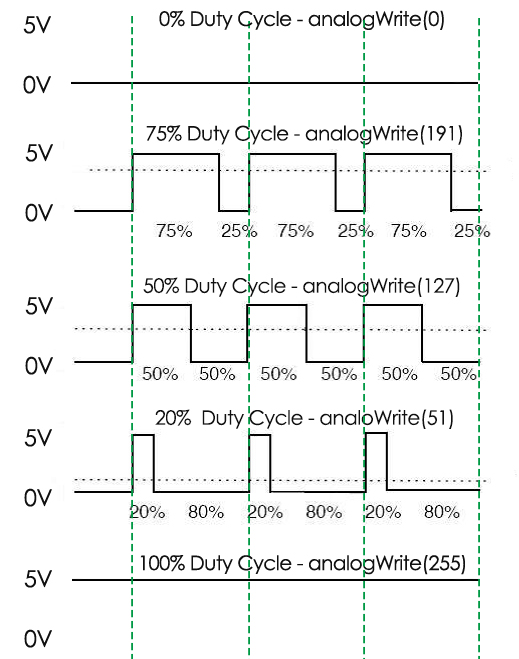
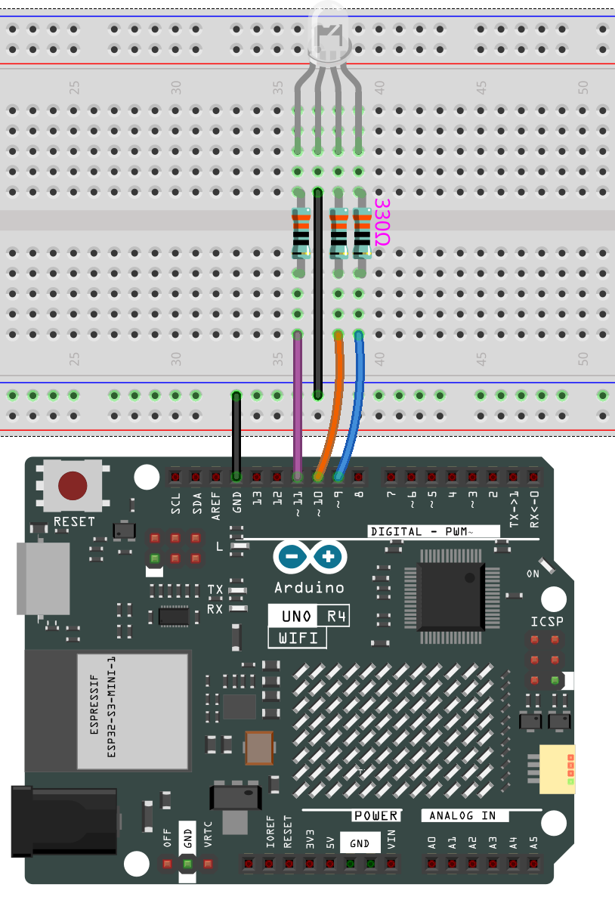
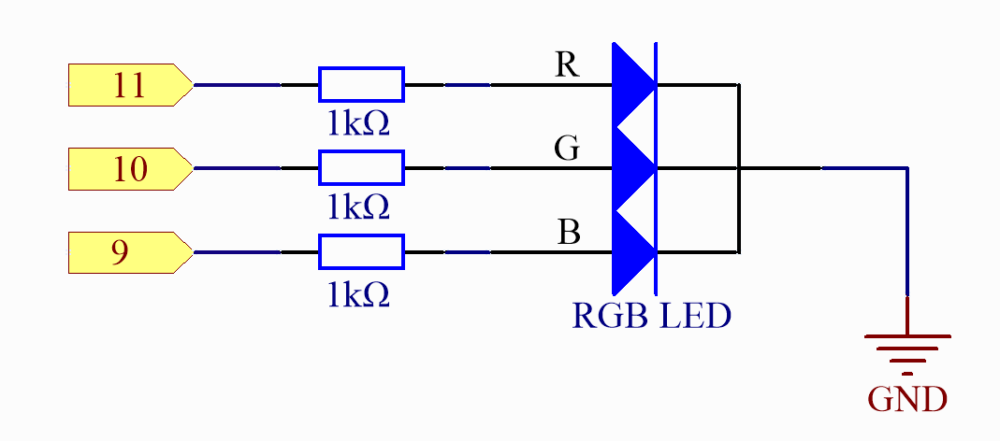

.. note::

    Ciao, benvenuto nella Community di SunFounder per appassionati di Raspberry Pi, Arduino e ESP32 su Facebook! Approfondisci Raspberry Pi, Arduino ed ESP32 insieme ad altri appassionati.

    **Perché unirsi?**

    - **Supporto Esperto**: Risolvi problemi post-vendita e sfide tecniche con l'aiuto della nostra comunità e del nostro team.
    - **Impara e Condividi**: Scambia suggerimenti e tutorial per migliorare le tue competenze.
    - **Anteprime Esclusive**: Accedi in anteprima agli annunci dei nuovi prodotti e alle anticipazioni.
    - **Sconti Speciali**: Godi di sconti esclusivi sui nostri prodotti più recenti.
    - **Promozioni e Giveaway Festivi**: Partecipa a giveaway e promozioni festive.

    👉 Pronto a esplorare e creare con noi? Clicca su [|link_sf_facebook|] e unisciti oggi!

.. _basic_rgb_led:

RGB LED
==========================

Panoramica
---------------

In questa lezione, utilizzeremo il PWM per controllare un LED RGB in modo che lampeggi con vari colori. Quando si impostano diversi valori PWM ai pin R, G e B del LED, la sua luminosità cambia. Mescolando i tre colori diversi, vedremo il LED RGB lampeggiare in colori differenti.

Componenti Necessari
-------------------------

In questo progetto, abbiamo bisogno dei seguenti componenti.

È sicuramente conveniente acquistare un kit completo, ecco il link: 

.. list-table::
    :widths: 20 20 20
    :header-rows: 1

    *   - Nome	
        - ELEMENTI IN QUESTO KIT
        - LINK
    *   - Elite Explorer Kit
        - 300+
        - |link_Elite_Explorer_kit|

Puoi anche acquistarli separatamente dai link seguenti.

.. list-table::
    :widths: 30 20
    :header-rows: 1

    *   - INTRODUZIONE DEI COMPONENTI
        - LINK PER L'ACQUISTO

    *   - :ref:`uno_r4_wifi`
        - \-
    *   - :ref:`cpn_breadboard`
        - |link_breadboard_buy|
    *   - :ref:`cpn_wires`
        - |link_wires_buy|
    *   - :ref:`cpn_resistor`
        - |link_resistor_buy|
    *   - :ref:`cpn_rgb_led`
        - |link_rgb_led_buy|

PWM
--------

La modulazione della larghezza di impulso, o PWM, è una tecnica per ottenere risultati analogici con mezzi digitali. Il controllo digitale è usato per creare un'onda quadra, un segnale che alterna tra acceso e spento. Questo schema acceso-spento può simulare tensioni intermedie tra completamente acceso (5 Volt) e spento (0 Volt) cambiando la porzione di tempo in cui il segnale rimane acceso rispetto al tempo in cui rimane spento. La durata del "tempo acceso" è chiamata larghezza di impulso. Per ottenere valori analogici variabili, si cambia, o modula, quella larghezza. Se si ripete questo schema acceso-spento abbastanza velocemente con un dispositivo, ad esempio un LED, il segnale appare come una tensione costante tra 0 e 5V che controlla la luminosità del LED. (Vedi la descrizione del PWM sul sito ufficiale di Arduino).

Nel grafico sottostante, le linee verdi rappresentano un periodo di tempo regolare. Questa durata o periodo è l'inverso della frequenza PWM. In altre parole, con la frequenza PWM di Arduino di circa 500Hz, le linee verdi misurano 2 millisecondi ciascuna.

Una chiamata a analogWrite() è su una scala da 0 a 255, ad esempio analogWrite(255) richiede un ciclo di lavoro del 100% (sempre acceso), e analogWrite(127) è un ciclo di lavoro del 50% (acceso metà del tempo).

Scoprirai che più piccolo è il valore PWM, più piccolo sarà il valore dopo essere stato convertito in tensione. Di conseguenza, il LED diventerà più fioco. Pertanto, possiamo controllare la luminosità del LED controllando il valore PWM.

Cablaggio
----------------------

Schema Elettrico
-----------------------

Codice
---------------

.. note::

    * Puoi aprire direttamente il file ``11-rgb_led.ino`` nel percorso ``elite-explorer-kit-main\basic_project\11-rgb_led``.
    * Oppure copia questo codice nell'Arduino IDE.

.. literalinclude:: /_code/11_basic_rgb_led.ino
   :language: cpp
   :linenos:
   :caption: 11-rgb_led.ino

.. raw:: html

   <video loop autoplay muted style = "max-width:100%">
      <source src="../_static/videos/basic_projects/11_basic_rgb_led.mp4"  type="video/mp4">
      Your browser does not support the video tag.
   </video>

Una volta caricato con successo il codice, vedrai il LED RGB lampeggiare in un pattern circolare di rosso, verde e blu inizialmente. Poi lampeggierà in sequenza di rosso, arancione, giallo, verde, blu, indaco e viola.

Analisi del Codice
--------------------

**Imposta il colore**

Qui utilizziamo la funzione ``color()`` per impostare il colore del LED RGB. 
Nel codice, è impostato per lampeggiare in 7 colori diversi.

Puoi utilizzare lo strumento di pittura sul tuo computer per ottenere il valore RGB.

1. Apri lo strumento di pittura sul tuo computer e clicca su Modifica colori.

   .. image:: img/11_rgbled_color1.png
      :align: center

2. Seleziona un colore, quindi puoi vedere il valore RGB di questo colore. Inseriscilo nel codice.
   
   .. note:: 
      A causa di fattori hardware e ambientali, i colori visualizzati sugli schermi dei computer e sui LED RGB possono variare anche utilizzando gli stessi valori RGB.

   .. image:: img/11_rgbled_color2.png
      :align: center

   .. raw:: html

       
   
   .. code-block:: arduino
   
       void loop() // esegui ripetutamente
   
       {
   
         // Colori di base:
   
         color(255, 0, 0); // accendi il LED RGB di rosso
   
         delay(1000); // ritardo di 1 secondo
   
         color(0,255, 0); // accendi il LED RGB di verde
   
         delay(1000); // ritardo di 1 secondo
   
         color(0, 0, 255); // accendi il LED RGB di blu
   
         delay(1000); // ritardo di 1 secondo
   
         // Esempi di colori miscelati:
   
         color(255,0,252); // accendi il LED RGB di rosso
   
         delay(1000); // ritardo di 1 secondo
   
         color(237,109,0); // accendi il LED RGB di arancione
   
         delay(1000); // ritardo di 1 secondo
   
         color(255,215,0); // accendi il LED RGB di giallo
   
         ......
   
   
**Funzione color()**

.. code-block:: arduino

    void color (int red, int green, int blue)
    // la funzione generatrice di colori

    {

      analogWrite(redPin, red);

      analogWrite(greenPin, green);

      analogWrite(bluePin, blue);

    }

Definisci tre variabili unsigned char, red, green e blue. Scrivi i loro valori a ``redPin``, ``greenPin`` e ``bluePin``. Ad esempio, color(128,0,128) scrive 128 a ``redPin``, 0 a ``greenPin`` e 128 a ``bluePin``. Il risultato è che il LED lampeggia di viola.

**analogWrite()**: Scrive un valore analogico (onda PWM) su un pin. Non ha nulla a che fare con un pin analogico, ma solo per i pin PWM. Non è necessario chiamare ``pinMode()`` per impostare il pin come output prima di chiamare ``analogWrite()``.
