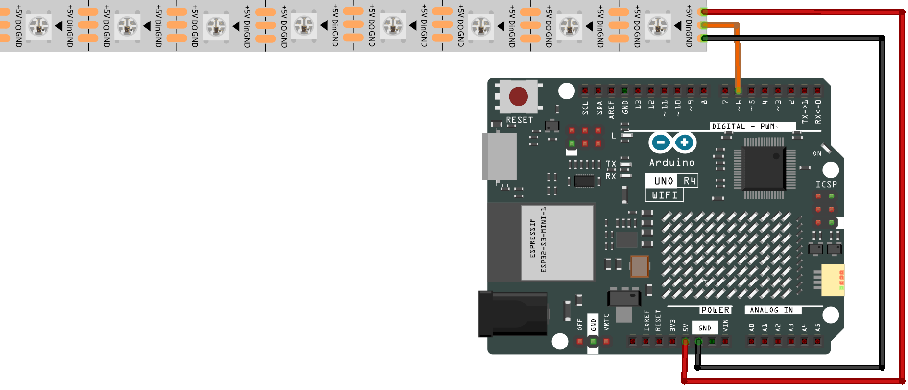

.. note::

    ¡Hola! Bienvenido a la Comunidad de Entusiastas de SunFounder Raspberry Pi, Arduino y ESP32 en Facebook. Sumérgete en el mundo de Raspberry Pi, Arduino y ESP32 junto a otros entusiastas.

    **¿Por qué unirse?**

    - **Soporte experto**: Resuelve problemas postventa y desafíos técnicos con la ayuda de nuestra comunidad y equipo.
    - **Aprende y comparte**: Intercambia consejos y tutoriales para mejorar tus habilidades.
    - **Avances exclusivos**: Obtén acceso anticipado a nuevos anuncios de productos y adelantos.
    - **Descuentos especiales**: Disfruta de descuentos exclusivos en nuestros productos más recientes.
    - **Promociones festivas y sorteos**: Participa en sorteos y promociones de temporada.

    👉 ¿Listo para explorar y crear con nosotros? Haz clic en [|link_sf_facebook|] y únete hoy mismo.

.. _basic_ws2812:

Tira de LEDs RGB WS2812
=============================

Descripción general
----------------------

En esta lección, aprenderás sobre los LEDs NeoPixel y cómo controlarlos utilizando la biblioteca FastLED en un Arduino Uno R4. Los LEDs NeoPixel se utilizan ampliamente en diversas aplicaciones como la decoración del hogar, prendas de vestir y la iluminación de eventos. La biblioteca FastLED simplifica el proceso de programación de estos LEDs. Aquí, una cadena de 8 LEDs NeoPixel está conectada a un Arduino, y cada LED en la secuencia se enciende momentáneamente en color azul antes de apagarse, moviéndose al siguiente LED en la cadena. Este ejemplo básico puede servir como base para patrones de luz más complejos o proyectos de iluminación interactiva.

Componentes necesarios
-------------------------

En este proyecto, necesitamos los siguientes componentes.

Es definitivamente conveniente comprar un kit completo, aquí tienes el enlace:

.. list-table::
    :widths: 20 20 20
    :header-rows: 1

    *   - Nombre	
        - ELEMENTOS EN ESTE KIT
        - ENLACE
    *   - Elite Explorer Kit
        - 300+
        - |link_Elite_Explorer_kit|

También puedes comprarlos por separado en los enlaces a continuación.

.. list-table::
    :widths: 30 20
    :header-rows: 1

    *   - INTRODUCCIÓN AL COMPONENTE
        - ENLACE DE COMPRA

    *   - :ref:`uno_r4_wifi`
        - \-
    *   - :ref:`cpn_wires`
        - |link_wires_buy|
    *   - :ref:`cpn_ws2812`
        - |link_ws2812_buy|

Conexión
----------------------

Diagrama esquemático
-----------------------

.. image:: img/12_ws2812_schematic.png
    :align: center
    :width: 80%

Código
---------------

.. note::

    * Puedes abrir el archivo ``12-ws2812.ino`` en la ruta ``elite-explorer-kit-main\basic_project\12-ws2812`` directamente.
    * O copiar este código en Arduino IDE.

.. note:: 
    Para instalar la biblioteca, utiliza el Administrador de Bibliotecas de Arduino y busca **"FastLED"** e instálala. 

.. important::
    Con el lanzamiento de |link_fastled_3_7_0|, la biblioteca FastLED ahora admite oficialmente el Arduino UNO R4. Por lo tanto, ya no necesitas instalar manualmente la versión de desarrollo. Simplemente actualiza o instala la biblioteca FastLED utilizando el Administrador de Bibliotecas de Arduino.
.. warning::
    **[Desactualizado]** Dado que la biblioteca |link_FastLED_lib| aún no ha lanzado oficialmente una versión compatible con Arduino R4, tendrás que descargar :download:`el último código de desarrollo de la biblioteca FastLED <https://codeload.github.com/FastLED/FastLED/zip/refs/heads/master>` y sobrescribir los archivos existentes de la biblioteca FastLED. Para obtener instrucciones detalladas sobre cómo hacerlo, consulta la sección :ref:`manual_install_lib`. (Esta note será retirada cuando la biblioteca FastLED lance oficialmente una actualización que admita el Arduino UNO R4.)

.. raw:: html

    <iframe src=https://create.arduino.cc/editor/sunfounder01/6c9b8c2c-6cea-4ea8-a959-e579ca98f35d/preview?embed style="height:510px;width:100%;margin:10px 0" frameborder=0></iframe>

.. raw:: html

   <video loop autoplay muted style = "max-width:100%">
      <source src="../_static/videos/basic_projects/12_basic_ws2812.mp4"  type="video/mp4">
      Your browser does not support the video tag.
   </video>

Después de cargar el código correctamente, verás que cada LED en la cadena de 8 LEDs NeoPixel se enciende uno a la vez en color azul. El programa recorrerá esta secuencia continuamente, apagando cada LED antes de pasar al siguiente. Con un breve retraso entre cada LED, el efecto de iluminación aparecerá como un punto azul que viaja a lo largo de la cadena.

Análisis del código
------------------------

1. Importar la biblioteca y configurar constantes

   - Importar la biblioteca ``FastLED`` para utilizar sus funciones.
   - Definir el número de LEDs y el pin de datos al que están conectados.
   
   .. code-block:: arduino
   
      #include <FastLED.h>  // Incluir biblioteca FastLED
      #define NUM_LEDS 8    // Número de LEDs en la cadena
      #define DATA_PIN 6    // Pin de datos para el control de LED

2. Inicializar la matriz de LEDs
   
   Crear una matriz de tipo ``CRGB`` para almacenar la información de color de cada LED.

   .. code-block:: arduino

      CRGB leds[NUM_LEDS];  // Matriz para almacenar datos de color de los LEDs

3. Inicializar los LEDs en Setup

   Utilizar ``FastLED.addLeds`` para inicializar los LEDs.

   .. code-block:: arduino

      void setup() {
        FastLED.addLeds<NEOPIXEL, DATA_PIN>(leds, NUM_LEDS);  // Inicializar LEDs
      }

4. Controlar los LEDs en Loop
   
   Recorrer cada LED para configurarlo en azul, mostrarlo, despejarlo y luego retrasar.

   - La matriz ``leds`` sirve como un búfer de color para tu tira de LEDs. Cada elemento en esta matriz corresponde a un LED individual en tu tira física, y su valor de color determina el color que el LED mostrará. El orden de los elementos en la matriz coincide con el orden de los LEDs en la tira, comenzando desde el primer LED (que corresponde a ``leds[0]``) hasta el último LED. Para cambiar el color de un LED específico en tu tira, simplemente modifica el elemento correspondiente en la matriz ``leds``. Puedes usar |fastled_color| o establecer colores usando RGB (Tomando el verde como ejemplo, usa ``leds[dot] = CRGB::Green`` o ``leds[dot] = CRGB(0, 255, 0);``).

   - La función ``FastLED.show();`` actualiza la tira de LEDs con nuevos datos de color, haciendo que los cambios sean visibles. Es como presionar el botón de "publicar" para tu tira de LEDs después de realizar ediciones y ajustes en el código.

   .. raw:: html

      

   .. code-block:: arduino

      void loop() {
        for (int dot = 0; dot < NUM_LEDS; dot++) {
          leds[dot] = CRGB::Blue;   // Configurar el LED actual en azul
          FastLED.show();           // Actualizar LEDs
          leds[dot] = CRGB::Black;  // Despejar el LED actual
          delay(30);                // Esperar un breve período antes de pasar al siguiente LED
        }
      }
