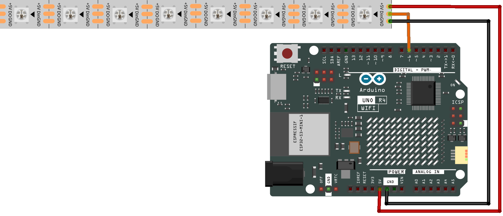

.. _basic_ws2812:

WS2812 RGB LED 灯条
==========================

概述
---------------

在本课中，您将了解 NeoPixel LED 以及如何使用 FastLED 库在 Arduino Uno R4 上控制它们。NeoPixel LED 广泛应用于家居装饰、可穿戴设备和活动照明等领域。FastLED 库简化了这些 LED 的编程过程。这里，将一串 8 个 NeoPixel LED 连接到 Arduino，序列中的每个 LED 会短暂亮起蓝色然后熄灭，接着轮到链条中的下一个 LED。这个基础示例可以作为更复杂的光效或交互式照明项目的基础。

所需元件
-------------------------

本项目中，我们需要以下元件。

购买整套套件会更加方便，以下是链接：

.. list-table::
    :widths: 20 20 20
    :header-rows: 1

    *   - 名称
        - 套件所含项目
        - 链接
    *   - Elite Explorer 套件
        - 300+
        - |link_Elite_Explorer_kit|

您也可以从以下链接单独购买。

.. list-table::
    :widths: 30 20
    :header-rows: 1

    *   - 元件介绍
        - 购买链接

    *   - :ref:`uno_r4_wifi`
        - \-
    *   - :ref:`cpn_wires`
        - |link_wires_buy|
    *   - :ref:`cpn_ws2812`
        - |link_ws2812_buy|

接线
----------------------

原理图
-----------------------

.. image:: img/12_ws2812_schematic.png
    :align: center
    :width: 80%

代码
---------------

.. note::

    * 您可以直接打开路径 ``elite-explorer-kit-main\basic_project\12-ws2812`` 下的 ``12-ws2812.ino`` 文件。
    * 或者将以下代码复制到 Arduino IDE 中。

.. note::
    要安装库，请使用 Arduino 库管理器搜索 **"FastLED"** 并安装。

.. important::
    随着 |link_fastled_3_7_0| 的发布，FastLED 库现已正式支持 Arduino UNO R4。因此，您不再需要手动安装开发版本。只需使用 Arduino 库管理器更新或安装 FastLED 库即可。

.. warning::
    **[已过时]** 由于 |link_FastLED_lib| 库尚未正式发布支持 Arduino R4 的版本，您需要下载 :download:`FastLED 库的最新开发代码 <https://codeload.github.com/FastLED/FastLED/zip/refs/heads/master>` 并覆盖现有的 FastLED 库文件。有关如何执行此操作的详细说明，请参考 :ref:`manual_install_lib` 部分。（当 FastLED 库正式发布支持 Arduino UNO R4 的更新后，此说明将被撤回。）

.. raw:: html

    <iframe src=https://create.arduino.cc/editor/sunfounder01/6c9b8c2c-6cea-4ea8-a959-e579ca98f35d/preview?embed style="height:510px;width:100%;margin:10px 0" frameborder=0></iframe>

.. raw:: html

   <video loop autoplay muted style = "max-width:100%">
      <source src="../_static/videos/basic_projects/12_basic_ws2812.mp4"  type="video/mp4">
      您的浏览器不支持视频标签。
   </video>

代码成功上传后，您将看到 8 个 NeoPixel LED 灯串中的每个 LED 逐个亮起蓝色。程序将持续循环此序列，在转到下一个 LED 之前关闭当前 LED。由于每个 LED 之间有一个短暂的延迟，灯光效果将显示为一个沿着灯串移动的蓝色光点。

代码分析
------------------------

1. 导入库并设置常量

   - 导入 ``FastLED`` 库以使用其函数。
   - 定义 LED 数量及其连接的数据引脚。

   .. code-block:: arduino

      #include <FastLED.h>  // 包含 FastLED 库
      #define NUM_LEDS 8    // 灯串中 LED 的数量
      #define DATA_PIN 6    // LED 控制的数据引脚

2. 初始化 LED 数组

   创建一个 ``CRGB`` 类型的数组，用于存储每个 LED 的颜色信息。

   .. code-block:: arduino

      CRGB leds[NUM_LEDS];  // 用于存储 LED 颜色数据的数组

3. 在 Setup 中初始化 LED

   使用 ``FastLED.addLeds`` 初始化 LED。

   .. code-block:: arduino

      void setup() {
        FastLED.addLeds<NEOPIXEL, DATA_PIN>(leds, NUM_LEDS);  // 初始化 LED
      }

4. 在 Loop 中控制 LED

   循环遍历每个 LED，将其设为蓝色、显示、清除然后延迟。

   - ``leds`` 数组作为 LED 灯条的颜色缓冲区。该数组中的每个元素对应物理灯条上的一个 LED，其颜色值决定了该 LED 将显示的颜色。数组中元素的顺序与灯条上 LED 的顺序一致，从第一个 LED（对应于 ``leds[0]``）到最后一个 LED。要更改灯条上特定 LED 的颜色，只需修改 ``leds`` 数组中相应的元素。您可以使用 |fastled_color| 或使用 RGB 设置颜色（以绿色为例，使用 ``leds[dot] = CRGB::Green`` 或 ``leds[dot] = CRGB(0, 255, 0);``）。

   - ``FastLED.show();`` 函数用新的颜色数据更新 LED 灯条，使更改可见。这就像在代码中进行编辑和调整后，为 LED 灯条按下"发布"按钮。

   .. raw:: html

      

   .. code-block:: arduino

      void loop() {
        for (int dot = 0; dot < NUM_LEDS; dot++) {
          leds[dot] = CRGB::Blue;   // 将当前 LED 设为蓝色
          FastLED.show();           // 更新 LED
          leds[dot] = CRGB::Black;  // 清除当前 LED
          delay(30);                // 短暂等待后转到下一个 LED
        }
      }
