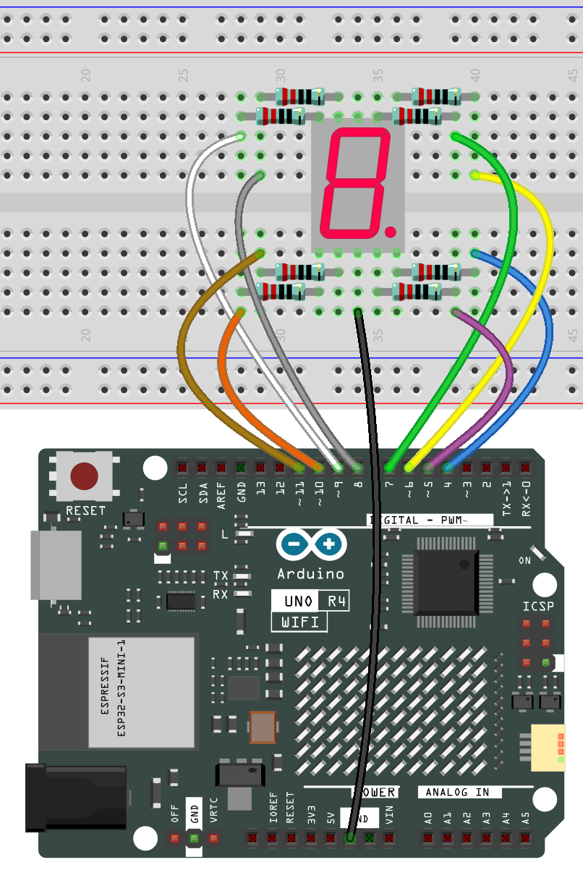
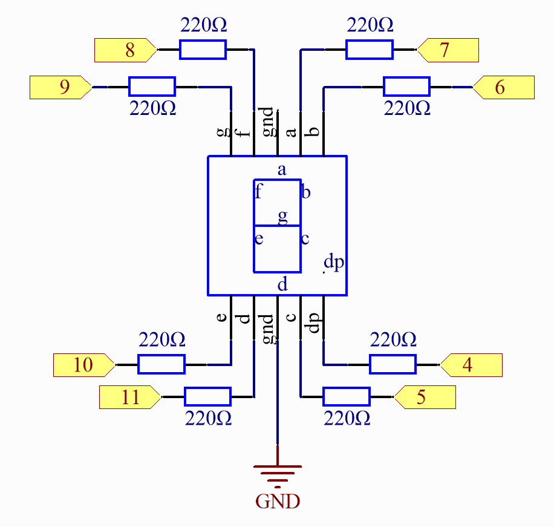

.. note::

    Hallo und willkommen in der SunFounder Raspberry Pi & Arduino & ESP32 Enthusiasten-Gemeinschaft auf Facebook! Tauchen Sie tiefer ein in die Welt von Raspberry Pi, Arduino und ESP32 mit anderen Enthusiasten.

    **Warum beitreten?**

    - **Expertenunterstützung**: Lösen Sie Nachverkaufsprobleme und technische Herausforderungen mit Hilfe unserer Gemeinschaft und unseres Teams.
    - **Lernen & Teilen**: Tauschen Sie Tipps und Anleitungen aus, um Ihre Fähigkeiten zu verbessern.
    - **Exklusive Vorschauen**: Erhalten Sie frühzeitigen Zugang zu neuen Produktankündigungen und exklusiven Einblicken.
    - **Spezialrabatte**: Genießen Sie exklusive Rabatte auf unsere neuesten Produkte.
    - **Festliche Aktionen und Gewinnspiele**: Nehmen Sie an Gewinnspielen und Feiertagsaktionen teil.

    👉 Sind Sie bereit, mit uns zu erkunden und zu erschaffen? Klicken Sie auf [|link_sf_facebook|] und treten Sie heute bei!

.. _basic_7segment:

7-Segment-Anzeige
==========================

.. https://docs.sunfounder.com/projects/uno-mega-kit/en/latest/uno/7_segment_display_uno.html#segmeng-uno

Überblick
-------------------

Eine 7-Segment-Anzeige ist ein Gerät, das Zahlen und Buchstaben darstellen kann. Sie besteht aus sieben in Parallelschaltung verbundenen LEDs. Verschiedene Buchstaben/Zahlen können angezeigt werden, indem die Pins der Anzeige mit der Stromquelle verbunden und die entsprechenden Pins aktiviert werden, wodurch die entsprechenden LED-Segmente eingeschaltet werden. In dieser Lektion lernen wir, wie man bestimmte Zeichen darauf anzeigt.

Benötigte Komponenten
------------------------

Für dieses Projekt benötigen wir die folgenden Komponenten.

Es ist definitiv praktisch, ein komplettes Kit zu kaufen, hier ist der Link:

.. list-table::
    :widths: 20 20 20
    :header-rows: 1

    *   - Name
        - ARTIKEL IN DIESEM KIT
        - LINK
    *   - Elite Explorer Kit
        - 300+
        - |link_Elite_Explorer_kit|

Sie können die Komponenten auch separat über die untenstehenden Links kaufen.

.. list-table::
    :widths: 30 20
    :header-rows: 1

    *   - KOMPONENTENBESCHREIBUNG
        - KAUF-LINK

    *   - :ref:`uno_r4_wifi`
        - \-
    *   - :ref:`cpn_breadboard`
        - |link_breadboard_buy|
    *   - :ref:`cpn_wires`
        - |link_wires_buy|
    *   - :ref:`cpn_resistor`
        - |link_resistor_buy|
    *   - :ref:`cpn_7segment`
        - |link_7segment_buy|

Verdrahtung
----------------------

Schaltplan
------------------------

In diesem Experiment verbinden Sie jeden Pin a-g der 7-Segment-Anzeige jeweils mit einem 1000-Ohm-Strombegrenzungswiderstand und dann mit Pin 4-11. GND verbindet sich mit GND. Durch die Programmierung können wir einen oder mehrere der Pins 4-11 als High-Level setzen, um die entsprechende(n) LED(s) zu beleuchten.

Code
---------------

.. note::

    * Sie können die Datei ``13-7_segment.ino`` direkt unter dem Pfad ``elite-explorer-kit-main\basic_project\13-7_segment`` öffnen.
    * Oder kopieren Sie diesen Code in die Arduino IDE.

.. raw:: html

    <iframe src=https://create.arduino.cc/editor/sunfounder01/ce9857dc-6285-45cd-9918-e35b0b135836/preview?embed style="height:510px;width:100%;margin:10px 0" frameborder=0></iframe>

.. raw:: html

   <video loop autoplay muted style = "max-width:100%">
      <source src="../_static/videos/basic_projects/13_basic_7_segment.mp4"  type="video/mp4">
      Ihr Browser unterstützt das Video-Tag nicht.
   </video>

     

Code-Analyse
----------------------

Der Code könnte für dieses Experiment etwas lang erscheinen. Aber die Syntax ist einfach. Lassen Sie uns einen Blick darauf werfen.

**Aufrufen der Funktion in loop()**

.. code-block:: arduino

   digital_1(); //diaplay 1 to the 7-segment

   delay(1000); //wait for a second

   digital_2(); //diaplay 2 to the 7-segment

   delay(1000); //wait for a second

   digital_3(); //diaplay 3 to the 7-segment

   delay(1000); //wait for a second

   digital_4(); //diaplay 4 to the 7-segment

Durch den Aufruf dieser Funktionen in der loop()-Funktion wird die 7-Segment-Anzeige 0-F anzeigen. Die Funktionen werden nachfolgend gezeigt. Nehmen wir ``digital_2()`` als Beispiel:

**Detaillierte Analyse von digital_2()**

.. code-block:: arduino

   void digital_2()  //diaplay 2 to the 7-segment
   {
     turnOffAllSegments();
     digitalWrite(a, HIGH);
     digitalWrite(b, HIGH);
     digitalWrite(g, HIGH);
     digitalWrite(e, HIGH);
     digitalWrite(d, HIGH);
   }

.. image:: img/13_7segment.jpeg
   :align: center

Zuerst müssen wir verstehen, wie die Zahl **2** auf der 7-Segment-Anzeige erscheint. Dies wird erreicht, indem die Segmente a, b, d, e und g eingeschaltet werden. In der Programmierung werden Pins, die mit diesen Segmenten verbunden sind, auf ein hohes Niveau gesetzt, während c und f auf ein niedriges Niveau gesetzt werden. Wir beginnen mit der Funktion ``turnOffAllSegments()``, um alle Segmente auszuschalten, und beleuchten dann die benötigten.

Nachdem dieser Teil ausgeführt wurde, zeigt die 7-Segment-Anzeige **2** an. Ähnlich ist es mit der Anzeige anderer Zeichen. Da die Buchstaben b und d in Großbuchstaben, nämlich **B** und **D**, gleich aussehen würden wie **8** und **0** auf der Anzeige, werden sie stattdessen in Kleinbuchstaben dargestellt.
