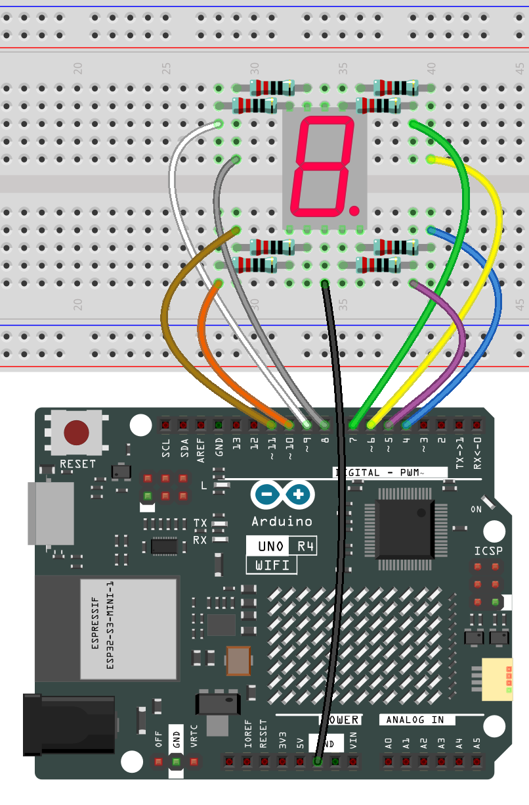
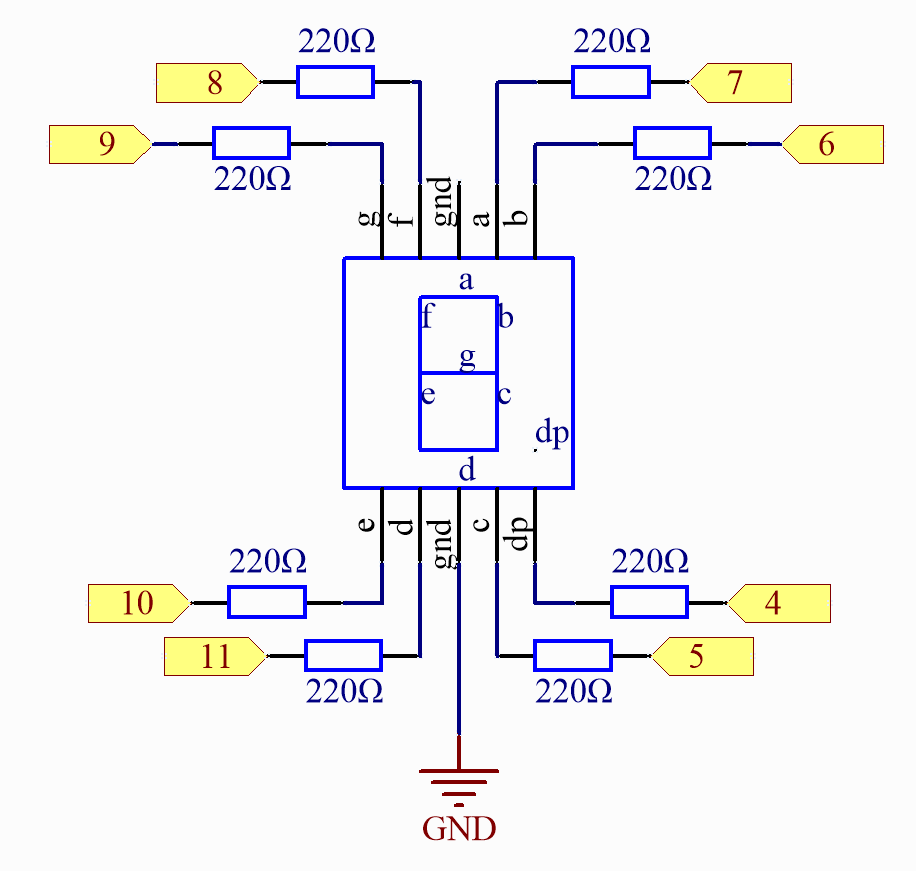
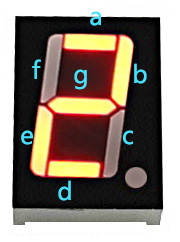

.. _basic_7segment:

7 段数码管
==========================

.. https://docs.sunfounder.com/projects/uno-mega-kit/en/latest/uno/7_segment_display_uno.html#segmeng-uno

概述
-------------------

7 段数码管是一种可以显示数字和字母的设备。它由七个并联的 LED 组成。通过将数码管上的引脚连接到电源并启用相关引脚，可以显示不同的字母/数字，从而点亮相应的 LED 段。在本课中，让我们学习如何在上面显示特定字符。

所需元件
------------------------

本项目中，我们需要以下元件。

购买整套套件会更加方便，以下是链接：

.. list-table::
    :widths: 20 20 20
    :header-rows: 1

    *   - 名称
        - 套件所含项目
        - 链接
    *   - Elite Explorer 套件
        - 300+
        - |link_Elite_Explorer_kit|

您也可以从以下链接单独购买。

.. list-table::
    :widths: 30 20
    :header-rows: 1

    *   - 元件介绍
        - 购买链接

    *   - :ref:`uno_r4_wifi`
        - \-
    *   - :ref:`cpn_breadboard`
        - |link_breadboard_buy|
    *   - :ref:`cpn_wires`
        - |link_wires_buy|
    *   - :ref:`cpn_resistor`
        - |link_resistor_buy|
    *   - :ref:`cpn_7segment`
        - |link_7segment_buy|

接线
----------------------

原理图
------------------------

在本实验中，将 7 段数码管的 a-g 每个引脚分别连接一个 1000 欧姆限流电阻，然后连接到引脚 4-11。GND 连接到 GND。通过编程，我们可以将 pin4-11 中的一个或多个设置为高电平，以点亮相应的 LED 段。

代码
---------------

.. note::

    * 您可以直接打开路径 ``elite-explorer-kit-main\basic_project\13-7_segment`` 下的 ``13-7_segment.ino`` 文件。
    * 或者将以下代码复制到 Arduino IDE 中。

.. literalinclude:: /_code/13_basic_7_segment.ino
   :language: cpp
   :linenos:
   :caption: 13-7_segment.ino

.. raw:: html

   <video loop autoplay muted style = "max-width:100%">
      <source src="../_static/videos/basic_projects/13_basic_7_segment.mp4"  type="video/mp4">
      您的浏览器不支持视频标签。
   </video>

     

代码分析
----------------------

这个实验的代码可能有点长，但语法很简单。让我们来看一下。

**在 loop() 中调用函数**

.. code-block:: arduino

   digital_1(); //在 7 段数码管上显示 1

   delay(1000); //等待一秒

   digital_2(); //在 7 段数码管上显示 2

   delay(1000); //等待一秒

   digital_3(); //在 7 段数码管上显示 3

   delay(1000); //等待一秒

   digital_4(); //在 7 段数码管上显示 4

将这些函数调用到 loop() 中是为了让 7 段数码管显示 0-F。函数如下所示。以 ``digital_2()`` 为例：

**digital_2() 的详细分析**

.. code-block:: arduino

   void digital_2()  //在 7 段数码管上显示 2
   {
     turnOffAllSegments();
     digitalWrite(a, HIGH);
     digitalWrite(b, HIGH);
     digitalWrite(g, HIGH);
     digitalWrite(e, HIGH);
     digitalWrite(d, HIGH);
   }

首先，我们需要了解数字 **2** 是如何在 7 段数码管上显示的。它通过给 a、b、d、e 和 g 段通电来实现。在编程中，连接到这些段的引脚设置为高电平，而 c 和 f 设置为低电平。我们首先使用函数 ``turnOffAllSegments()`` 关闭所有段，然后点亮所需的段。

运行这部分后，7 段数码管将显示 **2 ** 。同样，其他字符的显示方式相同。由于大写字母 B 和 D 在数码管上看起来与 **8 ** 和 **0** 相同，因此改为显示小写字母。
