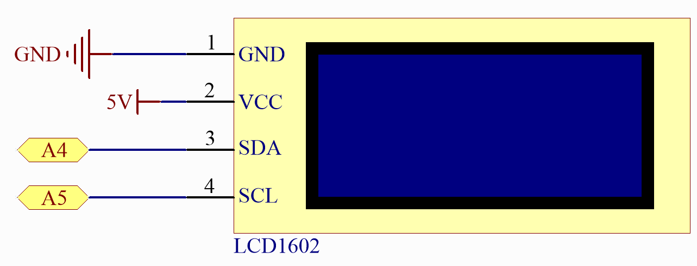

.. _basic_i2c_lcd1602:

I2C LCD1602
==========================

.. https://docs.sunfounder.com/projects/sensorkit-v2-arduino/en/latest/lesson_1.html

概述
---------------

在本课中，您将了解带有 I2C 接口的液晶显示器（LCD）。这类 LCD 广泛应用于各种电子设备中，例如数字时钟、微波炉、汽车仪表盘，甚至工业设备。I2C 接口简化了接线和连接，使爱好者和专业人士都能更方便高效地使用。

所需元件
-------------------------

本项目中，我们需要以下元件。

购买整套套件会更加方便，以下是链接：

.. list-table::
    :widths: 20 20 20
    :header-rows: 1

    *   - 名称
        - 套件所含项目
        - 链接
    *   - Elite Explorer 套件
        - 300+
        - |link_Elite_Explorer_kit|

您也可以从以下链接单独购买。

.. list-table::
    :widths: 30 20
    :header-rows: 1

    *   - 元件介绍
        - 购买链接

    *   - :ref:`uno_r4_wifi`
        - \-
    *   - :ref:`cpn_breadboard`
        - |link_breadboard_buy|
    *   - :ref:`cpn_wires`
        - |link_wires_buy|
    *   - :ref:`cpn_resistor`
        - |link_resistor_buy|
    *   - :ref:`cpn_i2c_lcd1602`
        - |link_i2clcd1602_buy|

接线
----------------------

.. image:: img/14-i2c_lcd_bb.png
    :align: center
    :width: 100%

原理图
-----------------------

代码
---------------

.. note::

    * 您可以直接打开路径 ``elite-explorer-kit-main\basic_project\14-i2c_lcd`` 下的 ``14-i2c_lcd.ino`` 文件。
    * 或者将以下代码复制到 Arduino IDE 中。

.. note::
    要安装库，请使用 Arduino 库管理器搜索 **"LiquidCrystal I2C"** 并安装。

.. literalinclude:: /_code/14_basic_i2c_lcd.ino
   :language: cpp
   :linenos:
   :caption: 14-i2c_lcd.ino

.. raw:: html

   <video loop autoplay muted style = "max-width:100%">
      <source src="../_static/videos/basic_projects/14_basic_i2c_lcd.mp4"  type="video/mp4">
      您的浏览器不支持视频标签。
   </video>

代码成功上传到 Arduino 后，LCD 将在第一行显示 "Hello world!"，在第二行显示 "LCD Tutorial"。

.. note::
    如果上传代码后 LCD 没有显示任何字符，您可以通过旋转 I2C 模块上的电位器调节对比度，直到 LCD 正常工作。

.. raw:: html

   <video loop autoplay muted style = "max-width:100%">
      <source src="../_static/videos/basic_projects/14_basic_i2c_lcd_2.mp4"  type="video/mp4">
      您的浏览器不支持视频标签。
   </video>

     

代码分析
------------------------

1. 包含库并初始化 LCD：
   包含 LiquidCrystal I2C 库，以提供用于 LCD 接口的函数和方法。接着，使用 LiquidCrystal_I2C 类创建一个 LCD 对象，指定 I2C 地址、列数和行数。

   .. note::
      要安装库，请使用 Arduino 库管理器搜索 **"LiquidCrystal I2C"** 并安装。

   .. code-block:: arduino

      #include <LiquidCrystal_I2C.h>
      LiquidCrystal_I2C lcd(0x27, 16, 2);

2. 设置函数：
   当 Arduino 启动时，``setup()`` 函数执行一次。在此函数中，LCD 被初始化、清除并打开背光。然后在 LCD 上显示两条消息。

   .. code-block:: arduino

      void setup() {
        lcd.init();       // 初始化 LCD
        lcd.clear();      // 清除 LCD 显示
        lcd.backlight();  // 确保背光亮起

        // 在 LCD 的两行上打印消息。
        lcd.setCursor(2, 0);  // 将光标设置到第 0 行的第 2 个字符位置
        lcd.print("Hello world!");

        lcd.setCursor(2, 1);  // 将光标移动到第 1 行的第 2 个字符位置
        lcd.print("LCD Tutorial");
      }
