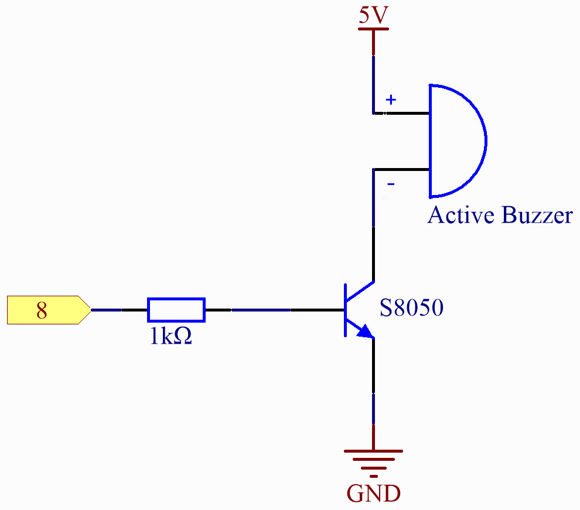

.. _basic_active_buzzer:

Active Buzzer
==========================

.. https://docs.sunfounder.com/projects/3in1-kit-r4/en/latest/basic_project/ar_active_buzzer.html#ar-beep

Overview
---------------

The active buzzer is a typical digital output device that is as easy to use as lighting up an LED!

Two types of buzzers are included in the kit. 
We need to use active buzzer. Turn them around, the sealed back (not the exposed PCB) is the one we want.

.. image:: img/16_buzzer.png
    :align: center
    :width: 80%

Required Components
-------------------------

* :ref:`uno_r4_wifi`
* :ref:`cpn_breadboard`
* :ref:`cpn_wires`
* :ref:`cpn_transistor`
* :ref:`cpn_resistor`
* :ref:`cpn_buzzer`

Wiring
----------------------

.. note::
    When connecting the buzzer, make sure to check its pins. The longer pin is the anode and the shorter one is the cathode. It's important not to mix them up, as doing so will prevent the buzzer from producing any sound.

.. image:: img/16-active_buzzer_bb.png
    :align: center
    :width: 70%

Schematic Diagram
-----------------------

Code
---------------

.. note::

    * You can open the file ``16-active_buzzer.ino`` under the path of ``Elite-Explorer-Kit-main\basic_project\16-active_buzzer`` directly.
    * Or copy this code into Arduino IDE.

.. raw:: html

    <iframe src=https://create.arduino.cc/editor/sunfounder01/bde4fd5c-8848-49cd-898f-8a824c836b80/preview?embed style="height:510px;width:100%;margin:10px 0" frameborder=0></iframe>

After the code is uploaded successfully, you will hear a beep every second.