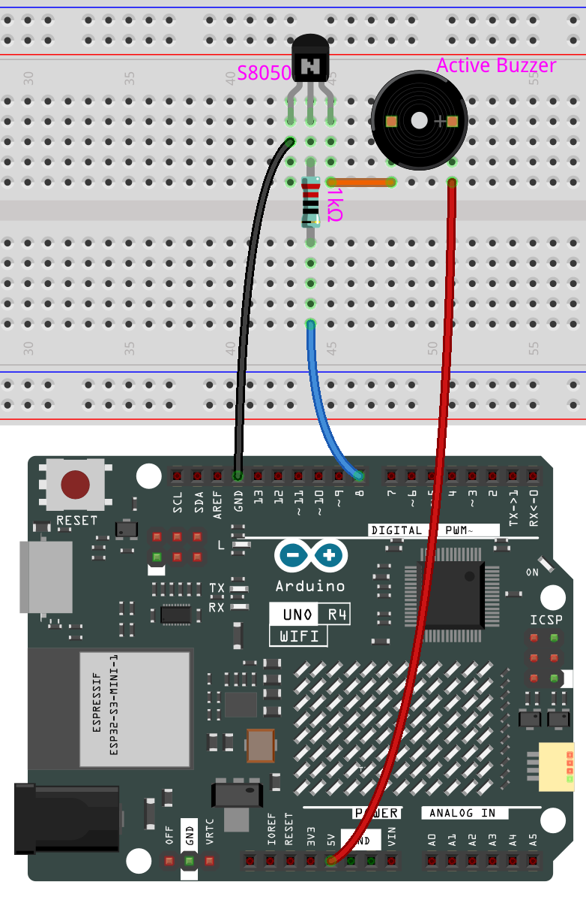
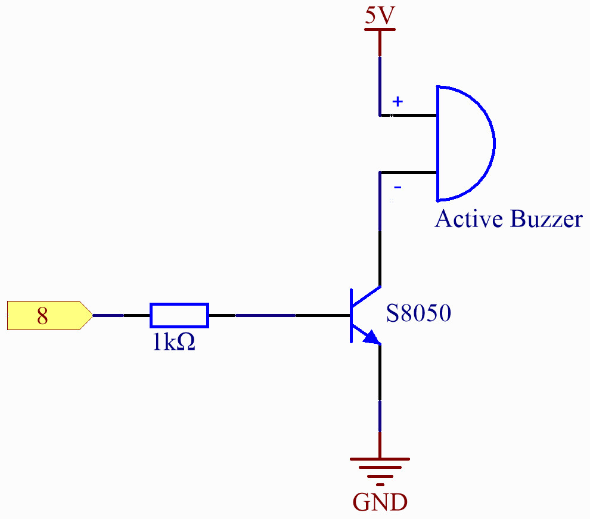

.. note::

    Ciao, benvenuto nella Community di SunFounder per appassionati di Raspberry Pi, Arduino e ESP32 su Facebook! Approfondisci Raspberry Pi, Arduino ed ESP32 insieme ad altri appassionati.

    **Perché unirsi?**

    - **Supporto Esperto**: Risolvi problemi post-vendita e sfide tecniche con l'aiuto della nostra comunità e del nostro team.
    - **Impara e Condividi**: Scambia suggerimenti e tutorial per migliorare le tue competenze.
    - **Anteprime Esclusive**: Accedi in anteprima agli annunci dei nuovi prodotti e alle anticipazioni.
    - **Sconti Speciali**: Godi di sconti esclusivi sui nostri prodotti più recenti.
    - **Promozioni e Giveaway Festivi**: Partecipa a giveaway e promozioni festive.

    👉 Pronto a esplorare e creare con noi? Clicca su [|link_sf_facebook|] e unisciti oggi!

.. _basic_active_buzzer:

Buzzer Attivo
==========================

.. https://docs.sunfounder.com/projects/3in1-kit-r4/en/latest/basic_project/ar_active_buzzer.html#ar-beep

Panoramica
---------------

Il buzzer attivo è un tipico dispositivo di output digitale facile da usare come accendere un LED!

Nel kit sono inclusi due tipi di buzzer. 
Dobbiamo usare il buzzer attivo. Girateli, il retro sigillato (non il PCB esposto) è quello che vogliamo.

.. image:: img/16_buzzer.png
    :align: center
    :width: 70%

Componenti Necessari
-------------------------

In questo progetto, abbiamo bisogno dei seguenti componenti.

È sicuramente conveniente acquistare un kit completo, ecco il link: 

.. list-table::
    :widths: 20 20 20
    :header-rows: 1

    *   - Nome	
        - ELEMENTI IN QUESTO KIT
        - LINK
    *   - Elite Explorer Kit
        - 300+
        - |link_Elite_Explorer_kit|

Puoi anche acquistarli separatamente dai link seguenti.

.. list-table::
    :widths: 30 20
    :header-rows: 1

    *   - INTRODUZIONE DEI COMPONENTI
        - LINK PER L'ACQUISTO

    *   - :ref:`uno_r4_wifi`
        - \-
    *   - :ref:`cpn_breadboard`
        - |link_breadboard_buy|
    *   - :ref:`cpn_wires`
        - |link_wires_buy|
    *   - :ref:`cpn_resistor`
        - |link_resistor_buy|
    *   - :ref:`cpn_transistor`
        - |link_transistor_buy|
    *   - :ref:`cpn_buzzer`
        - \-

Cablaggio
----------------------

.. note::
    Quando colleghi il buzzer, assicurati di controllare i suoi pin. Il pin più lungo è l'anodo e quello più corto è il catodo. È importante non confonderli, poiché in tal caso il buzzer non produrrà alcun suono.

Schema Elettrico
-----------------------

Codice
---------------

.. note::

    * Puoi aprire direttamente il file ``16-active_buzzer.ino`` nel percorso ``elite-explorer-kit-main\basic_project\16-active_buzzer``.
    * Oppure copia questo codice nell'Arduino IDE.

.. literalinclude:: /_code/16_basic_active_buzzer.ino
   :language: cpp
   :linenos:
   :caption: 16-active_buzzer.ino

Dopo aver caricato correttamente il codice, sentirai un bip ogni secondo.
