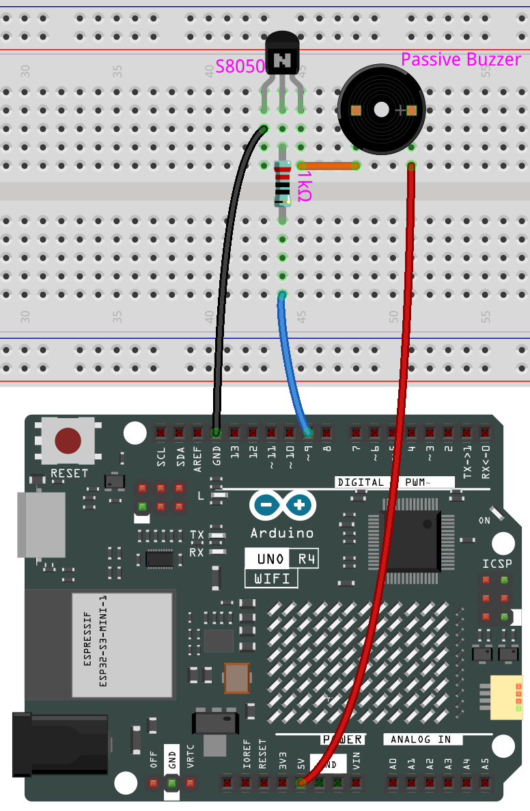
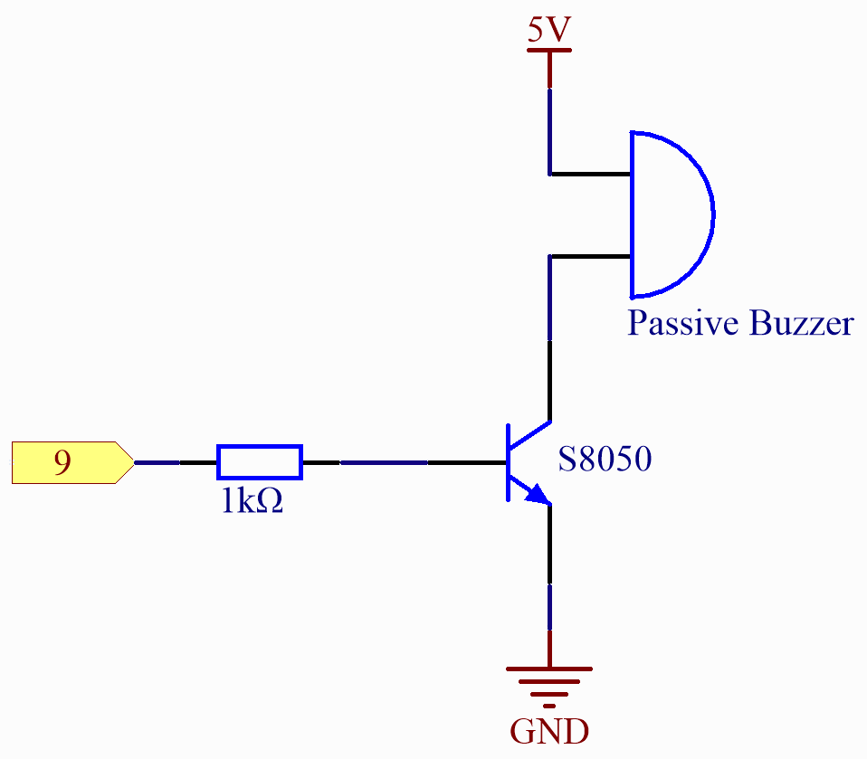

.. _basic_passive_buzzer:

Passiver Summer
==========================

.. https://docs.sunfounder.com/projects/3in1-kit-r4/en/latest/basic_project/ar_tone_notone.html#ar-passive-buzzer

Überblick
---------------

In diesem Projekt werden diese beiden Funktionen verwendet, um den passiven Summer zum Vibrieren zu bringen und Ton zu erzeugen. Die Funktion ``tone()`` erzeugt eine Rechteckwelle mit einer festgelegten Frequenz (und 50% Tastverhältnis) an einem Pin. Eine Dauer kann angegeben werden, oder die Welle setzt sich fort, bis ``noTone()`` aufgerufen wird.
Ähnlich wie beim aktiven Summer nutzt auch der passive Summer elektromagnetische Induktion für seinen Betrieb.
Der Unterschied besteht darin, dass ein passiver Summer keine eigene Schwingungsquelle hat und somit keinen Ton erzeugt, wenn Gleichstromsignale verwendet werden. Dies ermöglicht es jedoch, die eigene Schwingungsfrequenz des passiven Summers anzupassen und unterschiedliche Noten wie „do, re, mi, fa, sol, la, ti“ zu erzeugen.

Benötigte Komponenten
-------------------------

Für dieses Projekt benötigen wir die folgenden Komponenten.

Es ist definitiv praktisch, ein komplettes Kit zu kaufen, hier ist der Link:

.. list-table::
    :widths: 20 20 20
    :header-rows: 1

    *   - Name
        - ARTIKEL IN DIESEM KIT
        - LINK
    *   - Elite Explorer Kit
        - 300+
        - |link_Elite_Explorer_kit|

Sie können die Komponenten auch separat über die untenstehenden Links kaufen.

.. list-table::
    :widths: 30 20
    :header-rows: 1

    *   - KOMPONENTENBESCHREIBUNG
        - KAUF-LINK

    *   - :ref:`uno_r4_wifi`
        - \-
    *   - :ref:`cpn_breadboard`
        - |link_breadboard_buy|
    *   - :ref:`cpn_wires`
        - |link_wires_buy|
    *   - :ref:`cpn_resistor`
        - |link_resistor_buy|
    *   - :ref:`cpn_transistor`
        - |link_transistor_buy|
    *   - :ref:`cpn_buzzer`
        - |link_passive_buzzer_buy|

Verdrahtung
----------------------

.. note::
    Beim Anschließen des Summers achten Sie darauf, seine Pins zu überprüfen. Der längere Pin ist die Anode und der kürzere die Kathode. Es ist wichtig, sie nicht zu verwechseln, da sonst der Summer keinen Ton erzeugen wird.

Schaltplan
-----------------------

Code
---------------

.. note::

    * Sie können die Datei ``16-passive_buzzer.ino`` direkt unter dem Pfad ``elite-explorer-kit-main\basic_project\16-passive_buzzer`` öffnen.
    * Oder kopieren Sie diesen Code in die Arduino IDE.

.. raw:: html

    <iframe src=https://create.arduino.cc/editor/sunfounder01/7936cad2-3605-40a0-a9fc-573f934ab6b1/preview?embed style="height:510px;width:100%;margin:10px 0" frameborder=0></iframe>
    
Nachdem Sie die Codes auf das R4-Board hochgeladen haben, können Sie eine Melodie hören, die sieben Noten enthält.

Code-Analyse
------------------------

1. Einbinden der Töne-Bibliothek:
   Diese Bibliothek stellt die Frequenzwerte für verschiedene musikalische Noten zur Verfügung, sodass Sie musikalische Notation in Ihrem Code verwenden können.

   .. note::
      Bitte platzieren Sie die Datei ``pitches.h`` im selben Verzeichnis wie den Code, um eine ordnungsgemäße Funktion zu gewährleisten. |link_pitches|

      .. image:: img/16_passive_buzzer_piches.png

   .. code-block:: arduino
       
      #include "pitches.h"

2. Definition von Konstanten und Arrays:

   * ``buzzerPin`` ist der digitale Pin am Arduino, an den der Summer angeschlossen ist.

   * ``melody[]`` ist ein Array, das die Abfolge der zu spielenden Noten speichert.

   * ``noteDurations[]`` ist ein Array, das die Dauer jeder Note in der Melodie speichert.

   .. code-block:: arduino
   
      const int buzzerPin = 8;
      int melody[] = {
        NOTE_C4, NOTE_G3, NOTE_G3, NOTE_A3, NOTE_G3, 0, NOTE_B3, NOTE_C4
      };
      int noteDurations[] = {
        4, 8, 8, 4, 4, 4, 4, 4
      };

3. Abspielen der Melodie:

   * Die ``for``-Schleife iteriert über jede Note in der Melodie.

   * Die Funktion ``tone()`` spielt eine Note auf dem Summer für eine bestimmte Dauer.

   * Zwischen den Noten wird eine Verzögerung hinzugefügt, um sie zu unterscheiden.

   * Die Funktion ``noTone()`` stoppt den Ton.

   .. code-block:: arduino
   
      void setup() {
        for (int thisNote = 0; thisNote < 8; thisNote++) {
          int noteDuration = 1000 / noteDurations[thisNote];
          tone(buzzerPin, melody[thisNote], noteDuration);
          int pauseBetweenNotes = noteDuration * 1.30;
          delay(pauseBetweenNotes);
          noTone(buzzerPin);
        }
      }

4. Leere Loop-Funktion:
   Da die Melodie nur einmal im Setup gespielt wird, gibt es keinen Code in der Loop-Funktion.

5. Fühlen Sie sich frei, mit dem Ändern der Noten und Dauern in den Arrays ``melody[]`` und ``noteDurations[]`` zu experimentieren, um Ihre eigenen Melodien zu kreieren. Wenn Sie interessiert sind, gibt es ein GitHub-Repository (|link_arduino-songs|), das Arduino-Codes für verschiedene Lieder bietet. Obwohl ihr Ansatz sich von diesem Projekt unterscheidet, können Sie deren Noten und Dauern als Referenz heranziehen.
