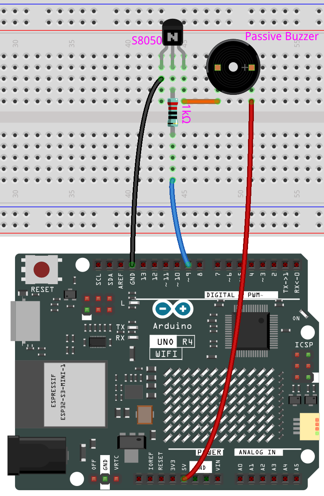
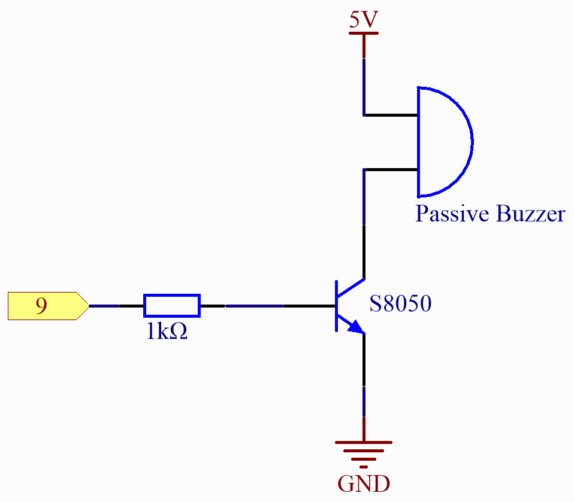

.. note::

    Bonjour, bienvenue dans la communauté SunFounder Raspberry Pi & Arduino & ESP32 Enthusiasts sur Facebook ! Plongez au cœur de Raspberry Pi, Arduino et ESP32 avec d'autres passionnés.

    **Pourquoi nous rejoindre ?**

    - **Support d'experts** : Résolvez les problèmes après-vente et les défis techniques grâce à l'aide de notre communauté et de notre équipe.
    - **Apprendre & Partager** : Échangez des astuces et des tutoriels pour améliorer vos compétences.
    - **Aperçus exclusifs** : Accédez en avant-première aux annonces de nouveaux produits et aux avant-goûts.
    - **Réductions spéciales** : Profitez de réductions exclusives sur nos nouveaux produits.
    - **Promotions festives et tirages au sort** : Participez à des tirages au sort et des promotions de vacances.

    👉 Prêt à explorer et créer avec nous ? Cliquez sur [|link_sf_facebook|] et rejoignez-nous dès aujourd'hui !

.. _basic_passive_buzzer:

Buzzer Passif
==========================

.. https://docs.sunfounder.com/projects/3in1-kit-r4/en/latest/basic_project/ar_tone_notone.html#ar-passive-buzzer

Vue d'ensemble
------------------

Dans ce projet, utilisez ces deux fonctions pour faire vibrer le buzzer passif et produire du son. La fonction ``tone()`` génère une onde carrée avec une fréquence spécifiée (et un cycle de service de 50 %) sur une broche. Une durée peut être spécifiée, ou l'onde continue jusqu'à ce que ``noTone()`` soit appelée.
Tout comme le buzzer actif, le buzzer passif utilise également l'induction électromagnétique pour fonctionner.
La différence est qu'un buzzer passif n'a pas sa propre source d'oscillation, il ne produira donc pas de son si des signaux CC sont utilisés. Cependant, cela permet au buzzer passif d'ajuster sa propre fréquence d'oscillation et de produire différentes notes telles que "do, ré, mi, fa, sol, la, si".

Composants requis
-------------------------

Pour ce projet, nous avons besoin des composants suivants. 

Il est certainement pratique d'acheter un kit complet, voici le lien : 

.. list-table::
    :widths: 20 20 20
    :header-rows: 1

    *   - Nom	
        - ARTICLES DANS CE KIT
        - LIEN
    *   - Elite Explorer Kit
        - 300+
        - |link_Elite_Explorer_kit|

Vous pouvez également les acheter séparément à partir des liens ci-dessous.

.. list-table::
    :widths: 30 20
    :header-rows: 1

    *   - INTRODUCTION DES COMPOSANTS
        - LIEN D'ACHAT

    *   - :ref:`uno_r4_wifi`
        - \-
    *   - :ref:`cpn_breadboard`
        - |link_breadboard_buy|
    *   - :ref:`cpn_wires`
        - |link_wires_buy|
    *   - :ref:`cpn_resistor`
        - |link_resistor_buy|
    *   - :ref:`cpn_transistor`
        - |link_transistor_buy|
    *   - :ref:`cpn_buzzer`
        - |link_passive_buzzer_buy|

Câblage
----------------------

.. note::
    Lors de la connexion du buzzer, assurez-vous de vérifier ses broches. La broche la plus longue est l'anode et la plus courte est la cathode. Il est important de ne pas les mélanger, car cela empêcherait le buzzer de produire du son.

Schéma de câblage
-----------------------

Code
---------------

.. note::

    * Vous pouvez ouvrir le fichier ``16-passive_buzzer.ino`` sous le chemin ``elite-explorer-kit-main\basic_project\16-passive_buzzer`` directement.
    * The ``pitches.h`` file is also required — place it in the same directory.
    * Ou copiez ce code dans Arduino IDE.

.. literalinclude:: /_code/pitches.h
   :language: cpp
   :linenos:
   :caption: pitches.h

.. literalinclude:: /_code/16_basic_passive_buzzer.ino
   :language: cpp
   :linenos:
   :caption: 16-passive_buzzer.ino
    
Lorsque vous avez terminé de téléverser le code sur la carte R4, vous pouvez entendre une mélodie contenant sept notes.

Analyse du code
------------------------

1. Inclusion de la bibliothèque pitches:
   Cette bibliothèque fournit les valeurs de fréquence pour diverses notes de musique, vous permettant d'utiliser la notation musicale dans votre code.

   .. note::
      Veuillez placer le fichier ``pitches.h`` dans le même répertoire que le code pour assurer son bon fonctionnement. |link_pitches|

      .. image:: img/16_passive_buzzer_piches.png

   .. code-block:: arduino
       
      #include "pitches.h"

2. Définition des constantes et des tableaux :

   * ``buzzerPin`` est la broche numérique sur l'Arduino où le buzzer est connecté.

   * ``melody[]`` est un tableau qui stocke la séquence des notes à jouer.

   * ``noteDurations[]`` est un tableau qui stocke la durée de chaque note de la mélodie.

   .. code-block:: arduino
   
      const int buzzerPin = 8;
      int melody[] = {
        NOTE_C4, NOTE_G3, NOTE_G3, NOTE_A3, NOTE_G3, 0, NOTE_B3, NOTE_C4
      };
      int noteDurations[] = {
        4, 8, 8, 4, 4, 4, 4, 4
      };

3. Jouer la mélodie :

   * La boucle ``for`` itère sur chaque note de la mélodie.

   * La fonction ``tone()`` joue une note sur le buzzer pour une durée spécifique.

   * Un délai est ajouté entre les notes pour les distinguer.

   * La fonction ``noTone()`` arrête le son.

   .. code-block:: arduino
   
      void setup() {
        for (int thisNote = 0; thisNote < 8; thisNote++) {
          int noteDuration = 1000 / noteDurations[thisNote];
          tone(buzzerPin, melody[thisNote], noteDuration);
          int pauseBetweenNotes = noteDuration * 1.30;
          delay(pauseBetweenNotes);
          noTone(buzzerPin);
        }
      }

4. Fonction loop vide :
   Comme la mélodie est jouée une seule fois dans le setup, il n'y a pas de code dans la fonction loop.

5. N'hésitez pas à expérimenter en modifiant les notes et les durées dans les tableaux ``melody[]`` et ``noteDurations[]`` pour créer vos propres mélodies. Si cela vous intéresse, il existe un dépôt GitHub (|link_arduino-songs|) qui propose du code Arduino pour jouer diverses chansons. Bien que leur approche puisse différer de ce projet, vous pouvez consulter leurs notes et durées à titre de référence.
