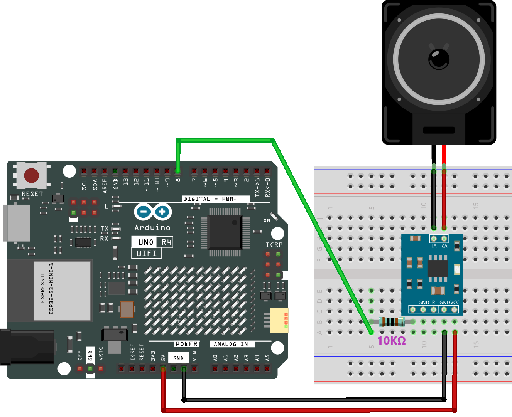
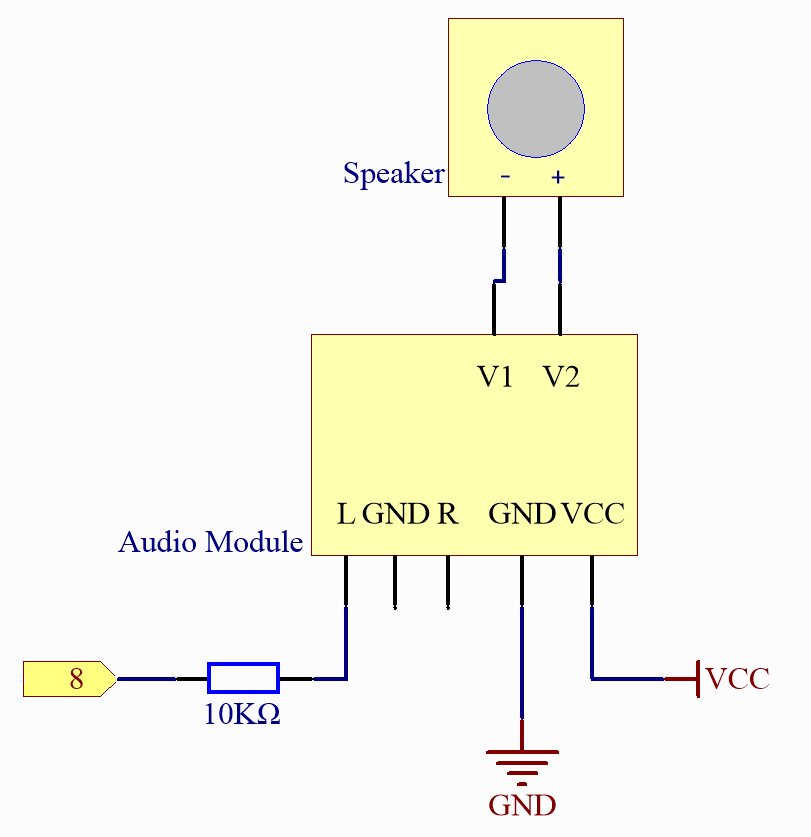

.. _basic_audio_speaker:

Audio Module and Speaker
==========================

Overview
---------------
In this lesson, you will learn about the Audio Module and Speaker when used with an Arduino Uno board. These components are widely utilized in various electronic applications, including musical toys, DIY sound systems, alarms, and even sophisticated musical instruments. By combining an Arduino with an Audio Module and Speaker, you can create a simple yet effective melody player.

Required Components
-------------------------

In this project, we need the following components. 

It's definitely convenient to buy a whole kit, here's the link: 

.. list-table::
    :widths: 20 20 20
    :header-rows: 1

    *   - Name	
        - ITEMS IN THIS KIT
        - LINK
    *   - Elite Explorer Kit
        - 300+
        - |link_Elite_Explorer_kit|

You can also buy them separately from the links below.

.. list-table::
    :widths: 30 20
    :header-rows: 1

    *   - COMPONENT INTRODUCTION
        - PURCHASE LINK

    *   - :ref:`uno_r4_wifi`
        - \-
    *   - :ref:`cpn_breadboard`
        - |link_breadboard_buy|
    *   - :ref:`cpn_wires`
        - |link_wires_buy|
    *   - :ref:`cpn_resistor`
        - |link_resistor_buy|
    *   - :ref:`cpn_audio_speaker`
        - \-

Wiring
----------------------

As this is a mono amplifier, you can connect pin 8 to the L or R pin of the audio amplifier module.

The 10K resistor is used to reduce high-frequency noise and lower the audio volume. It forms an RC low-pass filter with the parasitic capacitance of the DAC and audio amplifier. This filter decreases the amplitude of high-frequency signals, effectively reducing high-frequency noise. So, adding the 10K resistor makes the music sound softer and eliminates unwanted high-frequency noise.

Schematic Diagram
-----------------------

Code
---------------

.. note::

    * You can open the file ``17-speaker.ino`` under the path of ``elite-explorer-kit-main\basic_project\17-speaker`` directly.
    * Or copy this code into Arduino IDE.

.. raw:: html

    <iframe src=https://create.arduino.cc/editor/sunfounder01/33b690b5-0be6-434d-83d7-5bfcfce3775e/preview?embed style="height:510px;width:100%;margin:10px 0" frameborder=0></iframe>
    
At the time when you finish uploading the codes to the R4 board, you can hear a melody containing seven notes. 

Code Analysis
------------------------

1. Including the pitches library:
   This library provides the frequency values for various musical notes, allowing you to use musical notation in your code.

   .. note::
      Please place the ``pitches.h`` file in the same directory as the code to ensure proper functioning. |link_pitches|

      .. image:: img/16_passive_buzzer_piches.png

   .. code-block:: arduino
       
      #include "pitches.h"

2. Defining constants and arrays:

   * ``speakerPin`` is the digital pin on the Arduino where the speaker is connected.

   * ``melody[]`` is an array that stores the sequence of notes to be played.

   * ``noteDurations[]`` is an array that stores the duration of each note in the melody.

   .. code-block:: arduino
   
      const int speakerPin = 8;
      int melody[] = {
        NOTE_C4, NOTE_G3, NOTE_G3, NOTE_A3, NOTE_G3, 0, NOTE_B3, NOTE_C4
      };
      int noteDurations[] = {
        4, 8, 8, 4, 4, 4, 4, 4
      };

3. Playing the melody:

   * The ``for`` loop iterates over each note in the melody.

   * The ``tone()`` function plays a note on the spekaer for a specific duration.

   * A delay is added between notes to distinguish them.

   * The ``noTone()`` function stops the sound.

   .. code-block:: arduino
   
      void setup() {
        for (int thisNote = 0; thisNote < 8; thisNote++) {
          int noteDuration = 1000 / noteDurations[thisNote];
          tone(speakerPin, melody[thisNote], noteDuration);
          int pauseBetweenNotes = noteDuration * 1.30;
          delay(pauseBetweenNotes);
          noTone(speakerPin);
        }
      }

4. Empty loop function:
   Since the melody is played only once in the setup, there's no code in the loop function.

5. Feel free to experiment with altering the notes and durations in the ``melody[]`` and ``noteDurations[]`` arrays to create your own melodies. If you're interested, there is a GitHub repository (|link_arduino-songs|) that offers Arduino code for playing various songs. While their approach may differ from this project, you can consult their notes and durations for reference.