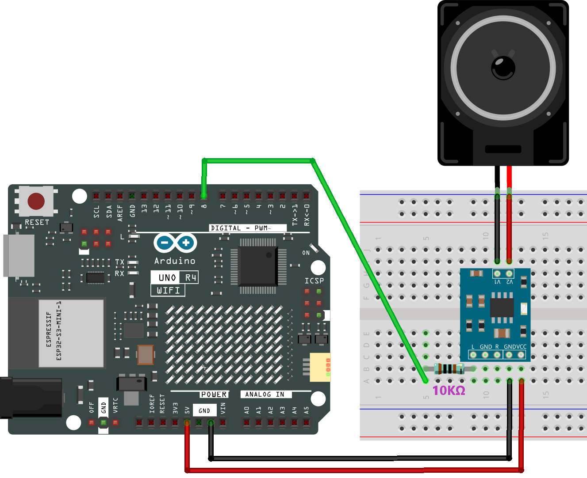
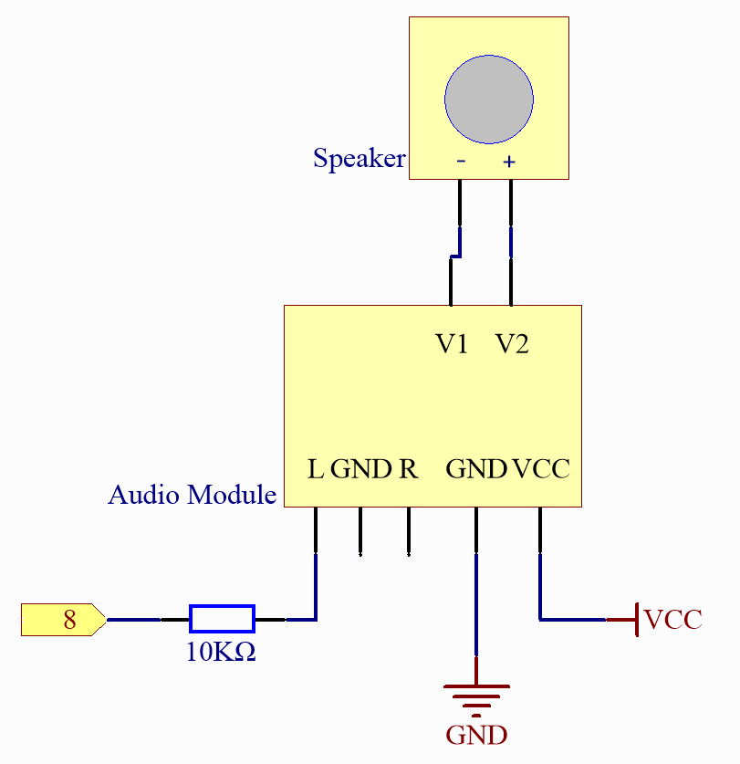

.. _basic_audio_speaker:

音频模块与扬声器
==========================

概述
---------------
在本课中，您将了解与 Arduino Uno 板一起使用的音频模块和扬声器。这些组件广泛应用于各种电子应用中，包括音乐玩具、DIY 音响系统、报警器，甚至精密的乐器。通过将 Arduino 与音频模块和扬声器结合，您可以创建一个简单而有效的旋律播放器。

所需元件
-------------------------

本项目中，我们需要以下元件。

购买整套套件会更加方便，以下是链接：

.. list-table::
    :widths: 20 20 20
    :header-rows: 1

    *   - 名称
        - 套件所含项目
        - 链接
    *   - Elite Explorer 套件
        - 300+
        - |link_Elite_Explorer_kit|

您也可以从以下链接单独购买。

.. list-table::
    :widths: 30 20
    :header-rows: 1

    *   - 元件介绍
        - 购买链接

    *   - :ref:`uno_r4_wifi`
        - \-
    *   - :ref:`cpn_breadboard`
        - |link_breadboard_buy|
    *   - :ref:`cpn_wires`
        - |link_wires_buy|
    *   - :ref:`cpn_resistor`
        - |link_resistor_buy|
    *   - :ref:`cpn_audio_speaker`
        - \-

接线
----------------------

由于这是一个单声道放大器，您可以将引脚 8 连接到音频放大器模块的 L 或 R 引脚。

10K 电阻用于降低高频噪声和减小音频音量。它与 DAC 和音频放大器的寄生电容形成一个 RC 低通滤波器。该滤波器降低高频信号的幅度，有效减少高频噪声。因此，添加 10K 电阻使音乐听起来更柔和，并消除不需要的高频噪声。

原理图
-----------------------

代码
---------------

.. note::

    * 您可以直接打开路径 ``elite-explorer-kit-main\basic_project\17-speaker`` 下的 ``17-speaker.ino`` 文件。
    * 或者将以下代码复制到 Arduino IDE 中。

.. raw:: html

    <iframe src=https://create.arduino.cc/editor/sunfounder01/33b690b5-0be6-434d-83d7-5bfcfce3775e/preview?embed style="height:510px;width:100%;margin:10px 0" frameborder=0></iframe>

将代码上传到 R4 板后，您可以听到包含七个音符的旋律。

代码分析
------------------------

1. 包含 pitches 库：
   该库提供了各种音符的频率值，使您可以在代码中使用音符记法。

   .. note::
      请将 ``pitches.h`` 文件放在与代码相同的目录中，以确保正常运行。|link_pitches|

      .. image:: img/16_passive_buzzer_piches.png

   .. code-block:: arduino

      #include "pitches.h"

2. 定义常量和数组：

   * ``speakerPin`` 是 Arduino 上连接扬声器的数字引脚。

   * ``melody[]`` 是一个存储要播放的音符序列的数组。

   * ``noteDurations[]`` 是一个存储旋律中每个音符时长的数组。

   .. code-block:: arduino

      const int speakerPin = 8;
      int melody[] = {
        NOTE_C4, NOTE_G3, NOTE_G3, NOTE_A3, NOTE_G3, 0, NOTE_B3, NOTE_C4
      };
      int noteDurations[] = {
        4, 8, 8, 4, 4, 4, 4, 4
      };

3. 播放旋律：

   * ``for`` 循环遍历旋律中的每个音符。

   * ``tone()`` 函数在扬声器上以特定时长播放一个音符。

   * 在音符之间添加延迟以区分它们。

   * ``noTone()`` 函数停止声音。

   .. code-block:: arduino

      void setup() {
        for (int thisNote = 0; thisNote < 8; thisNote++) {
          int noteDuration = 1000 / noteDurations[thisNote];
          tone(speakerPin, melody[thisNote], noteDuration);
          int pauseBetweenNotes = noteDuration * 1.30;
          delay(pauseBetweenNotes);
          noTone(speakerPin);
        }
      }

4. 空的 loop 函数：
   由于旋律仅在 setup 中播放一次，因此 loop 函数中没有代码。

5. 随意尝试更改 ``melody[]`` 和 ``noteDurations[]`` 数组中的音符和时长，创建您自己的旋律。如果您有兴趣，有一个 GitHub 仓库 (|link_arduino-songs|) 提供了播放各种歌曲的 Arduino 代码。虽然他们的方法可能与此项目不同，但您可以参考他们的音符和时长。
