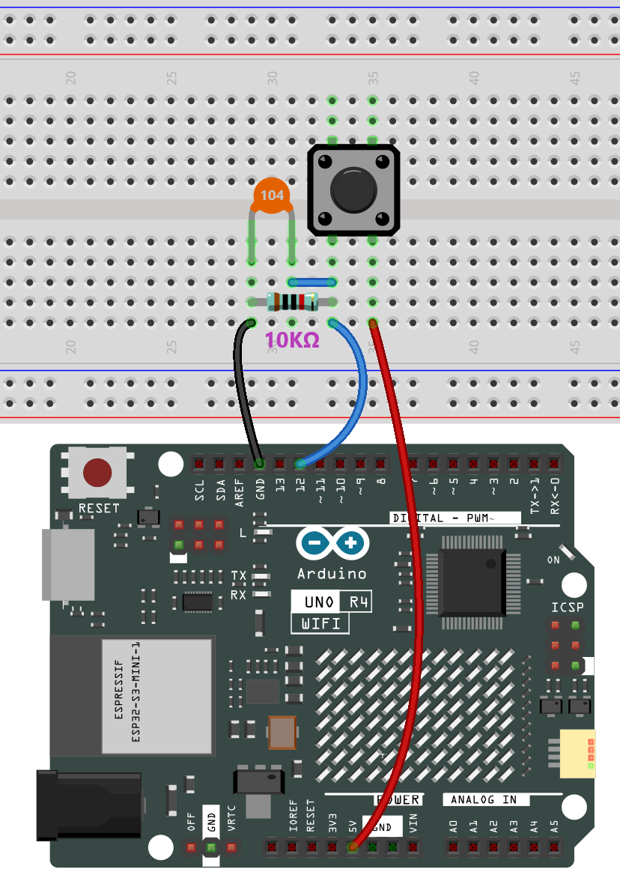
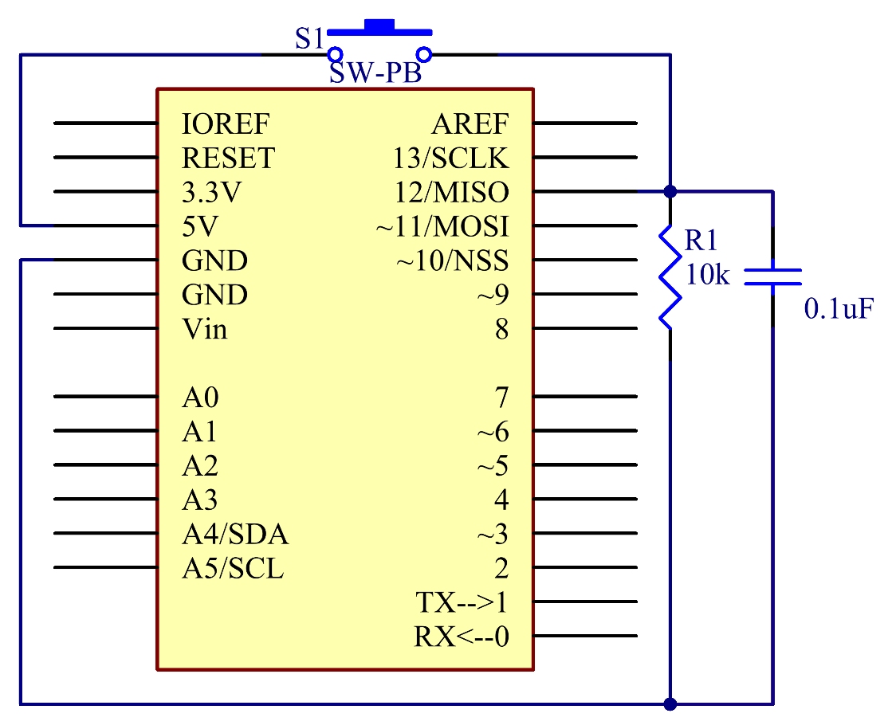

.. note::

    Ciao, benvenuto nella Community di SunFounder per appassionati di Raspberry Pi, Arduino e ESP32 su Facebook! Approfondisci Raspberry Pi, Arduino ed ESP32 insieme ad altri appassionati.

    **Perché unirsi?**

    - **Supporto Esperto**: Risolvi problemi post-vendita e sfide tecniche con l'aiuto della nostra comunità e del nostro team.
    - **Impara e Condividi**: Scambia suggerimenti e tutorial per migliorare le tue competenze.
    - **Anteprime Esclusive**: Accedi in anteprima agli annunci dei nuovi prodotti e alle anticipazioni.
    - **Sconti Speciali**: Godi di sconti esclusivi sui nostri prodotti più recenti.
    - **Promozioni e Giveaway Festivi**: Partecipa a giveaway e promozioni festive.

    👉 Pronto a esplorare e creare con noi? Clicca su [|link_sf_facebook|] e unisciti oggi!

.. _basic_button:

Pulsante
==========================

.. https://docs.sunfounder.com/projects/r4-basic-kit/en/latest/projects/controlling_led_by_button_uno.html#button-uno

Panoramica
----------------

In questa lezione imparerai a controllare un LED utilizzando un pulsante con Arduino. Pulsanti e LED sono componenti fondamentali in una vasta gamma di dispositivi elettronici, come telecomandi, torce e installazioni interattive. In questa configurazione, un pulsante viene utilizzato come dispositivo di input per controllare lo stato di un LED, che funge da dispositivo di output.

Il pulsante è collegato al pin 12 della scheda Arduino Uno R4 e il LED è collegato al pin 13. Quando il pulsante viene premuto, un segnale viene inviato all'Arduino, attivando l'accensione del LED. Al contrario, quando il pulsante viene rilasciato, il LED si spegne. Questo semplice ma efficace meccanismo può essere la base per progetti più complessi, come sistemi di automazione domestica, display interattivi e molto altro.

Alla fine di questa lezione, capirai come leggere l'input da un pulsante e usarlo per controllare un LED, acquisendo così una conoscenza di base delle operazioni di input/output con Arduino.

Componenti Necessari
-------------------------

In questo progetto, abbiamo bisogno dei seguenti componenti. 

È sicuramente conveniente acquistare un kit completo, ecco il link:

.. list-table::
    :widths: 20 20 20
    :header-rows: 1

    *   - Nome	
        - ELEMENTI IN QUESTO KIT
        - LINK
    *   - Elite Explorer Kit
        - 300+
        - |link_Elite_Explorer_kit|

Puoi anche acquistarli separatamente dai link seguenti.

.. list-table::
    :widths: 30 20
    :header-rows: 1

    *   - INTRODUZIONE DEI COMPONENTI
        - LINK PER L'ACQUISTO

    *   - :ref:`uno_r4_wifi`
        - \-
    *   - :ref:`cpn_breadboard`
        - |link_breadboard_buy|
    *   - :ref:`cpn_wires`
        - |link_wires_buy|
    *   - :ref:`cpn_resistor`
        - |link_resistor_buy|
    *   - :ref:`cpn_capacitor`
        - |link_capacitor_buy|
    *   - :ref:`cpn_button`
        - |link_button_buy|

Cablaggio
----------------------

Schema Elettrico
------------------------

Collega un'estremità del pulsante al pin 12, che è collegato a una resistenza pull-down e a un condensatore da 0,1uF (104) (per eliminare il jitter e ottenere un livello stabile quando il pulsante è in funzione). Collega l'altra estremità della resistenza a GND e uno dei pin all'altra estremità del pulsante a 5V. Quando il pulsante viene premuto, il pin 12 è a 5V (HIGH) e imposta il pin 13 (integrato con un LED) come HIGH allo stesso tempo. Poi rilascia il pulsante (il pin 12 passa a LOW) e il pin 13 è LOW. Quindi vedremo che il LED si accende e si spegne alternativamente quando il pulsante viene premuto e rilasciato.

Codice
---------------

.. note::

    * Puoi aprire direttamente il file ``18-button.ino`` nel percorso ``elite-explorer-kit-main\basic_project\18-button``.
    * Oppure copia questo codice nell'Arduino IDE.

.. raw:: html

    <iframe src=https://create.arduino.cc/editor/sunfounder01/a710eb54-9447-4542-ac98-c9a7e1ec4256/preview?embed style="height:510px;width:100%;margin:10px 0" frameborder=0></iframe>
    

Analisi del Codice
-----------------------

#. Definizione di Costanti e Variabili

   In questo segmento, vengono definiti i numeri di pin per il pulsante e il LED. Inoltre, viene dichiarata una variabile ``buttonState`` per mantenere lo stato corrente del pulsante.
 
   .. code-block:: arduino
 
     const int buttonPin = 12;
     const int ledPin = 13;
     int buttonState = 0;

#. Funzione di Setup

   La funzione ``setup()`` viene eseguita una volta quando la scheda Arduino viene avviata. I pin per il pulsante e il LED vengono configurati utilizzando la funzione ``pinMode``.
 
   .. code-block:: arduino
 
     void setup() {
       pinMode(buttonPin, INPUT);
       pinMode(ledPin, OUTPUT);
     }

#. Loop Principale

   La funzione ``loop()`` viene eseguita ripetutamente. All'interno di questo loop, la funzione ``digitalRead()`` viene utilizzata per leggere lo stato del pulsante. A seconda che il pulsante sia premuto o meno, il LED viene acceso o spento.
 
   .. code-block:: arduino
 
     void loop() {
       buttonState = digitalRead(buttonPin);
       if (buttonState == HIGH) {
         digitalWrite(ledPin, HIGH);
       } else {
         digitalWrite(ledPin, LOW);
       }
     }