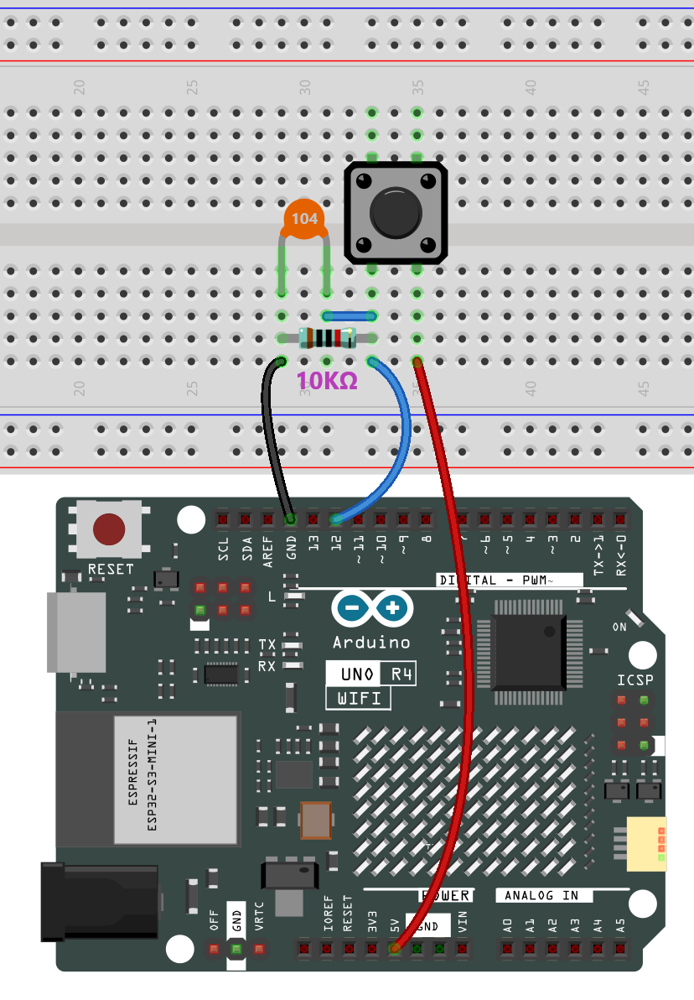
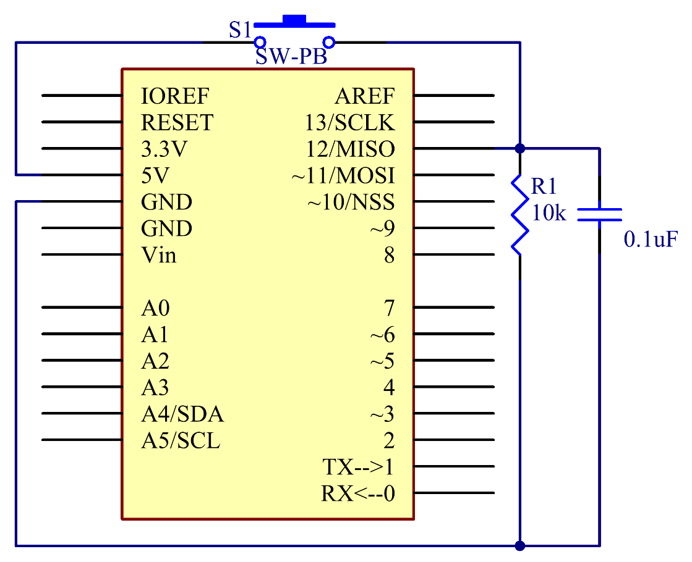

.. _basic_button:

按键
==========================

.. https://docs.sunfounder.com/projects/r4-basic-kit/en/latest/projects/controlling_led_by_button_uno.html#button-uno

概述
----------------

在本课中，您将学习如何使用 Arduino 通过按键控制 LED。按键和 LED 是各种电子设备中的基本元件，例如遥控器、手电筒和互动装置。在本设置中，按键作为输入设备来控制 LED（作为输出设备）的状态。

按键连接到 Arduino Uno R4 板的引脚 12，LED 连接到引脚 13。当按键按下时，信号发送到 Arduino，触发 LED 点亮。相反，当按键释放时，LED 熄灭。这种简单而有效的机制可以成为更复杂项目的基础，例如家庭自动化系统、互动展示等等。

通过本课程，您将了解如何从按键读取输入并用它来控制 LED，从而获得使用 Arduino 进行输入/输出操作的基础知识。

所需元件
-------------------------

本项目中，我们需要以下元件。

购买整套套件会更加方便，以下是链接：

.. list-table::
    :widths: 20 20 20
    :header-rows: 1

    *   - 名称
        - 套件所含项目
        - 链接
    *   - Elite Explorer 套件
        - 300+
        - |link_Elite_Explorer_kit|

您也可以从以下链接单独购买。

.. list-table::
    :widths: 30 20
    :header-rows: 1

    *   - 元件介绍
        - 购买链接

    *   - :ref:`uno_r4_wifi`
        - \-
    *   - :ref:`cpn_breadboard`
        - |link_breadboard_buy|
    *   - :ref:`cpn_wires`
        - |link_wires_buy|
    *   - :ref:`cpn_resistor`
        - |link_resistor_buy|
    *   - :ref:`cpn_capacitor`
        - |link_capacitor_buy|
    *   - :ref:`cpn_button`
        - |link_button_buy|

接线
----------------------

原理图
------------------------

将按键的一端连接到引脚 12，该引脚连接一个下拉电阻和一个 0.1uF (104) 电容（用于消除抖动，在按键工作时输出稳定电平）。将电阻的另一端连接到 GND，按键另一端的一个引脚连接到 5V。当按键按下时，引脚 12 为 5V (HIGH)，同时将引脚 13（集成了 LED）设置为高电平。然后松开按键（引脚 12 变为 LOW），引脚 13 变为低电平。因此，我们将看到 LED 随着按键的按下和释放交替亮灭。

代码
---------------

.. note::

    * 您可以直接打开路径 ``elite-explorer-kit-main\basic_project\18-button`` 下的 ``18-button.ino`` 文件。
    * 或者将以下代码复制到 Arduino IDE 中。

.. raw:: html

    <iframe src=https://create.arduino.cc/editor/sunfounder01/a710eb54-9447-4542-ac98-c9a7e1ec4256/preview?embed style="height:510px;width:100%;margin:10px 0" frameborder=0></iframe>

代码分析
-------------------

#. 定义常量和变量

   在此部分中，定义了按键和 LED 的引脚编号。同时，声明了一个变量 ``buttonState`` 用于保存按键的当前状态。

   .. code-block:: arduino

     const int buttonPin = 12;
     const int ledPin = 13;
     int buttonState = 0;

#. 设置函数

   ``setup()`` 函数在 Arduino 板启动时运行一次。使用 ``pinMode`` 函数设置按键和 LED 的引脚模式。

   .. code-block:: arduino

     void setup() {
       pinMode(buttonPin, INPUT);
       pinMode(ledPin, OUTPUT);
     }

#. 主循环

   ``loop()`` 函数重复运行。在此循环中，使用 ``digitalRead()`` 函数读取按键的状态。根据按键是否按下，打开或关闭 LED。

   .. code-block:: arduino

     void loop() {
       buttonState = digitalRead(buttonPin);
       if (buttonState == HIGH) {
         digitalWrite(ledPin, HIGH);
       } else {
         digitalWrite(ledPin, LOW);
       }
     }
