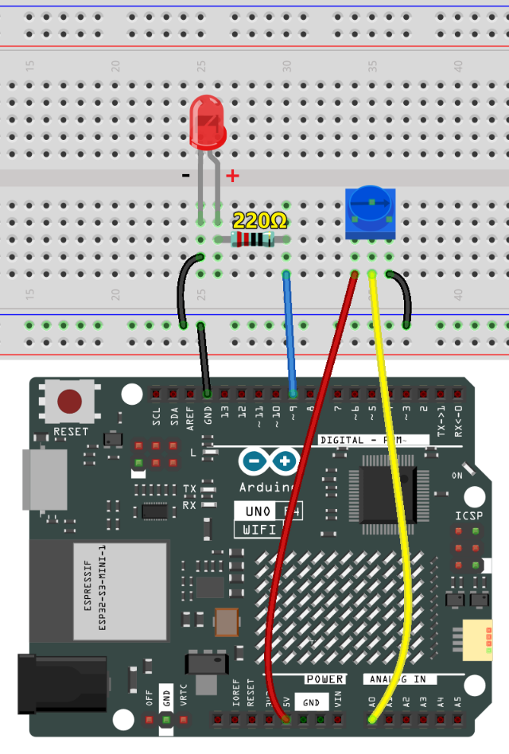
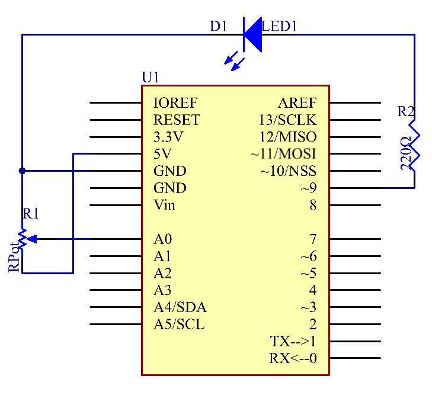

.. _basic_potentiometer:

ポテンショメータ
==========================

.. https://docs.sunfounder.com/projects/r4-basic-kit/en/latest/projects/controlling_an_led_by_potentiometer_uno.html

概要
--------------------

このレッスンでは、ポテンショメータを使ってLEDの明るさを変え、シリアルモニターでポテンショメータのデータを受け取り、その値の変化を見てみましょう。

必要なコンポーネント
-------------------------

このプロジェクトには、以下のコンポーネントが必要です。

全セットを購入するのが便利です。こちらがリンクです：

.. list-table::
    :widths: 20 20 20
    :header-rows: 1

    *   - 名称	
        - このキットのアイテム数
        - リンク
    *   - Elite Explorer Kit
        - 300+
        - |link_Elite_Explorer_kit|

以下のリンクから個別に購入することもできます。

.. list-table::
    :widths: 30 20
    :header-rows: 1

    *   - コンポーネント紹介
        - 購入リンク

    *   - :ref:`uno_r4_wifi`
        - \-
    *   - :ref:`cpn_breadboard`
        - |link_breadboard_buy|
    *   - :ref:`cpn_wires`
        - |link_wires_buy|
    *   - :ref:`cpn_resistor`
        - |link_resistor_buy|
    *   - :ref:`led`
        - |link_led_buy|
    *   - :ref:`cpn_potentiometer`
        - |link_potentiometer_buy|

配線図
----------------------

回路図
---------------------------

この実験では、ポテンショメータは電圧分割器として使用され、3つのピンすべてにデバイスを接続します。ポテンショメータの中央のピンをピンA0に、他の2つのピンをそれぞれ5VとGNDに接続します。したがって、ポテンショメータの電圧は0-5Vです。ポテンショメータのノブを回すと、ピンA0の電圧が変わります。その後、制御ボードのADコンバータを使ってその電圧をデジタル値（0-1024）に変換します。プログラミングを通じて、変換されたデジタル値を使って制御ボード上のLEDの明るさを制御します。

コード
---------------

.. note::

    * ファイル ``19-potentiometer.ino`` を ``elite-explorer-kit-main\basic_project\19-potentiometer`` のパスで直接開くことができます。
    * または、このコードをArduino IDEにコピーしてください。

.. raw:: html

    <iframe src=https://create.arduino.cc/editor/sunfounder01/fb09e333-4057-40d8-8485-0de2d88c06c1/preview?embed style="height:510px;width:100%;margin:10px 0" frameborder=0></iframe>

Unoボードにコードをアップロードした後、シリアルモニターを開いてポテンショメータの読み取り値を観察することができます。ポテンショメータのノブを回すと、読み取り値はそれに応じて変化します。ポテンショメータからの生のアナログ読み取り値は0から1023の範囲です。同時に、コードはこの値を0から255の範囲にスケールし、シリアルモニターにも表示します。このスケールされた値は、接続されたLEDの明るさを制御するために使用されます。LEDは、スケールされた値に基づいて明るくなったり暗くなったりします。ポテンショメータの理論上の範囲は0から1023ですが、実際の範囲はハードウェアの公差によってわずかに異なることに注意する価値があります。

コード解析
---------------

#. 初期化とセットアップ（ピンモードの設定とシリアル通信の初期化）

   ループに入る前に、使用するピンを定義し、シリアル通信を初期化します。

   .. code-block:: arduino

      const int analogPin = 0;  // Analog input pin connected to the potentiometer
      const int ledPin = 9;     // Digital output pin connected to the LED

      void setup() {
        Serial.begin(9600);  // Initialize serial communication with a baud rate of 9600
      }

#. アナログ入力の読み取り（ポテンショメータからのデータの取得）

   このセグメントでは、ポテンショメータからのアナログデータを読み取り、シリアルモニターに出力します。

   .. code-block:: arduino

        inputValue = analogRead(analogPin);  // Read the analog value from the potentiometer
        Serial.print("Input: ");             // Print "Input: " to the serial monitor
        Serial.println(inputValue);          // Print the raw input value to the serial monitor

#. マッピングとスケーリング（ポテンショメータデータの変換）

   ポテンショメータからの生データ（0-1023の範囲）を新しい範囲の0-255にスケールします。

   ``map(value, fromLow, fromHigh, toLow, toHigh)`` は、ある範囲から別の範囲へ数値を変換するために使用されます。たとえば、値が ``fromLow`` から ``fromHigh`` の範囲内にある場合、それは ``toLow`` から ``toHigh`` の範囲内の対応する値に変換され、2つの範囲間で比例関係が保たれます。

   この場合、LEDピン（ピン9）の範囲が0-255なので、0-1023の範囲の値を同じスケールの0-255にマッピングする必要があります。

   .. code-block:: arduino

      outputValue = map(inputValue, 0, 1023, 0, 255);  // Map the input value to a new range

#. LED制御とシリアル出力

   最後に、スケールされた値に基づいてLEDの明るさを制御し、モニタリングのためにスケールされた値を表示します。

   .. code-block:: arduino

      Serial.print("Output: ");                        // Print "Output: " to the serial monitor
      Serial.println(outputValue);                     // Print the scaled output value to the serial monitor
      analogWrite(ledPin, outputValue);                // Control the LED brightness based on the scaled value
      delay(1000);     