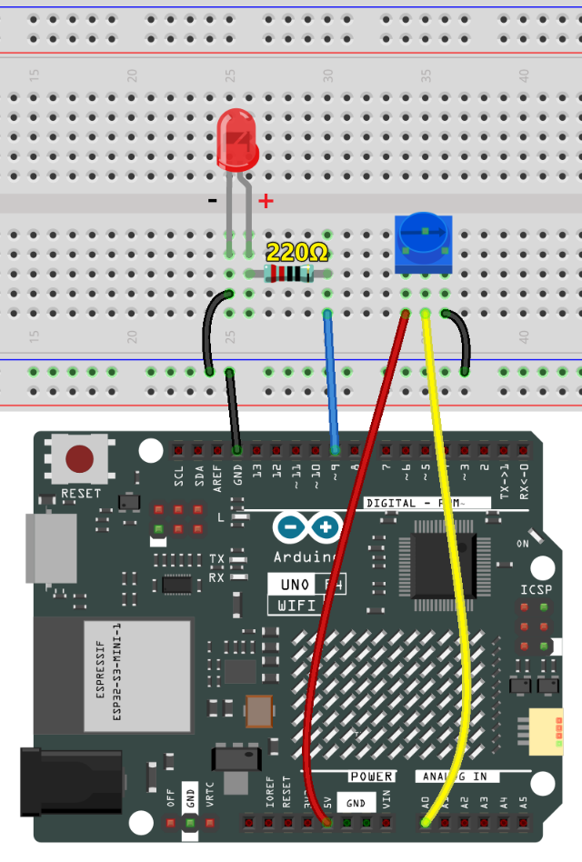
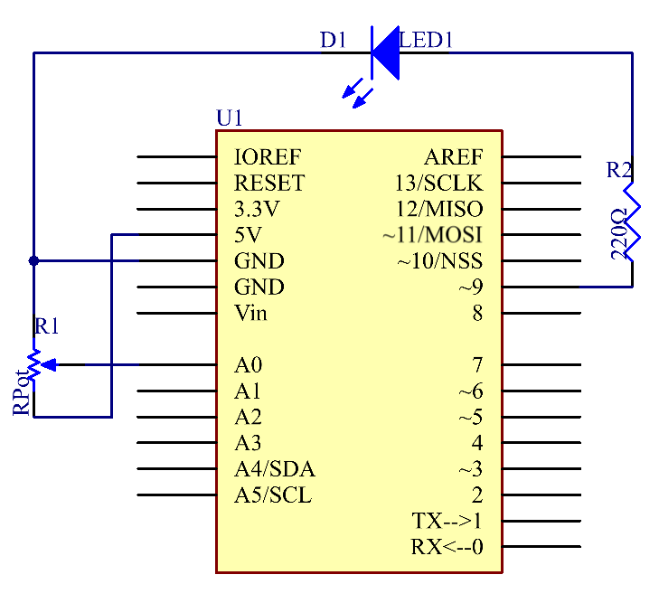

.. note::

    Hallo und willkommen in der SunFounder Raspberry Pi & Arduino & ESP32 Enthusiasten-Gemeinschaft auf Facebook! Tauchen Sie tiefer ein in die Welt von Raspberry Pi, Arduino und ESP32 mit anderen Enthusiasten.

    **Warum beitreten?**

    - **Expertenunterstützung**: Lösen Sie Nachverkaufsprobleme und technische Herausforderungen mit Hilfe unserer Gemeinschaft und unseres Teams.
    - **Lernen & Teilen**: Tauschen Sie Tipps und Anleitungen aus, um Ihre Fähigkeiten zu verbessern.
    - **Exklusive Vorschauen**: Erhalten Sie frühzeitigen Zugang zu neuen Produktankündigungen und exklusiven Einblicken.
    - **Spezialrabatte**: Genießen Sie exklusive Rabatte auf unsere neuesten Produkte.
    - **Festliche Aktionen und Gewinnspiele**: Nehmen Sie an Gewinnspielen und Feiertagsaktionen teil.

    👉 Sind Sie bereit, mit uns zu erkunden und zu erschaffen? Klicken Sie auf [|link_sf_facebook|] und treten Sie heute bei!

.. _basic_potentiometer:

Potentiometer
==========================

.. https://docs.sunfounder.com/projects/r4-basic-kit/en/latest/projects/controlling_an_led_by_potentiometer_uno.html

Überblick
--------------------

In dieser Lektion sehen wir uns an, wie wir die Leuchtkraft einer LED mit einem Potentiometer verändern und die Daten des Potentiometers im Seriellen Monitor ablesen, um seine Wertänderungen zu beobachten.

Benötigte Komponenten
-------------------------

In diesem Projekt benötigen wir die folgenden Komponenten.

Es ist definitiv praktisch, ein ganzes Kit zu kaufen, hier ist der Link: 

.. list-table::
    :widths: 20 20 20
    :header-rows: 1

    *   - Name	
        - ARTIKEL IN DIESEM KIT
        - LINK
    *   - Elite Explorer Kit
        - 300+
        - |link_Elite_Explorer_kit|

Sie können sie auch einzeln über die untenstehenden Links kaufen.

.. list-table::
    :widths: 30 20
    :header-rows: 1

    *   - KOMPONENTENBESCHREIBUNG
        - KAUF-LINK

    *   - :ref:`uno_r4_wifi`
        - \-
    *   - :ref:`cpn_breadboard`
        - |link_breadboard_buy|
    *   - :ref:`cpn_wires`
        - |link_wires_buy|
    *   - :ref:`cpn_resistor`
        - |link_resistor_buy|
    *   - :ref:`cpn_led`
        - |link_led_buy|
    *   - :ref:`cpn_potentiometer`
        - |link_potentiometer_buy|

Verdrahtung
----------------------

Schaltplan
---------------------------

In diesem Experiment wird das Potentiometer als Spannungsteiler verwendet, was bedeutet, dass Geräte an alle drei Pins angeschlossen werden. Verbinden Sie den mittleren Pin des Potentiometers mit Pin A0 und die anderen beiden Pins mit 5V bzw. GND. Daher liegt die Spannung des Potentiometers zwischen 0-5V. Drehen Sie den Knopf des Potentiometers, und die Spannung an Pin A0 wird sich ändern. Dann wird diese Spannung mit dem AD-Wandler im Steuerboard in einen digitalen Wert (0-1024) umgewandelt. Durch Programmierung können wir den umgewandelten digitalen Wert nutzen, um die Helligkeit der LED auf dem
Steuerboard zu steuern.

Code
---------------

.. note::

    * Sie können die Datei ``19-potentiometer.ino`` direkt unter dem Pfad ``elite-explorer-kit-main\basic_project\19-potentiometer`` öffnen.
    * Oder kopieren Sie diesen Code in die Arduino IDE.

.. literalinclude:: /_code/19_basic_potentiometer.ino
   :language: cpp
   :linenos:
   :caption: 19-potentiometer.ino

Nachdem der Code auf das Uno-Board hochgeladen wurde, kann der serielle Monitor geöffnet werden, um die gelesenen Werte des Potentiometers zu beobachten. Wenn Sie am Knopf des Potentiometers drehen, ändert sich der gelesene Wert entsprechend. Der rohe Analogwert des Potentiometers reicht von \(0\) bis \(1023\). Gleichzeitig skaliert der Code diesen Wert in einen Bereich von \(0\) bis \(255\), der auch auf dem seriellen Monitor angezeigt wird. Dieser skalierte Wert wird dann verwendet, um die Helligkeit der angeschlossenen LED zu steuern. Die LED wird heller oder dunkler, je nach skaliertem Wert. Es ist anzumerken, dass der theoretische Bereich des Potentiometers \(0\) bis \(1023\) beträgt, der tatsächliche Bereich kann jedoch aufgrund von Hardwaretoleranzen leicht variieren.

Code-Analyse
--------------

#. Initialisierung und Einrichtung (Einstellen der Pin-Modi und Initialisieren der seriellen Kommunikation)

   Bevor wir in die Schleife einsteigen, definieren wir, welche Pins wir verwenden und initialisieren die serielle Kommunikation.

   .. code-block:: arduino

      const int analogPin = 0;  // Analog input pin connected to the potentiometer
      const int ledPin = 9;     // Digital output pin connected to the LED

      void setup() {
        Serial.begin(9600);  // Initialize serial communication with a baud rate of 9600
      }

#. Lesen des Analogeingangs (Daten vom Potentiometer abrufen)

   In diesem Abschnitt lesen wir die Analogdaten vom Potentiometer und drucken sie auf den seriellen Monitor.

   .. code-block:: arduino

        inputValue = analogRead(analogPin);  // Read the analog value from the potentiometer
        Serial.print("Input: ");             // Print "Input: " to the serial monitor
        Serial.println(inputValue);          // Print the raw input value to the serial monitor

#. Kartierung und Skalierung (Umrechnung der Potentiometer-Daten)

   Wir skalieren die Rohdaten vom Potentiometer, die im Bereich von 0-1023 liegen, in einen neuen Bereich von 0-255.

   ``map(value, fromLow, fromHigh, toLow, toHigh)`` wird verwendet, um eine Zahl von einem Bereich in einen anderen umzurechnen. Wenn der Wert innerhalb des Bereichs von ``fromLow`` und ``fromHigh`` liegt, wird er in einen entsprechenden Wert innerhalb des Bereichs von ``toLow`` und ``toHigh`` umgewandelt, wobei die Proportionalität zwischen den beiden Bereichen erhalten bleibt.

   In diesem Fall müssen wir, da der LED-Pin (Pin 9) einen Bereich von 0-255 hat, Werte im Bereich von 0-1023 auf dieselbe Skala von 0-255 abbilden.

   .. code-block:: arduino

      outputValue = map(inputValue, 0, 1023, 0, 255);  // Map the input value to a new range

#. Steuerung der LED und serielle Ausgabe

   Schließlich steuern wir die Helligkeit der LED basierend auf dem skalierten Wert und drucken den skalierten Wert zur Überwachung.

   .. code-block:: arduino

      Serial.print("Output: ");                        // Print "Output: " to the serial monitor
      Serial.println(outputValue);                     // Print the scaled output value to the serial monitor
      analogWrite(ledPin, outputValue);                // Control the LED brightness based on the scaled value
      delay(1000);     