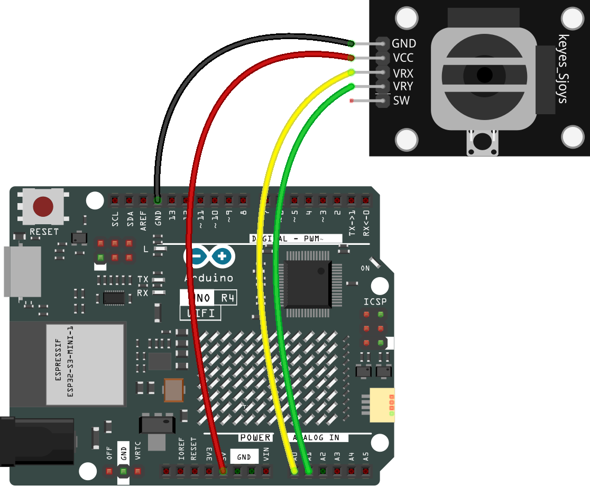

.. _basic_joystick:

ジョイスティックモジュール
==========================

.. https://docs.sunfounder.com/projects/r4-basic-kit/en/latest/projects/joystick_ps2_uno.html#joystick-uno

概要
---------------

ジョイスティックは、基部で回転するスティックから成る入力デバイスであり、その角度や方向を制御しているデバイスに報告します。ジョイスティックは、ビデオゲームやロボットの制御によく使用されます。ここでは、ジョイスティックPS2を使用します。

必要なコンポーネント
-------------------------

このプロジェクトには、以下のコンポーネントが必要です。

全セットを購入するのが便利です。こちらがリンクです：

.. list-table::
    :widths: 20 20 20
    :header-rows: 1

    *   - 名称	
        - このキットのアイテム数
        - リンク
    *   - Elite Explorer Kit
        - 300+
        - |link_Elite_Explorer_kit|

以下のリンクから個別に購入することもできます。

.. list-table::
    :widths: 30 20
    :header-rows: 1

    *   - コンポーネント紹介
        - 購入リンク

    *   - :ref:`uno_r4_wifi`
        - \-
    *   - :ref:`cpn_breadboard`
        - |link_breadboard_buy|
    *   - :ref:`cpn_wires`
        - |link_wires_buy|
    *   - :ref:`cpn_joystick`
        - |link_joystick_buy|

配線図
----------------------

回路図
---------------------

このモジュールには2つのアナログ出力（X、Yの両軸オフセットに対応）があります。

この実験では、Unoボードを使用してジョイスティックのノブの移動方向を検出します。

.. image:: img/20_joystick_schematic.png
    :align: center 
    :width: 70%

コード
-------

.. note::

    * ファイル ``20-joystick.ino`` を ``elite-explorer-kit-main\basic_project\20-joystick`` のパスで直接開くことができます。
    * または、このコードをArduino IDEにコピーしてください。

.. raw:: html

    <iframe src=https://create.arduino.cc/editor/sunfounder01/ac0f9910-e53e-43a3-a5ae-ec4d3a3f4aa1/preview?embed style="height:510px;width:100%;margin:10px 0" frameborder=0></iframe>

今、ロッカーを押すと、シリアルモニターに表示されるX軸とY軸の座標がそれに応じて変化します。ボタンを押すと、座標Z=0も表示されます。

コード解析
-------------------

このコードは、シリアルモニターを使用して、ジョイスティックPS2のVRXおよびVRYピンの値を表示します。

.. code-block:: arduino

    void loop()
    {
        Serial.print("X: "); 
        Serial.print(analogRead(xPin), DEC);  // print the value of VRX in DEC
        Serial.print("|Y: ");
        Serial.print(analogRead(yPin), DEC);  // print the value of VRX in DEC
        Serial.print("|Z: ");
        Serial.println(digitalRead(swPin));  // print the value of SW
        delay(50);
    }