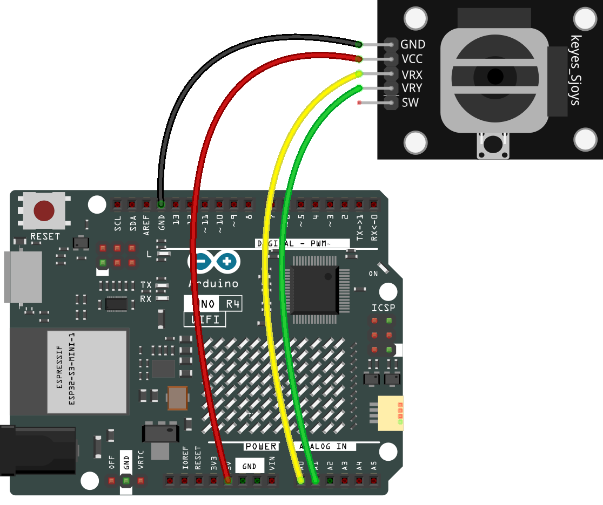
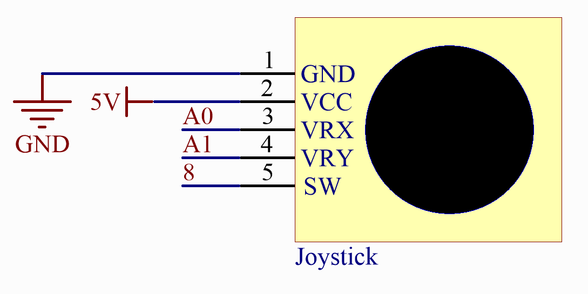

.. _basic_joystick:

摇杆模块
==========================

.. https://docs.sunfounder.com/projects/r4-basic-kit/en/latest/projects/joystick_ps2_uno.html#joystick-uno

概述
---------------

摇杆是一种输入设备，由一个在底座上旋转的摇杆组成，向所控制的设备报告其角度或方向。摇杆常用于控制视频游戏和机器人。这里使用的是 PS2 摇杆。

所需元件
-------------------------

本项目中，我们需要以下元件。

购买整套套件会更加方便，以下是链接：

.. list-table::
    :widths: 20 20 20
    :header-rows: 1

    *   - 名称
        - 套件所含项目
        - 链接
    *   - Elite Explorer 套件
        - 300+
        - |link_Elite_Explorer_kit|

您也可以从以下链接单独购买。

.. list-table::
    :widths: 30 20
    :header-rows: 1

    *   - 元件介绍
        - 购买链接

    *   - :ref:`uno_r4_wifi`
        - \-
    *   - :ref:`cpn_breadboard`
        - |link_breadboard_buy|
    *   - :ref:`cpn_wires`
        - |link_wires_buy|
    *   - :ref:`cpn_joystick`
        - |link_joystick_buy|

接线
----------------------

原理图
---------------------

该模块有两个模拟输出（对应 X、Y 双轴偏移）。

在本实验中，我们使用 Uno 板检测摇杆旋钮的移动方向。

代码
-------

.. note::

    * 您可以直接打开路径 ``elite-explorer-kit-main\basic_project\20-joystick`` 下的 ``20-joystick.ino`` 文件。
    * 或者将以下代码复制到 Arduino IDE 中。

.. literalinclude:: /_code/20_basic_joystick.ino
   :language: cpp
   :linenos:
   :caption: 20-joystick.ino

现在，当您推动摇杆时，串口监视器上显示的 X 和 Y 轴坐标将相应变化。按下按钮还将显示坐标 Z=0。

代码分析
-------------------

该代码使用串口监视器打印摇杆 PS2 的 VRX 和 VRY 引脚的值。

.. code-block:: arduino

    void loop()
    {
        Serial.print("X: ");
        Serial.print(analogRead(xPin), DEC);  // 以十进制格式打印 VRX 的值
        Serial.print("|Y: ");
        Serial.print(analogRead(yPin), DEC);  // 以十进制格式打印 VRY 的值
        Serial.print("|Z: ");
        Serial.println(digitalRead(swPin));  // 打印 SW 的值
        delay(50);
    }
