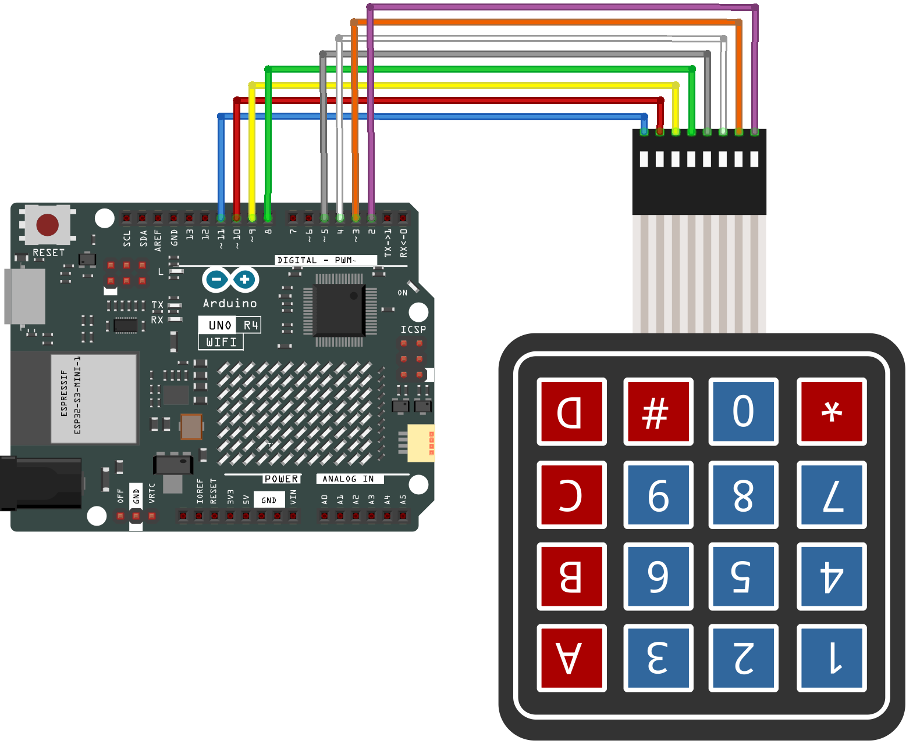
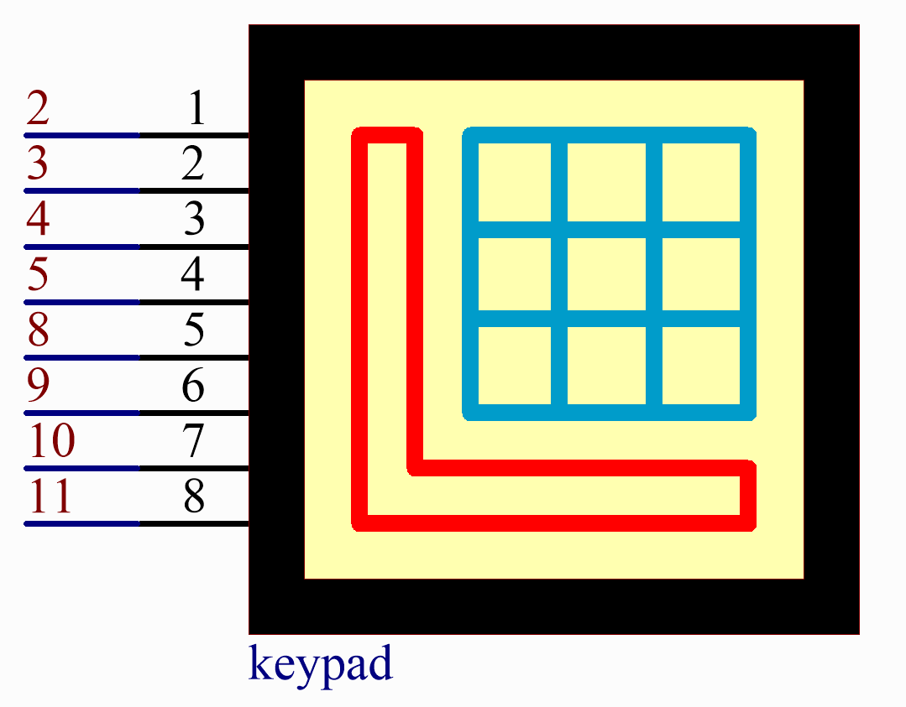

.. _basic_keypad:

キーパッド
==========================

概要
-------------

このレッスンでは、キーパッドの使用方法を学びます。キーパッドは、携帯電話、ファックス機、電子レンジなど、さまざまな種類のデバイスに適用できます。一般的にユーザー入力に使用されます。

必要なコンポーネント
-------------------------

このプロジェクトには、以下のコンポーネントが必要です。

全セットを購入するのが便利です。こちらがリンクです：

.. list-table::
    :widths: 20 20 20
    :header-rows: 1

    *   - 名称	
        - このキットのアイテム数
        - リンク
    *   - Elite Explorer Kit
        - 300+
        - |link_Elite_Explorer_kit|

以下のリンクから個別に購入することもできます。

.. list-table::
    :widths: 30 20
    :header-rows: 1

    *   - コンポーネント紹介
        - 購入リンク

    *   - :ref:`uno_r4_wifi`
        - \-
    *   - :ref:`cpn_wires`
        - |link_wires_buy|
    *   - :ref:`cpn_keypad`
        - |link_keypad_buy|

配線図
----------------------

回路図
----------------------

コード
-----------

.. note::

    * ファイル ``21-keypad.ino`` を ``elite-explorer-kit-main\basic_project\21-keypad`` のパスで直接開くことができます。
    * ライブラリをインストールするには、Arduinoライブラリマネージャーを使用し、 **「Adafruit Keypad」** を検索してインストールしてください。

.. raw:: html

    <iframe src=https://create.arduino.cc/editor/sunfounder01/25fd4116-92d4-4ee4-b3ba-6707f4334629/preview?embed style="height:510px;width:100%;margin:10px 0" frameborder=0></iframe>

UNOボードにコードをアップロードした後、シリアルモニターで、キーパッドで現在押されているキーの値を確認することができます。

コード解析
-------------------

1. ライブラリのインクルード

   まず、キーパッドと簡単にインターフェースするための ``Adafruit_Keypad`` ライブラリをインクルードします。

   .. code-block:: arduino

     #include "Adafruit_Keypad.h"

   .. note::

      * ライブラリをインストールするには、Arduinoライブラリマネージャーを使用し、 **「Adafruit Keypad」** を検索してインストールしてください。 

2. キーパッドの設定

   .. code-block:: arduino

     const byte ROWS = 4;
     const byte COLS = 4;
     char keys[ROWS][COLS] = {
       { '1', '2', '3', 'A' },
       { '4', '5', '6', 'B' },
       { '7', '8', '9', 'C' },
       { '*', '0', '#', 'D' }
     };
     byte rowPins[ROWS] = { 2, 3, 4, 5 };
     byte colPins[COLS] = { 8, 9, 10, 11 };

   - ``ROWS`` および ``COLS`` の定数はキーパッドの寸法を定義します。
   - ``keys`` は2次元配列で、キーパッドの各ボタンのラベルを格納しています。
   - ``rowPins`` と ``colPins`` は、キーパッドの行と列に接続されているArduinoピンを格納する配列です。

   .. raw:: html

       

3. キーパッドの初期化

   ``Adafruit_Keypad`` のインスタンスを ``myKeypad`` として作成し、初期化します。

   .. code-block:: arduino

     Adafruit_Keypad myKeypad = Adafruit_Keypad(makeKeymap(keys), rowPins, colPins, ROWS, COLS);

4. setup()関数

   シリアル通信とカスタムキーパッドを初期化します。

   .. code-block:: arduino

     void setup() {
       Serial.begin(9600);
       myKeypad.begin();
     }

5. メインループ

   キーイベントをチェックし、シリアルモニターに表示します。

   .. code-block:: arduino

     void loop() {
       myKeypad.tick();
       while (myKeypad.available()) {
         keypadEvent e = myKeypad.read();
         Serial.print((char)e.bit.KEY);
         if (e.bit.EVENT == KEY_JUST_PRESSED) Serial.println(" pressed");
         else if (e.bit.EVENT == KEY_JUST_RELEASED) Serial.println(" released");
       }
       delay(10);
     }

